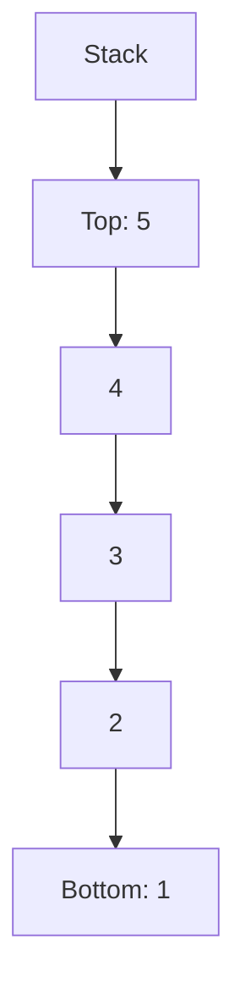

I want to prepare solutions of question papers of subjects Data Structures and Applications / Data structures in Python for my students in Gujarati language. I'll ask for answers one question at a time. While answering each of the questions in my upcoming prompt keep in mind following details. 
* Each question contains marks in brackets
* For 7 marks answer should be roughly 3 pages of handwritten content, for 4 marks 1.5 to 2 pages, and for 3 marks 1-1.5 pages.
* the answer should be easy to remember and easy for scoring marks in exams. 
* for tree diagrams or flowcharts use mermaid. 
* in most of the questions wherever possible draw some diagrams like block diagrams, flow charts, etc.
* I'll always provide questions in English and Gujrati both for your reference. but i want answer in Gujarati only. don't translate technical words and jargons in Gujarati, do not over use gujarati. remember this for our whole conversation.
* Use bullet points, it's easier to read, memorise and helps student score in exams. 
* while giving answer, repeat question first, and give Ans with, something like, Ans 1c: or something suitable, so that to make I can directly copy your response and paste it in my paper solution.
* compulsorily include at least suitable diagram in each answer. Diagrams helps students remember details easily and help them achieve good scores.
* use proper formatting where necessary, like using Heading level 3 for question, and Answer title. use Bold, italics emphasis on keywords of the answer. 
* the bulleted lists source code is using ' •' character directly instead of standard markdown character for list like '-' or '*', is there any particular reason to use it? if not than use standard bullets.

Now wait for my first prompt.


I want to prepare solutions of question papers of subjects Data Structures and Applications / Data structures in Python for my students in English & Gujarati language. I'll ask for answers one question at a time. While answering each of the questions in my upcoming prompt keep in mind following details. 

---

**Instructions for Preparing Question Paper Solutions**

1. **Question Details:**
   
   - Each question includes the marks in brackets. 
   - For 7 marks, aim for an answer that would take roughly 3 pages of handwritten content.
   - For 4 marks, provide an answer that spans about 1.5 to 2 pages.
   - For 3 marks, keep the answer to 1-1.5 pages.
   
2. **Answer Formatting:**
   
   - Repeat the question first.
   - Use a clear format like "Ans [Question Number]:" & for gujarati જવાબ[Question Number] to differentiate answers.
   - Use bullet points for lists to enhance readability and memorability. but do not use (•) character directly for bullets, use standard markdown way like - or *
   - Include diagrams like block diagrams, flowcharts, or tree diagrams where applicable.
   - For diagrams, use **mermaid** syntax for clarity and consistency.
   
3. **Language and Terminology:**
   - Give me answers in both the language, English and Gujarati.  Use heading 3 for questions
   
     ### Q3cOR: Explain the deletion of the first and last node in the singly linked list. (**07 marks**) 

     **Answer Q3cOR:** 
   
     give English answer here. 
   
     ### પ્રશ્નcOR: સિંગ્લી લિંક્ડ લિસ્ટ મા પ્રથમ અને છેલ્લો નોડ ને કાઢી નાખવાનુ સમજાવો. (**૦૭**) 
   
     **જવાબ Q3cOR:** 
   
     Give a Gujarati answer here.
   
   - In Gujarati version, Do not translate technical terms or jargon into Gujarati.
   
   - Do not translate technical jargon related to tree like- child, children, grandchild, leave etc.
   
   - Use minimal Gujarati text to ensure clarity and comprehension.
   
4. **Diagram Inclusion:**
   - Always include at least one suitable diagram in each answer to aid understanding and memorisation.
   - Ensure diagrams are clear and relevant to the question.

5. **Formatting and Emphasis:**
   - Use **bold** and *italics* to emphasise key terms and concepts.
   - Structure answers with headings where necessary, such as **Heading level 3** for questions and **Answer** titles.
   - Maintain proper formatting to enhance readability and scoring potential.
   - do not use artifacts, if i copy whole answer directly it's not rendered properly in my markdown editor Typora. 
   - do not include line such as below, keep your answer in such a manner that i can directly copy it and paste it to prepare solution.
   - for mermaid code blocks, lines containing special symbols are not giving syntax errors, using covering it with " " fixes in many cases. e.g.  E --> F[+ : 5+5=10 પુશ] doesn't work, but E --> F["+ : 5+5=10 પુશ"] works.

---

Certainly. Here are the refined instructions incorporating the suggestions:

**Instructions for Preparing Question Paper Solutions**

1. **Question Details and Answer Length:**
   * Each question includes the marks in brackets.
   * Use the following word count guidelines:
     - 7 marks: ~700-900 words (roughly 3 pages handwritten)
     - 4 marks: ~400-500 words (roughly 1.5-2 pages handwritten)
     - 3 marks: ~300-400 words (roughly 1-1.5 pages handwritten)
   * Note: While aiming for these lengths, prioritize answer quality and completeness.

2. **Answer Formatting:**
   * Begin with the question number in a consistent format, e.g., "Question 3(c) OR" or "Q3cOR".
   * Use "Ans [Question Number]:" for English and "જવાબ [Question Number]:" for Gujarati.
   * Employ bullet points (using - or *) for lists to enhance readability.
   * For code snippets, use triple backticks with the language specified, e.g.:
     ```python
     # Python code here
     ```

3. **Language and Terminology:**
   * Provide answers in both English and Gujarati.
   * Use heading 3 (###) for questions in both languages.
   * In the Gujarati version, keep technical terms in English, including but not limited to:
     - linked list, node, pointer, tree, child, children, grandchild, leaf, root, binary search tree

4. **Diagram Inclusion:**
   * Include at least one relevant diagram per answer.
   * Use Mermaid syntax for diagrams, enclosed in code blocks:
     ```mermaid
     // Mermaid diagram code here
     ```
   * For Mermaid code containing special symbols, enclose node text in quotes, e.g.:
     ```mermaid
     E --> F["+ : 5+5=10 પુશ"]
     ```

5. **Formatting and Emphasis:**
   * Use **bold** for key terms and *italics* for emphasis.
   * Structure answers with appropriate headings where necessary.

6. **Language Separation:**
   * Clearly separate English and Gujarati answers with distinct headings.

7. **Example Format:**

### Question 1(a): Explain the concept of a stack. (3 marks)

**Ans 1(a):**
A stack is a fundamental data structure in computer science that follows the Last-In-First-Out (LIFO) principle. Key points about stacks include:

- Elements are added and removed from the same end, called the "top" of the stack.
- Main operations: push (add an element) and pop (remove the top element).
- Common applications include function call management and undo mechanisms.



### પ્રશ્ન 1(અ): Stack ની વિભાવના સમજાવો. (3 ગુણ)

**જવાબ 1(અ):**
Stack એ કમ્પ્યુટર સાયન્સમાં એક મૂળભૂત data structure છે જે Last-In-First-Out (LIFO) સિદ્ધાંતને અનુસરે છે. Stack વિશેના મુખ્ય મુદ્દાઓમાં સામેલ છે:

- Elements ને એક જ છેડેથી ઉમેરવામાં અને દૂર કરવામાં આવે છે, જેને stack નો "top" કહેવામાં આવે છે.
- મુખ્ય operations: push (element ઉમેરવું) અને pop (top element દૂર કરવું).
- સામાન્ય applications: function call management અને undo mechanisms.


___________

Now wait for my first prompt.
