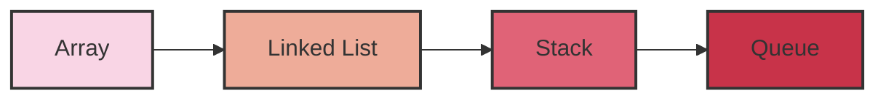

રેખીય ડેટા સ્ટ્રક્ચરની વ્યાખ્યા અને ઉદાહરણો:

રેખીય ડેટા સ્ટ્રક્ચર એ એવું ડેટા સ્ટ્રક્ચર છે જેમાં ડેટા elements એક પછી એક ક્રમમાં ગોઠવાયેલા હોય છે. આ પ્રકારના ડેટા સ્ટ્રક્ચરમાં, દરેક element એક જ predecessor અને એક જ successor ધરાવે છે, સિવાય કે પ્રથમ અને છેલ્લા element.

રેખીય ડેટા સ્ટ્રક્ચરની મુખ્ય લાક્ષણિકતાઓ:
1. ડેટા elements સીધી રેખામાં ગોઠવાયેલા હોય છે
2. મેમરીમાં સળંગ સ્થાનો પર સંગ્રહિત થાય છે
3. અનુક્રમિક access શક્ય છે

રેખીય ડેટા સ્ટ્રક્ચરના ઉદાહરણો:

1. Array
2. Linked List
3. Stack
4. Queue



રેખીય ડેટા સ્ટ્રક્ચરનો ઉપયોગ ડેટાને વ્યવસ્થિત રીતે સંગ્રહિત કરવા અને efficient રીતે access કરવા માટે થાય છે. દરેક પ્રકારનું રેખીય ડેટા સ્ટ્રક્ચર વિશિષ્ટ કાર્યો માટે ઉપયોગી છે, જેમ કે stack નો ઉપયોગ function calls ને manage કરવા માટે થાય છે, જ્યારે queue નો ઉપયોગ scheduling tasks માટે થાય છે.

ટાઇમ અને સ્પેસ કોમ્પ્લેક્ષીટીની વ્યાખ્યા:

1. ટાઇમ કોમ્પ્લેક્ષીટી:
ટાઇમ કોમ્પ્લેક્ષીટી એ એલ્ગોરિધમના execution સમયનું માપ છે. તે દર્શાવે છે કે ઇનપુટના કદ વધવાની સાથે એલ્ગોરિધમને પૂર્ણ થવામાં કેટલો સમય લાગશે.

મુખ્ય મુદ્દાઓ:
- Big O notation નો ઉપયોગ કરીને વ્યક્ત કરવામાં આવે છે (દા.ત., O(n), O(log n))
- ઇનપુટના કદ સાથે એલ્ગોરિધમનો વૃદ્ધિ દર દર્શાવે છે
- લૂપ્સ, રિકર્સન અને ઓપરેશન્સની સંખ્યા પર આધારિત છે

ઉદાહરણ:
```mermaid
graph TD
    A[ટાઇમ કોમ્પ્લેક્ષીટી] --> B[O(1) - Constant]
    A --> C[O(log n) - Logarithmic]
    A --> D[O(n) - Linear]
    A --> E[O(n^2) - Quadratic]
    A --> F[O(2^n) - Exponential]
```

2. સ્પેસ કોમ્પ્લેક્ષીટી:
સ્પેસ કોમ્પ્લેક્ષીટી એ એલ્ગોરિધમ દ્વારા વપરાતી મેમરીનું માપ છે. તે દર્શાવે છે કે ઇનપુટના કદ વધવાની સાથે એલ્ગોરિધમને કેટલી વધારાની મેમરીની જરૂર પડશે.

મુખ્ય મુદ્દાઓ:
- Big O notation નો ઉપયોગ કરીને વ્યક્ત કરવામાં આવે છે
- વેરિએબલ્સ, ડેટા સ્ટ્રક્ચર્સ અને રિકર્સન કૉલ્સ દ્વારા વપરાતી મેમરી ગણવામાં આવે છે
- Auxiliary space (વધારાની મેમરી) અને input space નો સમાવેશ થાય છે

ઉદાહરણ:
```mermaid
graph TD
    A[સ્પેસ કોમ્પ્લેક્ષીટી] --> B[O(1) - Constant]
    A --> C[O(n) - Linear]
    A --> D[O(n^2) - Quadratic]
    A --> E[O(log n) - Logarithmic]
```

ટાઇમ અને સ્પેસ કોમ્પ્લેક્ષીટી વચ્ચે trade-off હોઈ શકે છે. ક્યારેક, વધુ મેમરીનો ઉપયોગ કરીને એલ્ગોરિધમને વધુ ઝડપી બનાવી શકાય છે, અને તેનાથી વિપરીત પણ. એલ્ગોરિધમ્સનું વિશ્લેષણ કરતી વખતે બંને પાસાઓને ધ્યાનમાં લેવા જરૂરી છે.

