**Q1a:** રેખીય ડેટા સ્ટ્રક્ચર વ્યાખ્યાયિત કરો અને તેના ઉદાહરણો આપો. (**૦૩**)

રેખીય ડેટા સ્ટ્રક્ચરની વ્યાખ્યા અને ઉદાહરણો:

રેખીય ડેટા સ્ટ્રક્ચર એ એવું ડેટા સ્ટ્રક્ચર છે જેમાં ડેટા elements એક પછી એક ક્રમમાં ગોઠવાયેલા હોય છે. આ પ્રકારના ડેટા સ્ટ્રક્ચરમાં, દરેક element એક જ predecessor અને એક જ successor ધરાવે છે, સિવાય કે પ્રથમ અને છેલ્લા element.

રેખીય ડેટા સ્ટ્રક્ચરની મુખ્ય લાક્ષણિકતાઓ:
1. ડેટા elements સીધી રેખામાં ગોઠવાયેલા હોય છે
2. મેમરીમાં સળંગ સ્થાનો પર સંગ્રહિત થાય છે
3. અનુક્રમિક access શક્ય છે

રેખીય ડેટા સ્ટ્રક્ચરના ઉદાહરણો:

1. Array
2. Linked List
3. Stack
4. Queue

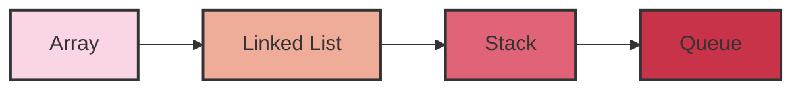

રેખીય ડેટા સ્ટ્રક્ચરનો ઉપયોગ ડેટાને વ્યવસ્થિત રીતે સંગ્રહિત કરવા અને efficient રીતે access કરવા માટે થાય છે. દરેક પ્રકારનું રેખીય ડેટા સ્ટ્રક્ચર વિશિષ્ટ કાર્યો માટે ઉપયોગી છે, જેમ કે stack નો ઉપયોગ function calls ને manage કરવા માટે થાય છે, જ્યારે queue નો ઉપયોગ scheduling tasks માટે થાય છે.

**Q1b:** ટાઇમ અને સ્પેસ કોમ્પ્લેક્ષીટી વ્યાખ્યાયિત કરો. (**૦૪**)

ટાઇમ અને સ્પેસ કોમ્પ્લેક્ષીટીની વ્યાખ્યા:

1. ટાઇમ કોમ્પ્લેક્ષીટી:
ટાઇમ કોમ્પ્લેક્ષીટી એ એલ્ગોરિધમના execution સમયનું માપ છે. તે દર્શાવે છે કે ઇનપુટના કદ વધવાની સાથે એલ્ગોરિધમને પૂર્ણ થવામાં કેટલો સમય લાગશે.

મુખ્ય મુદ્દાઓ:
- Big O notation નો ઉપયોગ કરીને વ્યક્ત કરવામાં આવે છે (દા.ત., O(n), O(log n))
- ઇનપુટના કદ સાથે એલ્ગોરિધમનો વૃદ્ધિ દર દર્શાવે છે
- લૂપ્સ, રિકર્સન અને ઓપરેશન્સની સંખ્યા પર આધારિત છે

ઉદાહરણ:
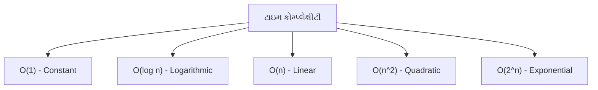

2. સ્પેસ કોમ્પ્લેક્ષીટી:
સ્પેસ કોમ્પ્લેક્ષીટી એ એલ્ગોરિધમ દ્વારા વપરાતી મેમરીનું માપ છે. તે દર્શાવે છે કે ઇનપુટના કદ વધવાની સાથે એલ્ગોરિધમને કેટલી વધારાની મેમરીની જરૂર પડશે.

મુખ્ય મુદ્દાઓ:
- Big O notation નો ઉપયોગ કરીને વ્યક્ત કરવામાં આવે છે
- વેરિએબલ્સ, ડેટા સ્ટ્રક્ચર્સ અને રિકર્સન કૉલ્સ દ્વારા વપરાતી મેમરી ગણવામાં આવે છે
- Auxiliary space (વધારાની મેમરી) અને input space નો સમાવેશ થાય છે

ઉદાહરણ:
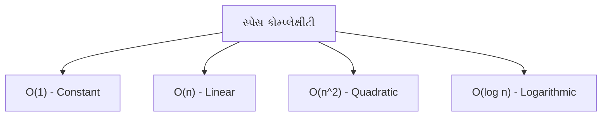

ટાઇમ અને સ્પેસ કોમ્પ્લેક્ષીટી વચ્ચે trade-off હોઈ શકે છે. ક્યારેક, વધુ મેમરીનો ઉપયોગ કરીને એલ્ગોરિધમને વધુ ઝડપી બનાવી શકાય છે, અને તેનાથી વિપરીત પણ. એલ્ગોરિધમ્સનું વિશ્લેષણ કરતી વખતે બંને પાસાઓને ધ્યાનમાં લેવા જરૂરી છે.
પ્રશ્ન 1c: ક્લાસ અને ઓબ્જેક્ટ ઉદાહરણ સાથે સમજાવો. (૦૭)

જવાબ 1c:

ક્લાસ:
• ક્લાસ એ object-oriented programming (OOP)નો મૂળભૂત building block છે.
• તે ડેટા અને મેથડ્સનું એક blueprint છે જે એક વસ્તુના લક્ષણો અને વર્તણૂકને વ્યાખ્યાયિત કરે છે.
• ક્લાસમાં attributes (properties) અને methods (functions) નો સમાવેશ થાય છે.

ઓબ્જેક્ટ:
• ઓબ્જેક્ટ એ ક્લાસનું એક instance છે.
• તે ક્લાસમાં વ્યાખ્યાયિત કરેલા ડેટા અને મેથડ્સનું એક concrete ઉદાહરણ છે.
• દરેક ઓબ્જેક્ટ પાસે પોતાના unique attributes અને methods હોય છે.

ઉદાહરણ:
આવો, 'Car' નામની ક્લાસ બનાવીને સમજીએ:

```python
class Car:
    def __init__(self, make, model, year):
        self.make = make
        self.model = model
        self.year = year
        self.speed = 0

    def accelerate(self):
        self.speed += 5

    def brake(self):
        if self.speed >= 5:
            self.speed -= 5
        else:
            self.speed = 0

    def get_info(self):
        return f"{self.year} {self.make} {self.model}, Speed: {self.speed} km/h"
```

આ ક્લાસના ઓબ્જેક્ટ્સ બનાવીએ:

```python
car1 = Car("Toyota", "Corolla", 2022)
car2 = Car("Honda", "Civic", 2023)

print(car1.get_info())  # Output: 2022 Toyota Corolla, Speed: 0 km/h
car1.accelerate()
car1.accelerate()
print(car1.get_info())  # Output: 2022 Toyota Corolla, Speed: 10 km/h

print(car2.get_info())  # Output: 2023 Honda Civic, Speed: 0 km/h
```

ક્લાસ અને ઓબ્જેક્ટના મુખ્ય મુદ્દાઓ:
• ક્લાસ એક template છે, જ્યારે ઓબ્જેક્ટ તેનું concrete instance છે.
• એક ક્લાસથી અનેક ઓબ્જેક્ટ્સ બનાવી શકાય છે.
• દરેક ઓબ્જેક્ટ પાસે પોતાના unique ડેટા હોય છે, પરંતુ તેઓ ક્લાસની methods share કરે છે.
• ઓબ્જેક્ટ્સ એકબીજાથી સ્વતંત્ર હોય છે અને તેમના attributes અલગ-અલગ હોઈ શકે છે.

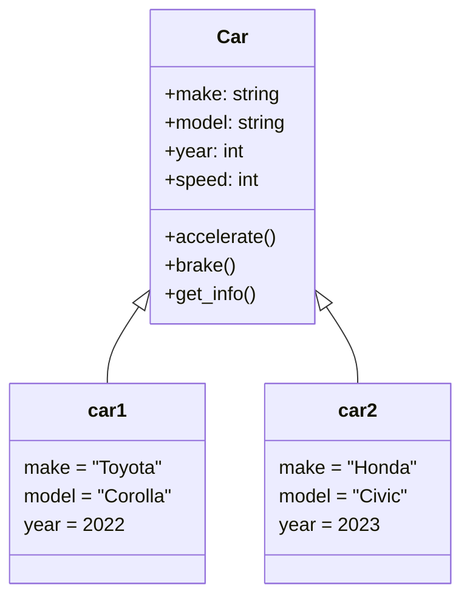

આ રીતે, ક્લાસ અને ઓબ્જેક્ટ OOP ના મહત્વના concepts છે જે કોડને વધુ સંગઠિત, પુન:ઉપયોગી અને maintain કરવા સરળ બનાવે છે.

પ્રશ્ન 1cOR: ઇંસ્ટંસ મેથડ, ક્લાસ મેથડ અને સ્ટેટીક મેથડ ઉદાહરણ સાથે સમજાવો. (૦૭)

જવાબ 1cOR:

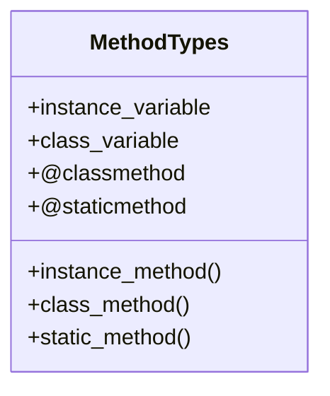

1. ઇંસ્ટંસ મેથડ:
   • ઓબ્જેક્ટ પર કાર્ય કરે છે
   • પ્રથમ પેરામીટર તરીકે 'self' લે છે
   • ઓબ્જેક્ટના સ્પેસિફિક ડેટા સાથે કામ કરે છે
   • ઉદાહરણ:
     ```python
     class Car:
         def __init__(self, model):
             self.model = model
         
         def get_model(self):
             return f"The car model is {self.model}"
     
     my_car = Car("Toyota")
     print(my_car.get_model())  # Output: The car model is Toyota
     ```

2. ક્લાસ મેથડ:
   • ક્લાસ પર કાર્ય કરે છે, ઓબ્જેક્ટ પર નહીં
   • @classmethod ડેકોરેટર સાથે વ્યાખ્યાયિત થાય છે
   • પ્રથમ પેરામીટર તરીકે 'cls' (ક્લાસ) લે છે
   • ક્લાસ વેરિએબલ્સ સાથે કામ કરે છે
   • ઉદાહરણ:
     ```python
     class Student:
         school = "ABC School"
         
         @classmethod
         def change_school(cls, new_school):
             cls.school = new_school
     
     Student.change_school("XYZ School")
     print(Student.school)  # Output: XYZ School
     ```

3. સ્ટેટીક મેથડ:
   • ન તો ક્લાસ કે ન તો ઓબ્જેક્ટ સાથે જોડાયેલ હોય છે
   • @staticmethod ડેકોરેટર સાથે વ્યાખ્યાયિત થાય છે
   • 'self' કે 'cls' પેરામીટર લેતી નથી
   • ક્લાસ કે ઇન્સ્ટન્સ ડેટા સાથે કામ કરતી નથી
   • ઉદાહરણ:
     ```python
     class MathOperations:
         @staticmethod
         def add(x, y):
             return x + y
     
     print(MathOperations.add(5, 3))  # Output: 8
     ```

તફાવતો:
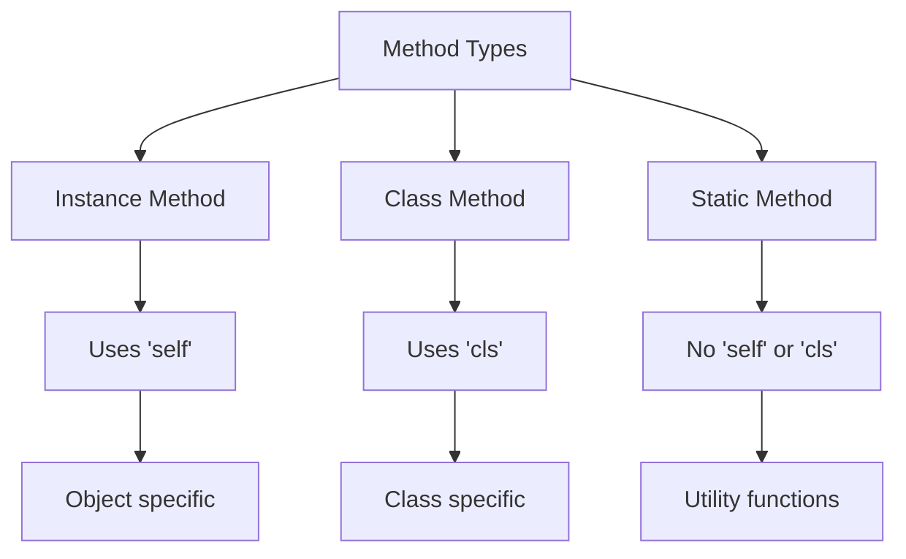

• ઇંસ્ટંસ મેથડ: ઓબ્જેક્ટ-સ્પેસિફિક ડેટા સાથે કામ કરે છે
• ક્લાસ મેથડ: ક્લાસ-સ્પેસિફિક ડેટા સાથે કામ કરે છે
• સ્ટેટીક મેથડ: કોઈ સ્પેસિફિક ડેટા સાથે કામ કરતી નથી, સામાન્ય utility functions તરીકે વપરાય છે

આ ત્રણેય પ્રકારની મેથડ્સ કોડને વધુ સંગઠિત અને વ્યવસ્થિત બનાવવામાં મદદ કરે છે, જે OOP ના સિદ્ધાંતોને અનુરૂપ છે.

### પ્રશ્ન 2a: રીકર્ઝીવ ફંકશન નો કોંસેપ્ટ સમજાવો. (૦૩)

#### જવાબ 2a:

રીકર્ઝીવ ફંકશન એ એવું ફંકશન છે જે **પોતાને જ કૉલ કરે છે**. આ કોન્સેપ્ટ પ્રોગ્રામિંગમાં ખૂબ જ મહત્વપૂર્ણ છે.

રીકર્ઝીવ ફંકશનના મુખ્ય ઘટકો:

1. **બેસ કેસ**: 
   - રીકર્ઝનને અટકાવવા માટેનો કેસ
   - ફંકશનને આગળ કૉલ કરવાની જરૂર નથી પડતી

2. **રીકર્ઝીવ કૉલ**: 
   - ફંકશન પોતાને જ કૉલ કરે છે
   - દરેક કૉલ સાથે પ્રોબ્લેમનું કદ ઘટતું જાય છે

3. **પ્રગતિ**: 
   - દરેક રીકર્ઝીવ કૉલ બેસ કેસ તરફ આગળ વધે છે

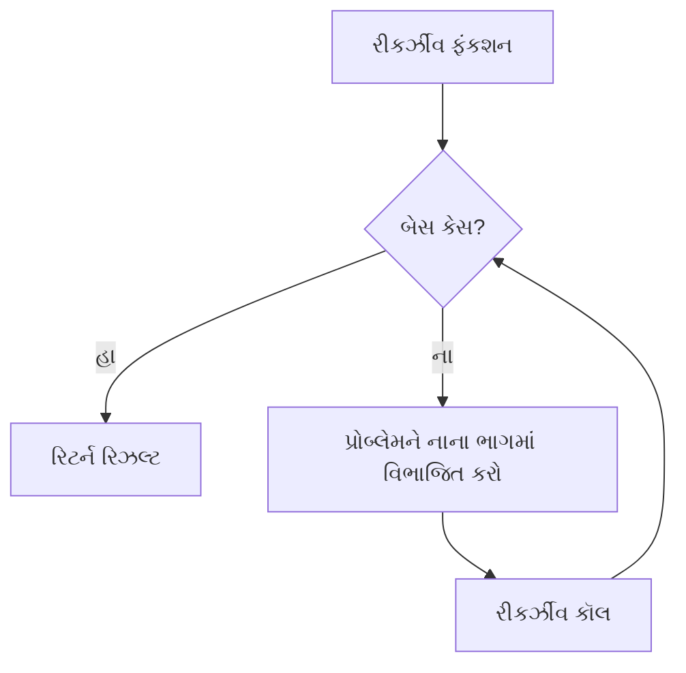

**ઉદાહરણ**: ફેક્ટોરિયલ ગણતરી

```python
def factorial(n):
    if n == 0 or n == 1:  # બેસ કેસ
        return 1
    else:
        return n * factorial(n-1)  # રીકર્ઝીવ કૉલ
```

રીકર્ઝીવ ફંકશન્સ **જટિલ પ્રોબ્લેમ્સને** સરળ અને **વાંચવામાં સહેલા** કોડમાં ઉકેલવામાં મદદ કરે છે, પરંતુ તેમનો ઉપયોગ કાળજીપૂર્વક કરવો જોઈએ કારણ કે તેઓ **મેમરી અને પ્રોસેસિંગ પાવર**નો વધુ ઉપયોગ કરી શકે છે.

### પ્રશ્ન 2b: સ્ટેક અને ક્યુ વ્યાખ્યાયિત કરો. (૦૪)

#### જવાબ 2b:

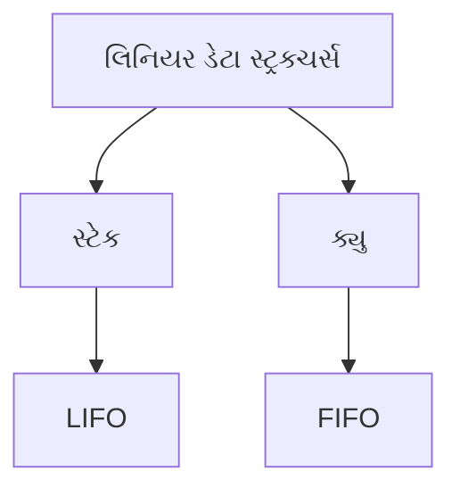

1. **સ્ટેક (Stack)**:
   - સ્ટેક એક **LIFO** (Last In First Out) પ્રકારનું ડેટા સ્ટ્રક્ચર છે.
   - મુખ્ય ઓપરેશન્સ:
     * **Push**: નવો એલિમેન્ટ ટોચ પર ઉમેરે છે
     * **Pop**: ટોચ પરનો એલિમેન્ટ દૂર કરે છે
   - ઉપયોગ: ફંક્શન કૉલ્સ, undo મેકેનિઝમ, એક્સપ્રેશન ઇવેલ્યુએશન

   ```python
   stack = []
   stack.append(1)  # Push
   stack.append(2)
   top_element = stack.pop()  # Pop
   ```

2. **ક્યુ (Queue)**:
   - ક્યુ એક **FIFO** (First In First Out) પ્રકારનું ડેટા સ્ટ્રક્ચર છે.
   - મુખ્ય ઓપરેશન્સ:
     * **Enqueue**: નવો એલિમેન્ટ પાછળથી ઉમેરે છે
     * **Dequeue**: આગળથી એલિમેન્ટ દૂર કરે છે
   - ઉપયોગ: પ્રિન્ટ જોબ્સ, પ્રોસેસ શેડ્યુલિંગ, બફર્સ

   ```python
   from collections import deque
   queue = deque()
   queue.append(1)  # Enqueue
   queue.append(2)
   front_element = queue.popleft()  # Dequeue
   ```

**સ્ટેક અને ક્યુ વચ્ચેનો તફાવત**:

| સ્ટેક                         | ક્યુ                                 |
| --------------------------- | ---------------------------------- |
| LIFO પ્રિન્સિપલ               | FIFO પ્રિન્સિપલ                      |
| એક જ એન્ડથી ઇન્સર્શન અને ડિલિશન | એક એન્ડથી ઇન્સર્શન, બીજા એન્ડથી ડિલિશન |
| ટોપ એલિમેન્ટ એક્સેસ થાય છે       | ફ્રન્ટ અને રિયર એલિમેન્ટ્સ એક્સેસ થાય છે    |

બંને ડેટા સ્ટ્રક્ચર્સ **લિનિયર** છે અને **વિશિષ્ટ એપ્લિકેશન્સ**માં ઉપયોગી છે. તેમનો યોગ્ય ઉપયોગ **એફિશિયન્ટ ડેટા મેનેજમેન્ટ** અને **અલ્ગોરિધમ ડિઝાઇન**માં મદદ કરે છે.

### પ્રશ્ન 2c: સ્ટેક ના બેઝિક ઓપરેશન સમજાવો. (૦૭)

#### જવાબ 2c:

સ્ટેક એક મહત્વપૂર્ણ ડેટા સ્ટ્રક્ચર છે જે LIFO (Last In First Out) પ્રિન્સિપલ પર કાર્ય કરે છે. સ્ટેકના મુખ્ય બેઝિક ઓપરેશન્સ નીચે મુજબ છે:

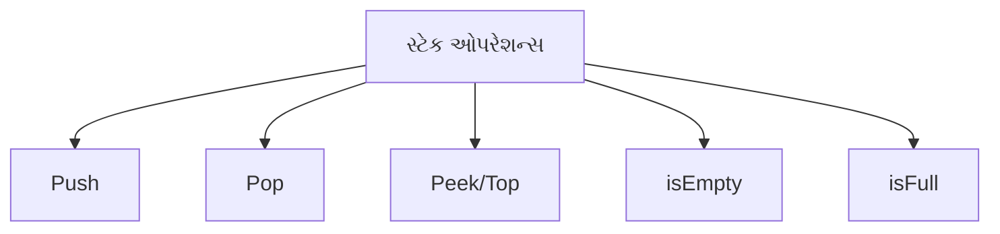

1. **Push ઓપરેશન**:
   - *કાર્ય*: સ્ટેકમાં નવો એલિમેન્ટ ઉમેરે છે.
   - *પ્રક્રિયા*: 
     * નવો એલિમેન્ટ સ્ટેકની ટોચ પર ઉમેરવામાં આવે છે.
     * ટોપ પોઇન્ટર એક વધારવામાં આવે છે.
   - *સમયની જટિલતા*: O(1)
   
   ```python
   def push(stack, item):
       stack.append(item)
       print(f"Pushed {item} to the stack")
   ```

2. **Pop ઓપરેशન**:
   - *કાર્ય*: સ્ટેકમાંથી ટોચનો એલિમેન્ટ દૂર કરે છે.
   - *પ્રક્રિયા*: 
     * સ્ટેકની ટોચ પરનો એલિમેન્ટ રિટર્ન કરવામાં આવે છે અને દૂર કરવામાં આવે છે.
     * ટોપ પોઇન્ટર એક ઘટાડવામાં આવે છે.
   - *સમયની જટિલતા*: O(1)
   
   ```python
   def pop(stack):
       if not isEmpty(stack):
           return stack.pop()
       print("Stack is empty")
   ```

3. **Peek/Top ઓપરેશન**:
   - *કાર્ય*: સ્ટેકના ટોચના એલિમેન્ટને જોવા માટે.
   - *પ્રક્રિયા*: ટોચના એલિમેન્ટને દૂર કર્યા વિના રિટર્ન કરે છે.
   - *સમયની જટિલતા*: O(1)
   
   ```python
   def peek(stack):
       if not isEmpty(stack):
           return stack[-1]
       print("Stack is empty")
   ```

4. **isEmpty ઓપરેશન**:
   - *કાર્ય*: સ્ટેક ખાલી છે કે નહીં તે ચકાસે છે.
   - *પ્રક્રિયા*: જો સ્ટેકમાં કોઈ એલિમેન્ટ નથી તો true રિટર્ન કરે છે.
   - *સમયની જટિલતા*: O(1)
   
   ```python
   def isEmpty(stack):
       return len(stack) == 0
   ```

5. **isFull ઓપરેશન** (જો સ્ટેક ફિક્સ્ડ સાઇઝનો હોય તો):
   - *કાર્ય*: સ્ટેક પૂર્ણ ભરેલો છે કે નહીં તે ચકાસે છે.
   - *પ્રક્રિયા*: જો સ્ટેકની સાઇઝ મહત્તમ કેપેસિટી સુધી પહોંચી ગઈ હોય તો true રિટર્ન કરે છે.
   - *સમયની જટિલતા*: O(1)
   
   ```python
   def isFull(stack, capacity):
       return len(stack) == capacity
   ```

**સ્ટેક ઓપરેશન્સનું ઉદાહરણ**:

```python
stack = []
capacity = 3

push(stack, 1)
push(stack, 2)
push(stack, 3)

print("Top element:", peek(stack))
print("Popped:", pop(stack))
print("Is stack empty?", isEmpty(stack))
print("Is stack full?", isFull(stack, capacity))
```

આ બેઝિક ઓપરેશન્સ સ્ટેકને **એફિશિયન્ટ અને ફ્લેક્સિબલ** ડેટા સ્ટ્રક્ચર બનાવે છે. તેઓ **O(1) ટાઇમ કોમ્પ્લેક્સિટી** ધરાવે છે, જે તેમને ઘણી એપ્લિકેશન્સ માટે આદર્શ બનાવે છે. સ્ટેક **ફંક્શન કૉલ્સ**, **એક્સપ્રેશન ઇવેલ્યુએશન**, અને **ઉંડો મેકેનિઝમ** જેવા કાર્યો માટે વ્યાપકપણે ઉપયોગમાં લેવાય છે.
### પ્રશ્ન 2aOR: સિંગ્લી લિંક્ડ લિસ્ટ વ્યાખ્યાયિત કરો. (૦૩)

#### જવાબ 2aOR:

સિંગ્લી લિંક્ડ લિસ્ટ એક **લિનિયર ડેટા સ્ટ્રક્ચર** છે જેમાં એલિમેન્ટ્સ (નોડ્સ) એક પછી એક જોડાયેલા હોય છે.

**મુખ્ય લક્ષણો**:

1. **નોડ્સની રચના**:
   - **ડેટા**: એલિમેન્ટની વેલ્યુ સ્ટોર કરે છે
   - **નેક્સ્ટ પોઈન્ટર**: આગળના નોડનું એડ્રેસ ધરાવે છે

2. **લિંકિંગ**:
   - દરેક નોડ માત્ર આગળના નોડને પોઈન્ટ કરે છે
   - છેલ્લો નોડ NULL ને પોઈન્ટ કરે છે

3. **હેડ પોઈન્ટર**:
   - પ્રથમ નોડને પોઈન્ટ કરે છે
   - લિસ્ટની શરૂઆત દર્શાવે છે


**સિંગ્લી લિંક્ડ લિસ્ટના ફાયદા**:
- **ડાયનેમિક સાઈઝ**: મેમરીનો *એફિશિયન્ટ* ઉપયોગ
- **ઈન્સર્શન/ડિલીશન**: *O(1)* ટાઇમ કોમ્પ્લેક્સિટી (જો પોઝિશન જાણીતી હોય તો)

**મર્યાદાઓ**:
- **રિવર્સ ટ્રાવર્સલ**: શક્ય નથી
- **રેન્ડમ એક્સેસ**: *O(n)* ટાઇમ કોમ્પ્લેક્સિટી

સિંગ્લી લિંક્ડ લિસ્ટ્સ **સ્ટેક્સ**, **ક્યૂઝ**, અને **હેશ ટેબલ્સ** જેવા અન્ય ડેટા સ્ટ્રક્ચર્સના આધાર તરીકે વપરાય છે. તેઓ **મેમરી મેનેજમેન્ટ** અને **ડાયનેમિક ડેટા સ્ટોરેજ**માં પણ મહત્વપૂર્ણ ભૂમિકા ભજવે છે.

### પ્રશ્ન 2bOR: ક્યુ ઉપર એનક્યુ ડીક્યુ ઓપરેશન સમજાવો. (૦૪)

#### જવાબ 2bOR:

ક્યુ એ FIFO (First In First Out) પ્રિન્સિપલ પર આધારિત લિનિયર ડેટા સ્ટ્રક્ચર છે. એનક્યુ અને ડીક્યુ ક્યુના બે મુખ્ય ઓપરેશન્સ છે.

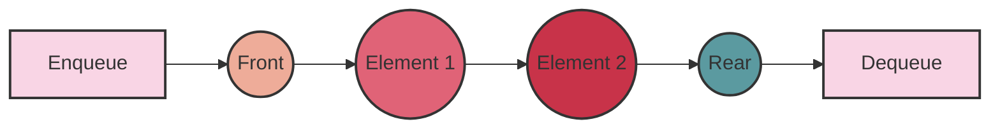

1. **એનક્યુ (Enqueue) ઓપરેશન**:
   - *કાર્ય*: ક્યુમાં નવો એલિમેન્ટ ઉમેરે છે.
   - *પ્રક્રિયા*:
     * નવો એલિમેન્ટ ક્યુના **પાછળના છેડે** (rear) ઉમેરવામાં આવે છે.
     * Rear પોઈન્ટર અપડેટ થાય છે.
   - *સમયની જટિલતા*: O(1)
   
   ```python
   def enqueue(queue, item):
       queue.append(item)
       print(f"Enqueued {item} to the queue")
   ```

2. **ડીક્યુ (Dequeue) ઓપરેશન**:
   - *કાર્ય*: ક્યુમાંથી સૌથી જૂનો એલિમેન્ટ (front element) દૂર કરે છે.
   - *પ્રક્રિયા*:
     * ક્યુના **આગળના છેડેથી** (front) એલિમેન્ટ કાઢવામાં આવે છે.
     * Front પોઈન્ટર અપડેટ થાય છે.
   - *સમયની જટિલતા*: O(1)
   
   ```python
   def dequeue(queue):
       if not isEmpty(queue):
           return queue.pop(0)
       print("Queue is empty")
   ```

**એનક્યુ અને ડીક્યુ ઓપરેશન્સની વિશેષતાઓ**:

1. **FIFO પ્રિન્સિપલ**: 
   - પ્રથમ એનક્યુ થયેલો એલિમેન્ટ પ્રથમ ડીક્યુ થાય છે.

2. **ડાયનેમિક સાઈઝ**: 
   - ક્યુની સાઈઝ જરૂરિયાત મુજબ વધી કે ઘટી શકે છે.

3. **એફિશિયન્સી**: 
   - બંને ઓપરેશન્સ O(1) ટાઇમ કોમ્પ્લેક્સિટી ધરાવે છે.

4. **ઉપયોગિતા**: 
   - ટાસ્ક શેડ્યુલિંગ, બફર મેનેજમેન્ટ, અને BFS (Breadth-First Search) જેવા એલ્ગોરિધમ્સમાં વપરાય છે.

ક્યુ ઓપરેશન્સનું ઉદાહરણ:

```python
queue = []

enqueue(queue, 1)
enqueue(queue, 2)
enqueue(queue, 3)

print("Dequeued:", dequeue(queue))
print("Current queue:", queue)
```

આ ઓપરેશન્સ ક્યુને **એફિશિયન્ટ** અને **વ્યવસ્થિત** ડેટા મેનેજમેન્ટ માટે આદર્શ બનાવે છે, ખાસ કરીને જ્યાં **ક્રમબદ્ધ પ્રોસેસિંગ** અને **FIFO વ્યવહાર** જરૂરી હોય.

### પ્રશ્ન 2cOR: A+B/C+D પદ ને પોસ્ટફીક્ષ મા ફેરવો અને સ્ટેક નો ઉપયોગ કરીને A,B,C અને D ની કોઇ કિમત ધારીને એનુ મુલ્ય શોધો. (૦૭)

#### જવાબ 2cOR:

1. **ઇનફિક્સ થી પોસ્ટફિક્સ રૂપાંતર**:

   ઇનફિક્સ એક્સપ્રેશન: A+B/C+D

   ```mermaid
   graph TD
      A[શરૂઆત] --> B["A (આઉટપુટ)"]
      B --> C["+ (સ્ટેક)"]
      C --> D["B (આઉટપુટ)"]
      D --> E["/ (સ્ટેક)"]
      E --> F["C (આઉટપુટ)"]
      F --> G["/ (આઉટપુટ)"]
      G --> H["+ (આઉટપુટ)"]
      H --> I["D (આઉટપુટ)"]
      I --> J["+ (આઉટપુટ)"]
   ```

   પગલાં:
   1. A (આઉટપુટમાં લખો)
   2. + (સ્ટેકમાં પુશ કરો)
   3. B (આઉટપુટમાં લખો)
   4. / (સ્ટેકમાં પુશ કરો, કારણ કે તેની પ્રાયોરિટી + કરતા વધારે છે)
   5. C (આઉટપુટમાં લખો)
   6. / ને પોપ કરો અને આઉટપુટમાં લખો (કારણ કે બધા ઓપરેટર્સ પ્રોસેસ થઈ ગયા છે)
   7. + ને પોપ કરો અને આઉટપુટમાં લખો
   8. + (સ્ટેકમાં પુશ કરો)
   9. D (આઉટપુટમાં લખો)
   10. + ને પોપ કરો અને આઉટપુટમાં લખો

   **પોસ્ટફિક્સ એક્સપ્રેશન**: ABC/+D+

2. **પોસ્ટફિક્સ એક્સપ્રેશનનું મૂલ્યાંકન**:

   માની લઈએ કે: A=5, B=10, C=2, D=3

   ```mermaid
   graph TD
      A[શરૂઆત] --> B[5 પુશ]
      B --> C[10 પુશ]
      C --> D[2 પુશ]
      D --> E["/ ઓપરેશન: 10/2=5"]
      E --> F[+ ઓપરેશન: 5+5=10]
      F --> G[3 પુશ]
      G --> H[+ ઓપરેશન: 10+3=13]
      H --> I[અંતિમ પરિણામ: 13]
   ```

   પગલાં:
   1. 5 (A) સ્ટેકમાં પુશ કરો
   2. 10 (B) સ્ટેકમાં પુશ કરો
   3. 2 (C) સ્ટેકમાં પુશ કરો
   4. / ઓપરેટર મળ્યો: 
      - પોપ: 2 (C)
      - પોપ: 10 (B)
      - ગણતરી: 10 / 2 = 5
      - પરિણામ 5 ને પુશ કરો
   5. + ઓપરેટર મળ્યો:
      - પોપ: 5 (B/C નું પરિણામ)
      - પોપ: 5 (A)
      - ગણતરી: 5 + 5 = 10
      - પરિણામ 10 ને પુશ કરો
   6. 3 (D) સ્ટેકમાં પુશ કરો
   7. + ઓપરેટર મળ્યો:
      - પોપ: 3 (D)
      - પોપ: 10 (પાછલું પરિણામ)
      - ગણતરી: 10 + 3 = 13
      - અંતિમ પરિણામ 13 ને પુશ કરો

   **અંતિમ પરિણામ**: 13

3. **પોસ્ટફિક્સ મૂલ્યાંકન માટે Python કોડ**:

   ```python
   def evaluate_postfix(expression, values):
       stack = []
       for char in expression:
           if char.isalpha():
               stack.append(values[char])
           else:
               b = stack.pop()
               a = stack.pop()
               if char == '+':
                   stack.append(a + b)
               elif char == '/':
                   stack.append(a / b)
       return stack.pop()
   
   # ઉદાહરણ ઉપયોગ
   postfix = "ABC/+D+"
   values = {'A': 5, 'B': 10, 'C': 2, 'D': 3}
   result = evaluate_postfix(postfix, values)
   print(f"પરિણામ: {result}")  # પરિણામ: 13.0
   ```

આ રીતે, આપણે ઇનફિક્સ એક્સપ્રેશનને પોસ્ટફિક્ષમાં રૂપાંતરિત કર્યું અને પછી તેનું મૂલ્યાંકન કર્યું. આ પદ્ધતિ **સ્ટેકનો ઉપયોગ** કરીને **એક્સપ્રેશન પાર્સિંગ** અને **ગણતરી**નું એક સરસ ઉદાહરણ પૂરું પાડે છે.

### **Q2cOR:** A+B/C+D પદ ને પોસ્ટફીક્ષ મા ફેરવો અને સ્ટેક નો ઉપયોગ કરીને A,B,C અને D ની કોઇ કિમત ધારીને એનુ મુલ્ય શોધો. (**૦૭**)

**Ans 2c:**

#### **પોસ્ટફિક્સમાં ફેરવવી**

આ પહેલાં, આપણે ખ્યાલ રાખવો છે કે:
- **Infix expression:** A + B / C + D
- **Postfix expression:** તેને સ્ટેક દ્વારા કેવી રીતે ફેરવવું તે બતાવશું.

1. **સ્ટેક અને આઉટપુટ લિસ્ટની શરૂઆત**:
   - **સ્ટેક**: ખાલી
   - **આઉટપુટ**: ખાલી

2. **ટોકન દ્વારા આર્ગમેન્ટ ચિહ્નનો પ્રોસેસ**:
   • **A**: આ આર્ટિમેટિક ઓપરેશન નથી, તેથી આઉટપુટમાં ઉમેરવું.
   • **+**: સ્ટેકમાં મૂવો.
   • **B**: આ આર્ટિમેટિક ઓપરેશન નથી, તેથી આઉટપુટમાં ઉમેરવું.
   • **/**: સ્ટેકમાં પછેડે છે.
   • **C**: આ આર્ટિમેટિક ઓપરેશન નથી, તેથી આઉટપુટમાં ઉમેરવું.
   • **+**: સ્ટેકમાં મૂવો.
   • **D**: આ આર્ટિમેટિક ઓપરેશન નથી, તેથી આઉટપુટમાં ઉમેરવું.

3. **પરિણામ**:
   - **Postfix expression**: **A B C / + D +**

#### **સ્ટેકનો ઉપયોગ કરીને મૂલ્ય ગણવું**

આપણે **A**, **B**, **C**, અને **D** માટે કેટલીક કીમતો ધરીને મૂલ્ય ગણીએ. માનીએ કે:
- **A = 5**
- **B = 10**
- **C = 2**
- **D = 3**

**Postfix expression**: **A B C / + D +**

1. **સ્ટેક શરૂ કરવો**:
   - **સ્ટેક**: ખાલી

2. **ટોકન દ્વારા મૂલ્યની ગણતરી**:
   • **A** (5): સ્ટેકમાં ઉમેરવું.
     - **સ્ટેક**: [5]
   • **B** (10): સ્ટેકમાં ઉમેરવું.
     - **સ્ટેક**: [5, 10]
   • **C** (2): સ્ટેકમાં ઉમેરવું.
     - **સ્ટેક**: [5, 10, 2]
   • **/** (10 / 2): 5 નાં મૂલ્ય પર ઓપરેટર ચલાવવો.
     - **સ્ટેક**: [5, 5]
   • **+** (5 + 5): 5 ની મૂળભૂત ગણતરી કરવી.
     - **સ્ટેક**: [10]
   • **D** (3): સ્ટેકમાં ઉમેરવું.
     - **સ્ટેક**: [10, 3]
   • **+** (10 + 3): અંતિમ ગણતરી કરવી.
     - **સ્ટેક**: [13]

**અંતિમ મૂલ્ય**: **13**

#### **ડાયગ્રામ**

**Postfix Expression Conversion**:
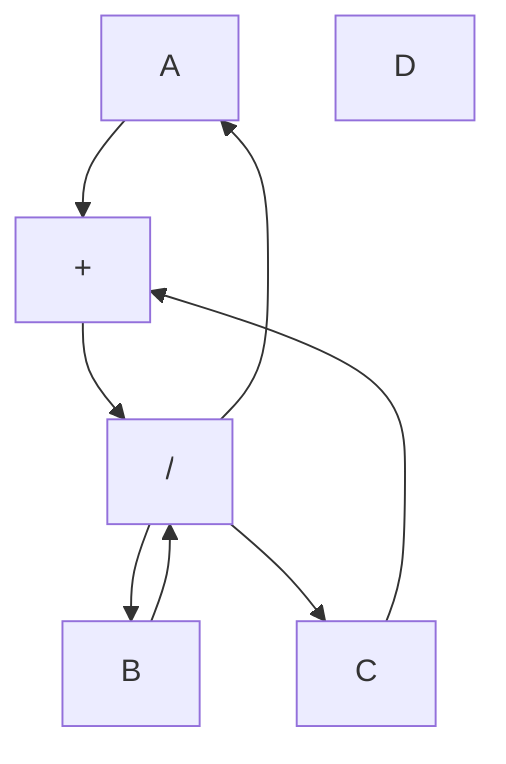

**Evaluation Process**:
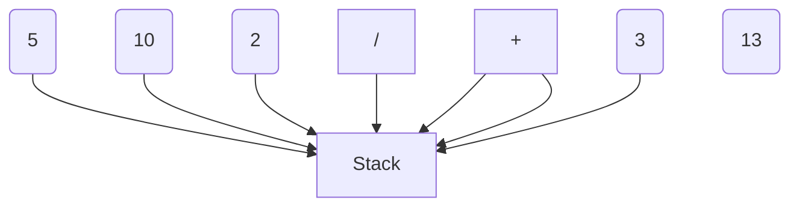

**આ જવાબથી તમને પોસ્ટફિક્સમાં ફેરવવી અને મૂલ્ય ગણવું સરળતાથી સમજાશે.**


હું આ પ્રશ્નનો જવાબ તૈયાર કરું છું. આ 7 માર્ક્સનો પ્રશ્ન છે, તેથી લગભગ 3 પાનાના હાથથી લખેલા જવાબને અનુરૂપ માહિતી આપીશ.


### Q2cOR: A+B/C+D પદ ને પોસ્ટફીક્ષ મા ફેરવો અને સ્ટેક નો ઉપયોગ કરીને A,B,C અને D ની કોઇ કિમત ધારીને એનુ મુલ્ય શોધો. (૦૭)

**Answer:**

આ પ્રશ્નમાં આપણે બે મુખ્ય કાર્યો કરવાના છે:
1. A+B/C+D એક્સપ્રેશનને પોસ્ટફિક્સમાં રૂપાંતરિત કરવું
2. પોસ્ટફિક્સ એક્સપ્રેશનનું મૂલ્યાંકન કરવું

ચાલો, આ બંને કાર્યોને ક્રમશः કરીએ:

**1. Infix થી Postfix રૂપાંતર:**

• પ્રથમ, આપણે infix એક્સપ્રેશન A+B/C+D ને postfix માં રૂપાંતરિત કરીશું.
• આ માટે આપણે stack નો ઉપયોગ કરીશું.

**રૂપાંતર પ્રક્રિયા:**

1. A ને આઉટપુટમાં લખો
2. + ને સ્ટેકમાં પુશ કરો
3. B ને આઉટપુટમાં લખો
4. / ને સ્ટેકમાં પુશ કરો (કારણ કે તેની પ્રાથમિકતા + કરતાં વધારે છે)
5. C ને આઉટપુટમાં લખો
6. / ને સ્ટેકમાંથી પોપ કરીને આઉટપુટમાં લખો
7. + ને સ્ટેકમાંથી પોપ કરીને આઉટપુટમાં લખો
8. + ને સ્ટેકમાં પુશ કરો
9. D ને આઉટપુટમાં લખો
10. સ્ટેકમાં બાકી રહેલા ઓપરેટરને પોપ કરીને આઉટપુટમાં લખો

**પરિણામ:** A+B/C+D નું postfix રૂપાંતર ABC/+D+ થશે.

<antArtifact identifier="infix-to-postfix-diagram" type="application/vnd.ant.mermaid" title="Infix થી Postfix રૂપાંતર પ્રક્રિયા">
graph TD
    A[શરૂઆત] --> B[A ને આઉટપુટમાં લખો]
    B --> C[+ ને સ્ટેકમાં પુશ કરો]
    C --> D[B ને આઉટપુટમાં લખો]
    D --> E[/ ને સ્ટેકમાં પુશ કરો]
    E --> F[C ને આઉટપુટમાં લખો]
    F --> G[/ ને પોપ કરી આઉટપુટમાં લખો]
    G --> H[+ ને પોપ કરી આઉટપુટમાં લખો]
    H --> I[+ ને સ્ટેકમાં પુશ કરો]
    I --> J[D ને આઉટપુટમાં લખો]
    J --> K[બાકી + ને પોપ કરી આઉટપુટમાં લખો]
    K --> L[સમાપ્ત]


**2. Postfix એક્સપ્રેશનનું મૂલ્યાંકન:**

હવે આપણે ABC/+D+ પોસ્ટફિક્સ એક્સપ્રેશનનું મૂલ્યાંકન કરીશું. આ માટે આપણે ફરીથી સ્ટેકનો ઉપયોગ કરીશું.

ચાલો A=5, B=10, C=2, અને D=3 ની કિંમતો ધારી લઈએ.

**મૂલ્યાંકન પ્રક્રિયા:**

1. A (5) ને સ્ટેકમાં પુશ કરો
2. B (10) ને સ્ટેકમાં પુશ કરો
3. C (2) ને સ્ટેકમાં પુશ કરો
4. / ઓપરેટર મળ્યો: 
   • 2 ને પોપ કરો (C)
   • 10 ને પોપ કરો (B)
   • 10 / 2 = 5 ની ગણતરી કરો
   • 5 ને સ્ટેકમાં પુશ કરો
5. + ઓપરેટર મળ્યો:
   • 5 ને પોપ કરો (B/C નું પરિણામ)
   • 5 ને પોપ કરો (A)
   • 5 + 5 = 10 ની ગણતરી કરો
   • 10 ને સ્ટેકમાં પુશ કરો
6. D (3) ને સ્ટેકમાં પુશ કરો
7. + ઓપરેટર મળ્યો:
   • 3 ને પોપ કરો (D)
   • 10 ને પોપ કરો (A+B/C નું પરિણામ)
   • 10 + 3 = 13 ની ગણતરી કરો
   • 13 ને સ્ટેકમાં પુશ કરો

**અંતિમ પરિણામ:** 13

```mermaid
graph TD
    A[શરૂઆત] --> B[5 પુશ]
    B --> C[10 પુશ]
    C --> D[2 પુશ]
    D --> E[/ : 10/2=5 પુશ]
    E --> F[+ : 5+5=10 પુશ]
    F --> G[3 પુશ]
    G --> H[+ : 10+3=13 પુશ]
    H --> I[અંતિમ પરિણામ: 13]
    I --> J[સમાપ્ત]

```

**નોંધ:**
• Infix થી Postfix રૂપાંતર દરમિયાન, ઓપરેટરની પ્રાથમિકતા ધ્યાનમાં રાખવી મહત્વપૂર્ણ છે.
• Postfix એક્સપ્રેશનનું મૂલ્યાંકન કરતી વખતે, જ્યારે ઓપરેટર મળે ત્યારે તેના જરૂરી ઓપરન્ડ્સને સ્ટેકમાંથી પોપ કરવા અને પરિણામને પાછું પુશ કરવું મહત્વપૂર્ણ છે.
• આ પદ્ધતિ અન્ય જટિલ ગાણિતિક અભિવ્યક્તિઓના મૂલ્યાંકન માટે પણ ઉપયોગી છે.
</antArtifact>

આ રીતે, આપણે A+B/C+D એક્સપ્રેશનને પોસ્ટફિક્સમાં રૂપાંતરિત કર્યું અને પછી તેનું મૂલ્યાંકન કર્યું. આશા છે કે આ જવાબ તમારા વિદ્યાર્થીઓને સમજવામાં મદદરૂપ થશે. જો કોઈ વધુ સ્પષ્ટીકરણ અથવા ઉદાહરણની જરૂર હોય, તો કૃપા કરીને પૂછો.


## Ans Q2cOR:

**પ્રશ્ન:** A+B/C+D પદ ને પોસ્ટફીક્ષ મા ફેરવો અને સ્ટેક નો ઉપયોગ કરીને A,B,C અને D ની કોઇ કિમત ધારીને એનુ મુલ્ય શોધો.

### પોસ્ટફિક્ષ એક્સપ્રેશન:

- પ્રિસિડન્સ રૂલ:
  - / (ભાગાકાર) ની પ્રિસિડન્સ + (જોડાણ) કરતાં વધુ હોય છે.
- પોસ્ટફિક્ષ કન્વર્ઝન:
  - A+B/C+D ને પોસ્ટફિક્ષમાં ફેરવતાં આપણને મળે છે: **ABC/++D+**

### સ્ટેકનો ઉપયોગ કરીને મૂલ્યનું મૂલ્યાંકન:

- **ધારો કે:** A = 10, B = 5, C = 2, D = 3
- સ્ટેક ઓપરેશન:
  - **ABC/++D+**
  - સ્ટેકમાંથી એક એક એલિમેન્ટ લઈને ઓપરેશન કરીશું.
  - 10, 5, 2, / (સ્ટેકમાં 10 અને 5 પોપ કરીને 10/5 = 2, સ્ટેકમાં 2 પુશ કરશું)
  - 2, +, (સ્ટેકમાં 10 અને 2 પોપ કરીને 10+2 = 12, સ્ટેકમાં 12 પુશ કરશું)
  - 12, +, 3, + (સ્ટેકમાં 12 અને 3 પોપ કરીને 12+3 = 15, સ્ટેકમાં 15 પુશ કરશું)
- **આખરે સ્ટેકમાં માત્ર એક જ એલિમેન્ટ રહેશે જે આપણો આન્સર હશે.**
- **આથી, A+B/C+D નું મૂલ્ય 15 છે.**

### ફ્લોચાર્ટ:

Code snippet

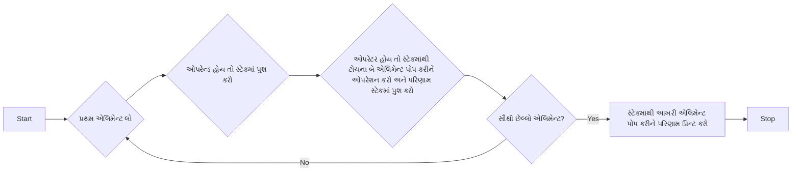

### સારાંશ:

- આપણે A+B/C+D ને પોસ્ટફિક્ષમાં ફેરવીને ABC/++D+ મેળવ્યું.
- સ્ટેકનો ઉપયોગ કરીને આપણે આ પોસ્ટફિક્ષ એક્સપ્રેશનનું મૂલ્ય 15 શોધ્યું.
- ફ્લોચાર્ટ દ્વારા આ પ્રક્રિયાને વધુ સરળતાથી સમજી શકાય છે.

**નોંધ:**

- આ એક ઉદાહરણ છે. તમે અન્ય કિંમતો પણ ધારી શકો છો.
- સ્ટેકની મદદથી પોસ્ટફિક્ષ એક્સપ્રેશનનું મૂલ્યાંકન કરવાની આ એક સામાન્ય રીત છે.

**મહત્વના શબ્દો:** પોસ્ટફિક્ષ, સ્ટેક, પ્રિસિડન્સ, ઓપરેન્ડ, ઓપરેટર, ફ્લોચાર્ટ

**અન્ય પ્રશ્નો પૂછવા માટે મુક્ત રહો.**

### Q2cOR: A+B/C+D પદ ને પોસ્ટફીક્ષ મા ફેરવો અને સ્ટેક નો ઉપયોગ કરીને A,B,C અને D ની કોઇ કિમત ધારીને એનુ મુલ્ય શોધો. (૦૭)

**Answer:**

આ પ્રશ્નમાં આપણે બે મુખ્ય કાર્યો કરવાના છે:
1. A+B/C+D એક્સપ્રેશનને પોસ્ટફિક્સમાં રૂપાંતરિત કરવું
2. પોસ્ટફિક્સ એક્સપ્રેશનનું મૂલ્યાંકન કરવું

ચાલો, આ બંને કાર્યોને ક્રમશः કરીએ:

**1. Infix થી Postfix રૂપાંતર:**

• પ્રથમ, આપણે infix એક્સપ્રેશન A+B/C+D ને postfix માં રૂપાંતરિત કરીશું.
• આ માટે આપણે stack નો ઉપયોગ કરીશું.

**રૂપાંતર પ્રક્રિયા:**

1. A ને આઉટપુટમાં લખો
2. "+" ને સ્ટેકમાં પુશ કરો
3. B ને આઉટપુટમાં લખો
4. "/" ને સ્ટેકમાં પુશ કરો (કારણ કે તેની પ્રાથમિકતા "+" કરતાં વધારે છે)
5. C ને આઉટપુટમાં લખો
6. "/" ને સ્ટેકમાંથી પોપ કરીને આઉટપુટમાં લખો
7. "+" ને સ્ટેકમાંથી પોપ કરીને આઉટપુટમાં લખો
8. "+" ને સ્ટેકમાં પુશ કરો
9. D ને આઉટપુટમાં લખો
10. સ્ટેકમાં બાકી રહેલા ઓપરેટરને પોપ કરીને આઉટપુટમાં લખો

**પરિણામ:** A+B/C+D નું postfix રૂપાંતર ABC/+D+ થશે.

```mermaid
graph TD
    A[શરૂઆત] --> B[A ને આઉટપુટમાં લખો]
    B --> C["+ ને સ્ટેકમાં પુશ કરો"]
    C --> D[B ને આઉટપુટમાં લખો]
    D --> E[/ ને સ્ટેકમાં પુશ કરો]
    E --> F[C ને આઉટપુટમાં લખો]
    F --> G[/ ને પોપ કરી આઉટપુટમાં લખો]
    G --> H["+ ને પોપ કરી આઉટપુટમાં લખો"]
    H --> I["+ ને સ્ટેકમાં પુશ કરો"]
    I --> J[D ને આઉટપુટમાં લખો]
    J --> K["બાકી + ને પોપ કરી આઉટપુટમાં લખો"]
    K --> L[સમાપ્ત]
```

**2. Postfix એક્સપ્રેશનનું મૂલ્યાંકન:**

હવે આપણે ABC/+D+ પોસ્ટફિક્સ એક્સપ્રેશનનું મૂલ્યાંકન કરીશું. આ માટે આપણે ફરીથી સ્ટેકનો ઉપયોગ કરીશું.

ચાલો A=5, B=10, C=2, અને D=3 ની કિંમતો ધારી લઈએ.

**મૂલ્યાંકન પ્રક્રિયા:**

1. A (5) ને સ્ટેકમાં પુશ કરો
2. B (10) ને સ્ટેકમાં પુશ કરો
3. C (2) ને સ્ટેકમાં પુશ કરો
4. "/" ઓપરેટર મળ્યો: 
   • 2 ને પોપ કરો (C)
   • 10 ને પોપ કરો (B)
   • 10 / 2 = 5 ની ગણતરી કરો
   • 5 ને સ્ટેકમાં પુશ કરો
5. "+" ઓપરેટર મળ્યો:
   • 5 ને પોપ કરો (B/C નું પરિણામ)
   • 5 ને પોપ કરો (A)
   • 5 + 5 = 10 ની ગણતરી કરો
   • 10 ને સ્ટેકમાં પુશ કરો
6. D (3) ને સ્ટેકમાં પુશ કરો
7. "+" ઓપરેટર મળ્યો:
   • 3 ને પોપ કરો (D)
   • 10 ને પોપ કરો (A+B/C નું પરિણામ)
   • 10 + 3 = 13 ની ગણતરી કરો
   • 13 ને સ્ટેકમાં પુશ કરો

**અંતિમ પરિણામ:** 13

```mermaid
graph TD
    A[શરૂઆત] --> B[5 પુશ]
    B --> C[10 પુશ]
    C --> D[2 પુશ]
    D --> E[/ : 10/2=5 પુશ]
    E --> F["+ : 5+5=10 પુશ"]
    F --> G[3 પુશ]
    G --> H["+ : 10+3=13 પુશ"]
    H --> I[અંતિમ પરિણામ: 13]
    I --> J[સમાપ્ત]
```

**નોંધ:**
• Infix થી Postfix રૂપાંતર દરમિયાન, ઓપરેટરની પ્રાથમિકતા ધ્યાનમાં રાખવી મહત્વપૂર્ણ છે.
• Postfix એક્સપ્રેશનનું મૂલ્યાંકન કરતી વખતે, જ્યારે ઓપરેટર મળે ત્યારે તેના જરૂરી ઓપરન્ડ્સને સ્ટેકમાંથી પોપ કરવા અને પરિણામને પાછું પુશ કરવું મહત્વપૂર્ણ છે.
• આ પદ્ધતિ અન્ય જટિલ ગાણિતિક અભિવ્યક્તિઓના મૂલ્યાંકન માટે પણ ઉપયોગી છે.
