**Q1a:** રેખીય ડેટા સ્ટ્રક્ચર વ્યાખ્યાયિત કરો અને તેના ઉદાહરણો આપો. (**૦૩**)

રેખીય ડેટા સ્ટ્રક્ચરની વ્યાખ્યા અને ઉદાહરણો:

રેખીય ડેટા સ્ટ્રક્ચર એ એવું ડેટા સ્ટ્રક્ચર છે જેમાં ડેટા elements એક પછી એક ક્રમમાં ગોઠવાયેલા હોય છે. આ પ્રકારના ડેટા સ્ટ્રક્ચરમાં, દરેક element એક જ predecessor અને એક જ successor ધરાવે છે, સિવાય કે પ્રથમ અને છેલ્લા element.

રેખીય ડેટા સ્ટ્રક્ચરની મુખ્ય લાક્ષણિકતાઓ:
1. ડેટા elements સીધી રેખામાં ગોઠવાયેલા હોય છે
2. મેમરીમાં સળંગ સ્થાનો પર સંગ્રહિત થાય છે
3. અનુક્રમિક access શક્ય છે

રેખીય ડેટા સ્ટ્રક્ચરના ઉદાહરણો:

1. Array
2. Linked List
3. Stack
4. Queue

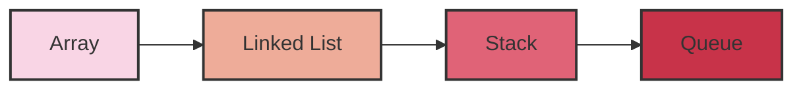

રેખીય ડેટા સ્ટ્રક્ચરનો ઉપયોગ ડેટાને વ્યવસ્થિત રીતે સંગ્રહિત કરવા અને efficient રીતે access કરવા માટે થાય છે. દરેક પ્રકારનું રેખીય ડેટા સ્ટ્રક્ચર વિશિષ્ટ કાર્યો માટે ઉપયોગી છે, જેમ કે stack નો ઉપયોગ function calls ને manage કરવા માટે થાય છે, જ્યારે queue નો ઉપયોગ scheduling tasks માટે થાય છે.

**Q1b:** ટાઇમ અને સ્પેસ કોમ્પ્લેક્ષીટી વ્યાખ્યાયિત કરો. (**૦૪**)

ટાઇમ અને સ્પેસ કોમ્પ્લેક્ષીટીની વ્યાખ્યા:

1. ટાઇમ કોમ્પ્લેક્ષીટી:
ટાઇમ કોમ્પ્લેક્ષીટી એ એલ્ગોરિધમના execution સમયનું માપ છે. તે દર્શાવે છે કે ઇનપુટના કદ વધવાની સાથે એલ્ગોરિધમને પૂર્ણ થવામાં કેટલો સમય લાગશે.

મુખ્ય મુદ્દાઓ:
- Big O notation નો ઉપયોગ કરીને વ્યક્ત કરવામાં આવે છે (દા.ત., O(n), O(log n))
- ઇનપુટના કદ સાથે એલ્ગોરિધમનો વૃદ્ધિ દર દર્શાવે છે
- લૂપ્સ, રિકર્સન અને ઓપરેશન્સની સંખ્યા પર આધારિત છે

ઉદાહરણ:
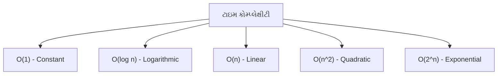

2. સ્પેસ કોમ્પ્લેક્ષીટી:
સ્પેસ કોમ્પ્લેક્ષીટી એ એલ્ગોરિધમ દ્વારા વપરાતી મેમરીનું માપ છે. તે દર્શાવે છે કે ઇનપુટના કદ વધવાની સાથે એલ્ગોરિધમને કેટલી વધારાની મેમરીની જરૂર પડશે.

મુખ્ય મુદ્દાઓ:
- Big O notation નો ઉપયોગ કરીને વ્યક્ત કરવામાં આવે છે
- વેરિએબલ્સ, ડેટા સ્ટ્રક્ચર્સ અને રિકર્સન કૉલ્સ દ્વારા વપરાતી મેમરી ગણવામાં આવે છે
- Auxiliary space (વધારાની મેમરી) અને input space નો સમાવેશ થાય છે

ઉદાહરણ:
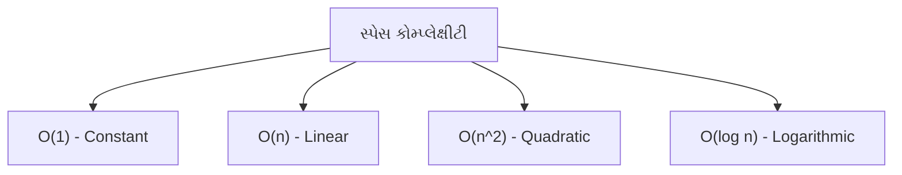

ટાઇમ અને સ્પેસ કોમ્પ્લેક્ષીટી વચ્ચે trade-off હોઈ શકે છે. ક્યારેક, વધુ મેમરીનો ઉપયોગ કરીને એલ્ગોરિધમને વધુ ઝડપી બનાવી શકાય છે, અને તેનાથી વિપરીત પણ. એલ્ગોરિધમ્સનું વિશ્લેષણ કરતી વખતે બંને પાસાઓને ધ્યાનમાં લેવા જરૂરી છે.
પ્રશ્ન 1c: ક્લાસ અને ઓબ્જેક્ટ ઉદાહરણ સાથે સમજાવો. (૦૭)

જવાબ 1c:

ક્લાસ:
• ક્લાસ એ object-oriented programming (OOP)નો મૂળભૂત building block છે.
• તે ડેટા અને મેથડ્સનું એક blueprint છે જે એક વસ્તુના લક્ષણો અને વર્તણૂકને વ્યાખ્યાયિત કરે છે.
• ક્લાસમાં attributes (properties) અને methods (functions) નો સમાવેશ થાય છે.

ઓબ્જેક્ટ:
• ઓબ્જેક્ટ એ ક્લાસનું એક instance છે.
• તે ક્લાસમાં વ્યાખ્યાયિત કરેલા ડેટા અને મેથડ્સનું એક concrete ઉદાહરણ છે.
• દરેક ઓબ્જેક્ટ પાસે પોતાના unique attributes અને methods હોય છે.

ઉદાહરણ:
આવો, 'Car' નામની ક્લાસ બનાવીને સમજીએ:

```python
class Car:
    def __init__(self, make, model, year):
        self.make = make
        self.model = model
        self.year = year
        self.speed = 0

    def accelerate(self):
        self.speed += 5

    def brake(self):
        if self.speed >= 5:
            self.speed -= 5
        else:
            self.speed = 0

    def get_info(self):
        return f"{self.year} {self.make} {self.model}, Speed: {self.speed} km/h"
```

આ ક્લાસના ઓબ્જેક્ટ્સ બનાવીએ:

```python
car1 = Car("Toyota", "Corolla", 2022)
car2 = Car("Honda", "Civic", 2023)

print(car1.get_info())  # Output: 2022 Toyota Corolla, Speed: 0 km/h
car1.accelerate()
car1.accelerate()
print(car1.get_info())  # Output: 2022 Toyota Corolla, Speed: 10 km/h

print(car2.get_info())  # Output: 2023 Honda Civic, Speed: 0 km/h
```

ક્લાસ અને ઓબ્જેક્ટના મુખ્ય મુદ્દાઓ:
• ક્લાસ એક template છે, જ્યારે ઓબ્જેક્ટ તેનું concrete instance છે.
• એક ક્લાસથી અનેક ઓબ્જેક્ટ્સ બનાવી શકાય છે.
• દરેક ઓબ્જેક્ટ પાસે પોતાના unique ડેટા હોય છે, પરંતુ તેઓ ક્લાસની methods share કરે છે.
• ઓબ્જેક્ટ્સ એકબીજાથી સ્વતંત્ર હોય છે અને તેમના attributes અલગ-અલગ હોઈ શકે છે.

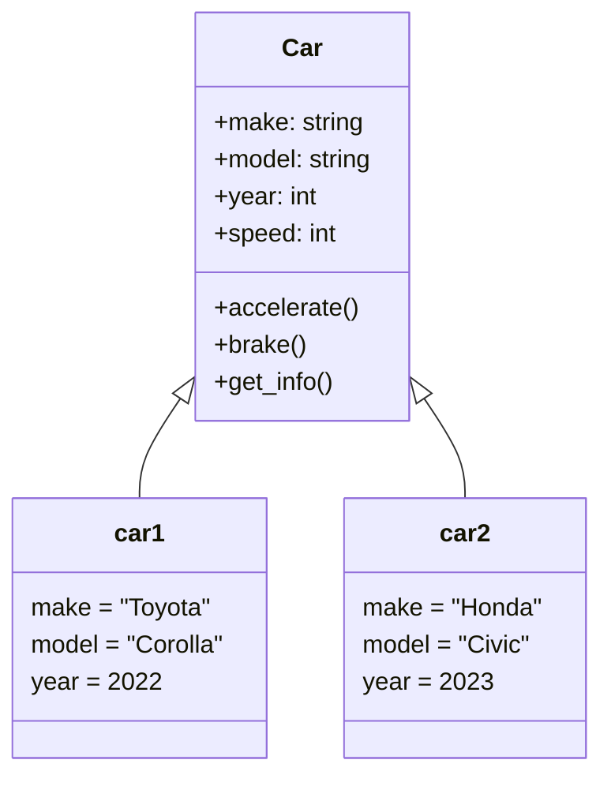

આ રીતે, ક્લાસ અને ઓબ્જેક્ટ OOP ના મહત્વના concepts છે જે કોડને વધુ સંગઠિત, પુન:ઉપયોગી અને maintain કરવા સરળ બનાવે છે.

પ્રશ્ન 1cOR: ઇંસ્ટંસ મેથડ, ક્લાસ મેથડ અને સ્ટેટીક મેથડ ઉદાહરણ સાથે સમજાવો. (૦૭)

જવાબ 1cOR:

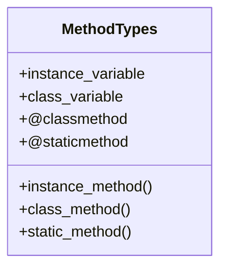

1. ઇંસ્ટંસ મેથડ:
   • ઓબ્જેક્ટ પર કાર્ય કરે છે
   • પ્રથમ પેરામીટર તરીકે 'self' લે છે
   • ઓબ્જેક્ટના સ્પેસિફિક ડેટા સાથે કામ કરે છે
   • ઉદાહરણ:
     ```python
     class Car:
         def __init__(self, model):
             self.model = model
         
         def get_model(self):
             return f"The car model is {self.model}"
     
     my_car = Car("Toyota")
     print(my_car.get_model())  # Output: The car model is Toyota
     ```

2. ક્લાસ મેથડ:
   • ક્લાસ પર કાર્ય કરે છે, ઓબ્જેક્ટ પર નહીં
   • @classmethod ડેકોરેટર સાથે વ્યાખ્યાયિત થાય છે
   • પ્રથમ પેરામીટર તરીકે 'cls' (ક્લાસ) લે છે
   • ક્લાસ વેરિએબલ્સ સાથે કામ કરે છે
   • ઉદાહરણ:
     ```python
     class Student:
         school = "ABC School"
         
         @classmethod
         def change_school(cls, new_school):
             cls.school = new_school
     
     Student.change_school("XYZ School")
     print(Student.school)  # Output: XYZ School
     ```

3. સ્ટેટીક મેથડ:
   • ન તો ક્લાસ કે ન તો ઓબ્જેક્ટ સાથે જોડાયેલ હોય છે
   • @staticmethod ડેકોરેટર સાથે વ્યાખ્યાયિત થાય છે
   • 'self' કે 'cls' પેરામીટર લેતી નથી
   • ક્લાસ કે ઇન્સ્ટન્સ ડેટા સાથે કામ કરતી નથી
   • ઉદાહરણ:
     ```python
     class MathOperations:
         @staticmethod
         def add(x, y):
             return x + y
     
     print(MathOperations.add(5, 3))  # Output: 8
     ```

તફાવતો:
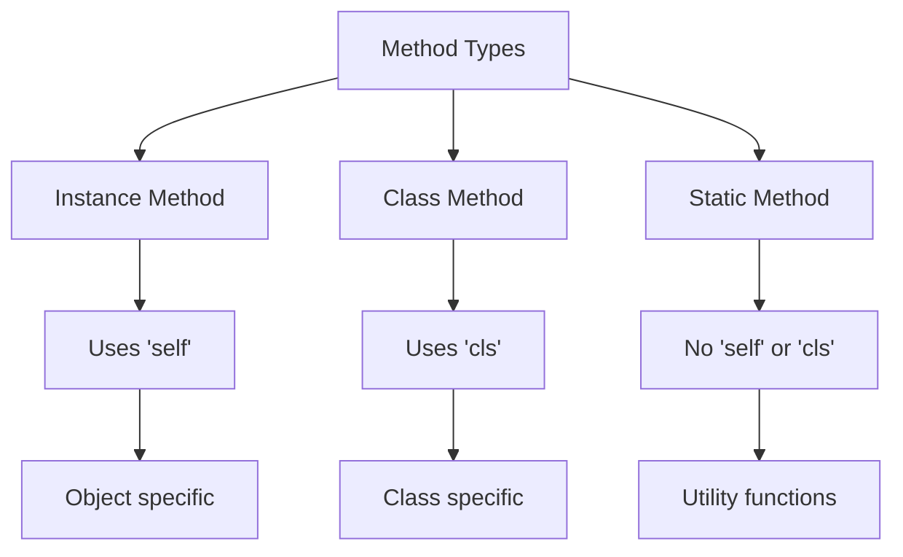

• ઇંસ્ટંસ મેથડ: ઓબ્જેક્ટ-સ્પેસિફિક ડેટા સાથે કામ કરે છે
• ક્લાસ મેથડ: ક્લાસ-સ્પેસિફિક ડેટા સાથે કામ કરે છે
• સ્ટેટીક મેથડ: કોઈ સ્પેસિફિક ડેટા સાથે કામ કરતી નથી, સામાન્ય utility functions તરીકે વપરાય છે

આ ત્રણેય પ્રકારની મેથડ્સ કોડને વધુ સંગઠિત અને વ્યવસ્થિત બનાવવામાં મદદ કરે છે, જે OOP ના સિદ્ધાંતોને અનુરૂપ છે.

### પ્રશ્ન 2a: રીકર્ઝીવ ફંકશન નો કોંસેપ્ટ સમજાવો. (૦૩)

#### જવાબ 2a:

રીકર્ઝીવ ફંકશન એ એવું ફંકશન છે જે **પોતાને જ કૉલ કરે છે**. આ કોન્સેપ્ટ પ્રોગ્રામિંગમાં ખૂબ જ મહત્વપૂર્ણ છે.

રીકર્ઝીવ ફંકશનના મુખ્ય ઘટકો:

1. **બેસ કેસ**: 
   - રીકર્ઝનને અટકાવવા માટેનો કેસ
   - ફંકશનને આગળ કૉલ કરવાની જરૂર નથી પડતી

2. **રીકર્ઝીવ કૉલ**: 
   - ફંકશન પોતાને જ કૉલ કરે છે
   - દરેક કૉલ સાથે પ્રોબ્લેમનું કદ ઘટતું જાય છે

3. **પ્રગતિ**: 
   - દરેક રીકર્ઝીવ કૉલ બેસ કેસ તરફ આગળ વધે છે

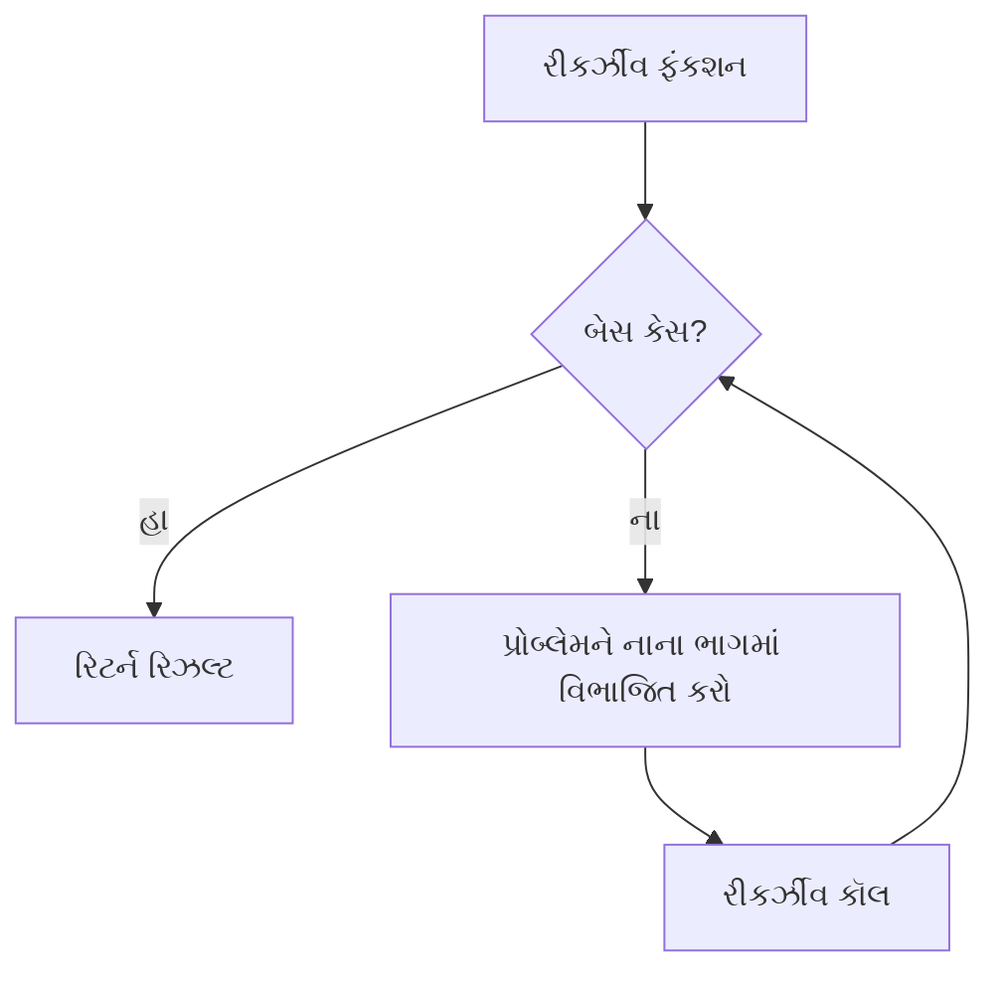

**ઉદાહરણ**: ફેક્ટોરિયલ ગણતરી

```python
def factorial(n):
    if n == 0 or n == 1:  # બેસ કેસ
        return 1
    else:
        return n * factorial(n-1)  # રીકર્ઝીવ કૉલ
```

રીકર્ઝીવ ફંકશન્સ **જટિલ પ્રોબ્લેમ્સને** સરળ અને **વાંચવામાં સહેલા** કોડમાં ઉકેલવામાં મદદ કરે છે, પરંતુ તેમનો ઉપયોગ કાળજીપૂર્વક કરવો જોઈએ કારણ કે તેઓ **મેમરી અને પ્રોસેસિંગ પાવર**નો વધુ ઉપયોગ કરી શકે છે.

### પ્રશ્ન 2b: સ્ટેક અને ક્યુ વ્યાખ્યાયિત કરો. (૦૪)

#### જવાબ 2b:

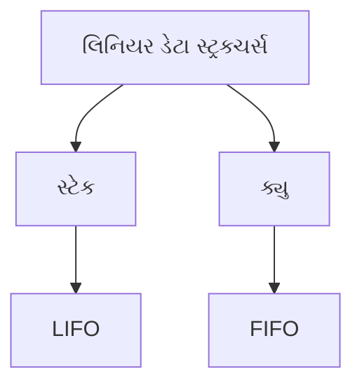

1. **સ્ટેક (Stack)**:
   - સ્ટેક એક **LIFO** (Last In First Out) પ્રકારનું ડેટા સ્ટ્રક્ચર છે.
   - મુખ્ય ઓપરેશન્સ:
     * **Push**: નવો એલિમેન્ટ ટોચ પર ઉમેરે છે
     * **Pop**: ટોચ પરનો એલિમેન્ટ દૂર કરે છે
   - ઉપયોગ: ફંક્શન કૉલ્સ, undo મેકેનિઝમ, એક્સપ્રેશન ઇવેલ્યુએશન

   ```python
   stack = []
   stack.append(1)  # Push
   stack.append(2)
   top_element = stack.pop()  # Pop
   ```

2. **ક્યુ (Queue)**:
   - ક્યુ એક **FIFO** (First In First Out) પ્રકારનું ડેટા સ્ટ્રક્ચર છે.
   - મુખ્ય ઓપરેશન્સ:
     * **Enqueue**: નવો એલિમેન્ટ પાછળથી ઉમેરે છે
     * **Dequeue**: આગળથી એલિમેન્ટ દૂર કરે છે
   - ઉપયોગ: પ્રિન્ટ જોબ્સ, પ્રોસેસ શેડ્યુલિંગ, બફર્સ

   ```python
   from collections import deque
   queue = deque()
   queue.append(1)  # Enqueue
   queue.append(2)
   front_element = queue.popleft()  # Dequeue
   ```

**સ્ટેક અને ક્યુ વચ્ચેનો તફાવત**:

| સ્ટેક                         | ક્યુ                                 |
| --------------------------- | ---------------------------------- |
| LIFO પ્રિન્સિપલ               | FIFO પ્રિન્સિપલ                      |
| એક જ એન્ડથી ઇન્સર્શન અને ડિલિશન | એક એન્ડથી ઇન્સર્શન, બીજા એન્ડથી ડિલિશન |
| ટોપ એલિમેન્ટ એક્સેસ થાય છે       | ફ્રન્ટ અને રિયર એલિમેન્ટ્સ એક્સેસ થાય છે    |

બંને ડેટા સ્ટ્રક્ચર્સ **લિનિયર** છે અને **વિશિષ્ટ એપ્લિકેશન્સ**માં ઉપયોગી છે. તેમનો યોગ્ય ઉપયોગ **એફિશિયન્ટ ડેટા મેનેજમેન્ટ** અને **અલ્ગોરિધમ ડિઝાઇન**માં મદદ કરે છે.

### પ્રશ્ન 2c: સ્ટેક ના બેઝિક ઓપરેશન સમજાવો. (૦૭)

#### જવાબ 2c:

સ્ટેક એક મહત્વપૂર્ણ ડેટા સ્ટ્રક્ચર છે જે LIFO (Last In First Out) પ્રિન્સિપલ પર કાર્ય કરે છે. સ્ટેકના મુખ્ય બેઝિક ઓપરેશન્સ નીચે મુજબ છે:

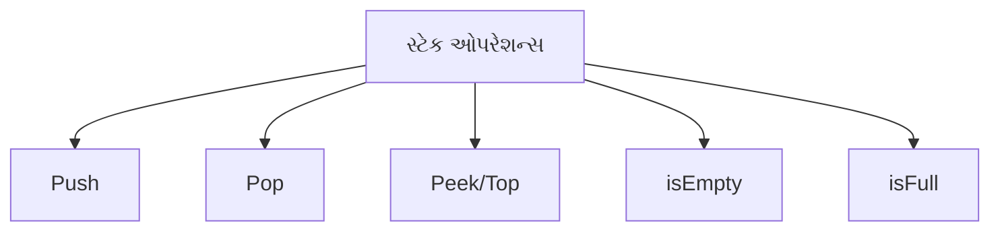

1. **Push ઓપરેશન**:
   - *કાર્ય*: સ્ટેકમાં નવો એલિમેન્ટ ઉમેરે છે.
   - *પ્રક્રિયા*: 
     * નવો એલિમેન્ટ સ્ટેકની ટોચ પર ઉમેરવામાં આવે છે.
     * ટોપ પોઇન્ટર એક વધારવામાં આવે છે.
   - *સમયની જટિલતા*: O(1)
   
   ```python
   def push(stack, item):
       stack.append(item)
       print(f"Pushed {item} to the stack")
   ```

2. **Pop ઓપરેशન**:
   - *કાર્ય*: સ્ટેકમાંથી ટોચનો એલિમેન્ટ દૂર કરે છે.
   - *પ્રક્રિયા*: 
     * સ્ટેકની ટોચ પરનો એલિમેન્ટ રિટર્ન કરવામાં આવે છે અને દૂર કરવામાં આવે છે.
     * ટોપ પોઇન્ટર એક ઘટાડવામાં આવે છે.
   - *સમયની જટિલતા*: O(1)
   
   ```python
   def pop(stack):
       if not isEmpty(stack):
           return stack.pop()
       print("Stack is empty")
   ```

3. **Peek/Top ઓપરેશન**:
   - *કાર્ય*: સ્ટેકના ટોચના એલિમેન્ટને જોવા માટે.
   - *પ્રક્રિયા*: ટોચના એલિમેન્ટને દૂર કર્યા વિના રિટર્ન કરે છે.
   - *સમયની જટિલતા*: O(1)
   
   ```python
   def peek(stack):
       if not isEmpty(stack):
           return stack[-1]
       print("Stack is empty")
   ```

4. **isEmpty ઓપરેશન**:
   - *કાર્ય*: સ્ટેક ખાલી છે કે નહીં તે ચકાસે છે.
   - *પ્રક્રિયા*: જો સ્ટેકમાં કોઈ એલિમેન્ટ નથી તો true રિટર્ન કરે છે.
   - *સમયની જટિલતા*: O(1)
   
   ```python
   def isEmpty(stack):
       return len(stack) == 0
   ```

5. **isFull ઓપરેશન** (જો સ્ટેક ફિક્સ્ડ સાઇઝનો હોય તો):
   - *કાર્ય*: સ્ટેક પૂર્ણ ભરેલો છે કે નહીં તે ચકાસે છે.
   - *પ્રક્રિયા*: જો સ્ટેકની સાઇઝ મહત્તમ કેપેસિટી સુધી પહોંચી ગઈ હોય તો true રિટર્ન કરે છે.
   - *સમયની જટિલતા*: O(1)
   
   ```python
   def isFull(stack, capacity):
       return len(stack) == capacity
   ```

**સ્ટેક ઓપરેશન્સનું ઉદાહરણ**:

```python
stack = []
capacity = 3

push(stack, 1)
push(stack, 2)
push(stack, 3)

print("Top element:", peek(stack))
print("Popped:", pop(stack))
print("Is stack empty?", isEmpty(stack))
print("Is stack full?", isFull(stack, capacity))
```

આ બેઝિક ઓપરેશન્સ સ્ટેકને **એફિશિયન્ટ અને ફ્લેક્સિબલ** ડેટા સ્ટ્રક્ચર બનાવે છે. તેઓ **O(1) ટાઇમ કોમ્પ્લેક્સિટી** ધરાવે છે, જે તેમને ઘણી એપ્લિકેશન્સ માટે આદર્શ બનાવે છે. સ્ટેક **ફંક્શન કૉલ્સ**, **એક્સપ્રેશન ઇવેલ્યુએશન**, અને **ઉંડો મેકેનિઝમ** જેવા કાર્યો માટે વ્યાપકપણે ઉપયોગમાં લેવાય છે.
### પ્રશ્ન 2aOR: સિંગ્લી લિંક્ડ લિસ્ટ વ્યાખ્યાયિત કરો. (૦૩)

#### જવાબ 2aOR:

સિંગ્લી લિંક્ડ લિસ્ટ એક **લિનિયર ડેટા સ્ટ્રક્ચર** છે જેમાં એલિમેન્ટ્સ (નોડ્સ) એક પછી એક જોડાયેલા હોય છે.

**મુખ્ય લક્ષણો**:

1. **નોડ્સની રચના**:
   - **ડેટા**: એલિમેન્ટની વેલ્યુ સ્ટોર કરે છે
   - **નેક્સ્ટ પોઈન્ટર**: આગળના નોડનું એડ્રેસ ધરાવે છે

2. **લિંકિંગ**:
   - દરેક નોડ માત્ર આગળના નોડને પોઈન્ટ કરે છે
   - છેલ્લો નોડ NULL ને પોઈન્ટ કરે છે

3. **હેડ પોઈન્ટર**:
   - પ્રથમ નોડને પોઈન્ટ કરે છે
   - લિસ્ટની શરૂઆત દર્શાવે છે


**સિંગ્લી લિંક્ડ લિસ્ટના ફાયદા**:
- **ડાયનેમિક સાઈઝ**: મેમરીનો *એફિશિયન્ટ* ઉપયોગ
- **ઈન્સર્શન/ડિલીશન**: *O(1)* ટાઇમ કોમ્પ્લેક્સિટી (જો પોઝિશન જાણીતી હોય તો)

**મર્યાદાઓ**:
- **રિવર્સ ટ્રાવર્સલ**: શક્ય નથી
- **રેન્ડમ એક્સેસ**: *O(n)* ટાઇમ કોમ્પ્લેક્સિટી

સિંગ્લી લિંક્ડ લિસ્ટ્સ **સ્ટેક્સ**, **ક્યૂઝ**, અને **હેશ ટેબલ્સ** જેવા અન્ય ડેટા સ્ટ્રક્ચર્સના આધાર તરીકે વપરાય છે. તેઓ **મેમરી મેનેજમેન્ટ** અને **ડાયનેમિક ડેટા સ્ટોરેજ**માં પણ મહત્વપૂર્ણ ભૂમિકા ભજવે છે.

### પ્રશ્ન 2bOR: ક્યુ ઉપર એનક્યુ ડીક્યુ ઓપરેશન સમજાવો. (૦૪)

#### જવાબ 2bOR:

ક્યુ એ FIFO (First In First Out) પ્રિન્સિપલ પર આધારિત લિનિયર ડેટા સ્ટ્રક્ચર છે. એનક્યુ અને ડીક્યુ ક્યુના બે મુખ્ય ઓપરેશન્સ છે.

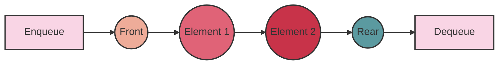

1. **એનક્યુ (Enqueue) ઓપરેશન**:
   - *કાર્ય*: ક્યુમાં નવો એલિમેન્ટ ઉમેરે છે.
   - *પ્રક્રિયા*:
     * નવો એલિમેન્ટ ક્યુના **પાછળના છેડે** (rear) ઉમેરવામાં આવે છે.
     * Rear પોઈન્ટર અપડેટ થાય છે.
   - *સમયની જટિલતા*: O(1)
   
   ```python
   def enqueue(queue, item):
       queue.append(item)
       print(f"Enqueued {item} to the queue")
   ```

2. **ડીક્યુ (Dequeue) ઓપરેશન**:
   - *કાર્ય*: ક્યુમાંથી સૌથી જૂનો એલિમેન્ટ (front element) દૂર કરે છે.
   - *પ્રક્રિયા*:
     * ક્યુના **આગળના છેડેથી** (front) એલિમેન્ટ કાઢવામાં આવે છે.
     * Front પોઈન્ટર અપડેટ થાય છે.
   - *સમયની જટિલતા*: O(1)
   
   ```python
   def dequeue(queue):
       if not isEmpty(queue):
           return queue.pop(0)
       print("Queue is empty")
   ```

**એનક્યુ અને ડીક્યુ ઓપરેશન્સની વિશેષતાઓ**:

1. **FIFO પ્રિન્સિપલ**: 
   - પ્રથમ એનક્યુ થયેલો એલિમેન્ટ પ્રથમ ડીક્યુ થાય છે.

2. **ડાયનેમિક સાઈઝ**: 
   - ક્યુની સાઈઝ જરૂરિયાત મુજબ વધી કે ઘટી શકે છે.

3. **એફિશિયન્સી**: 
   - બંને ઓપરેશન્સ O(1) ટાઇમ કોમ્પ્લેક્સિટી ધરાવે છે.

4. **ઉપયોગિતા**: 
   - ટાસ્ક શેડ્યુલિંગ, બફર મેનેજમેન્ટ, અને BFS (Breadth-First Search) જેવા એલ્ગોરિધમ્સમાં વપરાય છે.

ક્યુ ઓપરેશન્સનું ઉદાહરણ:

```python
queue = []

enqueue(queue, 1)
enqueue(queue, 2)
enqueue(queue, 3)

print("Dequeued:", dequeue(queue))
print("Current queue:", queue)
```

આ ઓપરેશન્સ ક્યુને **એફિશિયન્ટ** અને **વ્યવસ્થિત** ડેટા મેનેજમેન્ટ માટે આદર્શ બનાવે છે, ખાસ કરીને જ્યાં **ક્રમબદ્ધ પ્રોસેસિંગ** અને **FIFO વ્યવહાર** જરૂરી હોય.

### Q2cOR: A+B/C+D પદ ને પોસ્ટફીક્ષ મા ફેરવો અને સ્ટેક નો ઉપયોગ કરીને A,B,C અને D ની કોઇ કિમત ધારીને એનુ મુલ્ય શોધો. (૦૭)

**Answer:**

આ પ્રશ્નમાં આપણે બે મુખ્ય કાર્યો કરવાના છે:
1. A+B/C+D એક્સપ્રેશનને પોસ્ટફિક્સમાં રૂપાંતરિત કરવું
2. પોસ્ટફિક્સ એક્સપ્રેશનનું મૂલ્યાંકન કરવું

ચાલો, આ બંને કાર્યોને ક્રમશ: કરીએ:

**1. Infix થી Postfix રૂપાંતર:**

• પ્રથમ, આપણે infix એક્સપ્રેશન A+B/C+D ને postfix માં રૂપાંતરિત કરીશું.
• આ માટે આપણે stack નો ઉપયોગ કરીશું.

**રૂપાંતર પ્રક્રિયા:**

1. A ને આઉટપુટમાં લખો
2. "+" ને સ્ટેકમાં પુશ કરો
3. B ને આઉટપુટમાં લખો
4. "/" ને સ્ટેકમાં પુશ કરો (કારણ કે તેની પ્રાથમિકતા "+" કરતાં વધારે છે)
5. C ને આઉટપુટમાં લખો
6. "/" ને સ્ટેકમાંથી પોપ કરીને આઉટપુટમાં લખો
7. "+" ને સ્ટેકમાંથી પોપ કરીને આઉટપુટમાં લખો
8. "+" ને સ્ટેકમાં પુશ કરો
9. D ને આઉટપુટમાં લખો
10. સ્ટેકમાં બાકી રહેલા ઓપરેટરને પોપ કરીને આઉટપુટમાં લખો

**પરિણામ:** A+B/C+D નું postfix રૂપાંતર ABC/+D+ થશે.

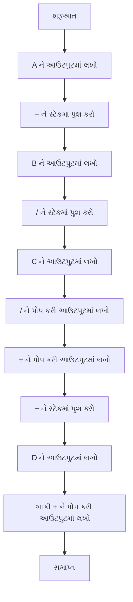

**2. Postfix એક્સપ્રેશનનું મૂલ્યાંકન:**

હવે આપણે ABC/+D+ પોસ્ટફિક્સ એક્સપ્રેશનનું મૂલ્યાંકન કરીશું. આ માટે આપણે ફરીથી સ્ટેકનો ઉપયોગ કરીશું.

ચાલો A=5, B=10, C=2, અને D=3 ની કિંમતો ધારી લઈએ.

**મૂલ્યાંકન પ્રક્રિયા:**

1. A (5) ને સ્ટેકમાં પુશ કરો
2. B (10) ને સ્ટેકમાં પુશ કરો
3. C (2) ને સ્ટેકમાં પુશ કરો
4. "/" ઓપરેટર મળ્યો: 
   • 2 ને પોપ કરો (C)
   • 10 ને પોપ કરો (B)
   • 10 / 2 = 5 ની ગણતરી કરો
   • 5 ને સ્ટેકમાં પુશ કરો
5. "+" ઓપરેટર મળ્યો:
   • 5 ને પોપ કરો (B/C નું પરિણામ)
   • 5 ને પોપ કરો (A)
   • 5 + 5 = 10 ની ગણતરી કરો
   • 10 ને સ્ટેકમાં પુશ કરો
6. D (3) ને સ્ટેકમાં પુશ કરો
7. "+" ઓપરેટર મળ્યો:
   • 3 ને પોપ કરો (D)
   • 10 ને પોપ કરો (A+B/C નું પરિણામ)
   • 10 + 3 = 13 ની ગણતરી કરો
   • 13 ને સ્ટેકમાં પુશ કરો

**અંતિમ પરિણામ:** 13

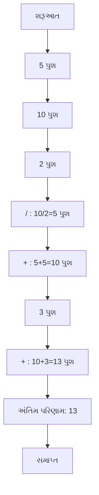

**નોંધ:**
• Infix થી Postfix રૂપાંતર દરમિયાન, ઓપરેટરની પ્રાથમિકતા ધ્યાનમાં રાખવી મહત્વપૂર્ણ છે.
• Postfix એક્સપ્રેશનનું મૂલ્યાંકન કરતી વખતે, જ્યારે ઓપરેટર મળે ત્યારે તેના જરૂરી ઓપરન્ડ્સને સ્ટેકમાંથી પોપ કરવા અને પરિણામને પાછું પુશ કરવું મહત્વપૂર્ણ છે.
• આ પદ્ધતિ અન્ય જટિલ ગાણિતિક અભિવ્યક્તિઓના મૂલ્યાંકન માટે પણ ઉપયોગી છે.

### Q3a: લિંક્ડ લિસ્ટ ના ઉપયોગો લખો. (૦૩)

**Answer:**

લિંક્ડ લિસ્ટ એ એક મહત્વપૂર્ણ ડેટા સ્ટ્રક્ચર છે જેના અનેક ઉપયોગો છે. અહીં કેટલાક મુખ્ય ઉપયોગો આપેલા છે:

1. **ડાયનેમિક મેમરી એલોકેશન**
   - લિંક્ડ લિસ્ટ રન-ટાઇમ પર મેમરી ફાળવણી અને મુક્તિ માટે ઉપયોગી છે.
   - તે ડેટાના કદ અનુસાર મેમરી વધારવા કે ઘટાડવામાં સરળતા આપે છે.

2. **સ્ટેક અને ક્યૂ નું અમલીકરણ**
   - લિંક્ડ લિસ્ટનો ઉપયોગ કરીને સ્ટેક અને ક્યૂ જેવા ડેટા સ્ટ્રક્ચર્સ સરળતાથી implement કરી શકાય છે.
   - આ ઉપયોગ ફંક્શન કોલ્સ, ઇવેન્ટ હેન્ડલિંગ અને ટાસ્ક શેડ્યૂલિંગમાં થાય છે.

3. **ઇમેજ વ્યુઅર**
   - ફોટો ગેલેરી એપ્લિકેશનમાં આગળ-પાછળ નેવિગેશન માટે.
   - મલ્ટી-લેયર ઇમેજ એડિટિંગ સોફ્ટવેરમાં લેયર્સ મેનેજ કરવા માટે.

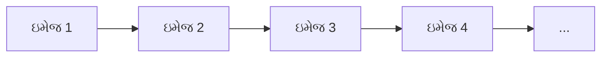

4. **મ્યુઝિક પ્લેયર પ્લેલિસ્ટ**
   - ગીતોની યાદી બનાવવા અને મેનેજ કરવા માટે.
   - શફલ અને રિપીટ મોડ જેવી સુવિધાઓ આસાનીથી implement કરી શકાય છે.

5. **પોલિનોમિયલ એડિશન અને મલ્ટિપ્લિકેશન**
   - બહુપદી સમીકરણોના સરવાળા અને ગુણાકાર માટે.
   - દરેક નોડ એક પદનું પ્રતિનિધિત્વ કરે છે.

6. **હેશ ટેબલ્સમાં કોલિઝન રિઝોલ્યુશન**
   - ઓપન હેશિંગમાં, એક જ હેશ વેલ્યુ ધરાવતા એલિમેન્ટ્સને લિંક્ડ લિસ્ટમાં સ્ટોર કરવામાં આવે છે.

7. **ગ્રાફ રિપ્રેઝન્ટેશન**
   - એડજેસન્સી લિસ્ટ તરીકે ગ્રાફને રજૂ કરવા માટે.
   - નેટવર્ક ટોપોલોજી અને સોશિયલ નેટવર્ક એનાલિસિસમાં ઉપયોગી.

8. **ઓપરેટિંગ સિસ્ટમ્સમાં**
   - ફાઇલ સિસ્ટમ્સમાં ડિસ્ક બ્લોક્સ મેનેજ કરવા.
   - પ્રોસેસ શેડ્યૂલિંગમાં રેડી અને બ્લોક્ડ પ્રોસેસની યાદી રાખવા.

આ ઉપયોગો લિંક્ડ લિસ્ટની વર્સેટાઇલ નેચર દર્શાવે છે, જે તેને વિવિધ એપ્લિકેશન્સમાં ઉપયોગી બનાવે છે.

### Q3b: પાયથનમા સિંગ્લી લિંક્ડ લિસ્ટ કેવી રીતે બનાવી શકાય એ સમજાવો. (૦૪)

**Answer:**

પાયથનમાં સિંગ્લી લિંક્ડ લિસ્ટ બનાવવા માટે આપણે બે મુખ્ય ઘટકોની જરૂર પડે છે: Node ક્લાસ અને LinkedList ક્લાસ. ચાલો આ બંને ઘટકોને વિગતવાર સમજીએ:

1. **Node ક્લાસ:**
   - દરેક નોડમાં બે attributes હોય છે: data અને next.
   - data એ નોડમાં સ્ટોર થયેલી માહિતી છે.
   - next એ પછીના નોડનો reference છે.

```python
class Node:
    def __init__(self, data):
        self.data = data
        self.next = None
```

2. **LinkedList ક્લાસ:**
   - આ ક્લાસ લિંક્ડ લિસ્ટની મુખ્ય કાર્યક્ષમતા પ્રદાન કરે છે.
   - તેમાં head નામનું attribute હોય છે, જે પ્રથમ નોડને પોઈન્ટ કરે છે.

```python
class LinkedList:
    def __init__(self):
        self.head = None

    def append(self, data):
        new_node = Node(data)
        if not self.head:
            self.head = new_node
            return
        current = self.head
        while current.next:
            current = current.next
        current.next = new_node

    def display(self):
        current = self.head
        while current:
            print(current.data, end=" -> ")
            current = current.next
        print("None")
```

3. **લિંક્ડ લિસ્ટનો ઉપયોગ:**
   - હવે આપણે LinkedList ક્લાસનો ઉપયોગ કરીને લિંક્ડ લિસ્ટ બનાવી શકીએ છીએ.

```python
# લિંક્ડ લિસ્ટ બનાવવી
my_list = LinkedList()

# નોડ્સ ઉમેરવા
my_list.append(10)
my_list.append(20)
my_list.append(30)

# લિંક્ડ લિસ્ટ પ્રદર્શિત કરવી
my_list.display()  # આઉટપુટ: 10 -> 20 -> 30 -> None
```

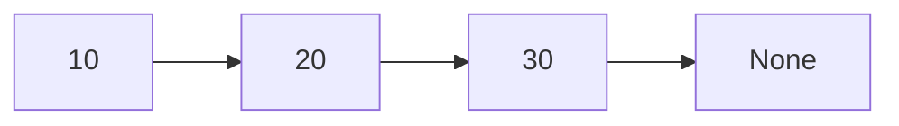

**મહત્વપૂર્ણ મુદ્દાઓ:**

- સિંગ્લી લિંક્ડ લિસ્ટમાં, દરેક નોડ માત્ર તેના પછીના નોડને જ પોઈન્ટ કરે છે.
- `append()` મેથડ નવા નોડને લિસ્ટના અંતે ઉમેરે છે.
- `display()` મેથડ લિસ્ટના બધા એલિમેન્ટ્સને પ્રિન્ટ કરે છે.
- લિંક્ડ લિસ્ટનો છેલ્લો નોડ None ને પોઈન્ટ કરે છે, જે લિસ્ટનો અંત સૂચવે છે.
- આ પ્રકારની implementation dynamic મેમરી એલોકેશનનો લાભ લે છે, જેથી લિસ્ટનું કદ runtime પર વધારી કે ઘટાડી શકાય છે.

આ રીતે, પાયથનમાં સિંગ્લી લિંક્ડ લિસ્ટ બનાવવામાં આવે છે. તેના પર વધુ ઓપરેશન્સ જેવા કે insertion, deletion, searching વગેરે implement કરી શકાય છે.

### Q3c: સિંગ્લી લિંક્ડ લિસ્ટ ની શરૂઆતમાં અને અંતમાં નવા નોડ ઉમેરવાનો કોડ લખો. (૦૭)

**Answer:**

સિંગ્લી લિંક્ડ લિસ્ટની શરૂઆતમાં અને અંતમાં નવા નોડ ઉમેરવા માટે આપણે બે અલગ મેથડ્સ લખીશું: `insert_at_beginning()` અને `insert_at_end()`. આ બંને મેથડ્સને LinkedList ક્લાસમાં ઉમેરીશું. ચાલો, આખો કોડ જોઈએ:

```python
class Node:
    def __init__(self, data):
        self.data = data
        self.next = None

class LinkedList:
    def __init__(self):
        self.head = None

    def insert_at_beginning(self, data):
        new_node = Node(data)
        new_node.next = self.head
        self.head = new_node

    def insert_at_end(self, data):
        new_node = Node(data)
        if not self.head:
            self.head = new_node
            return
        current = self.head
        while current.next:
            current = current.next
        current.next = new_node

    def display(self):
        current = self.head
        while current:
            print(current.data, end=" -> ")
            current = current.next
        print("None")

# લિંક્ડ લિસ્ટનો ઉપયોગ
my_list = LinkedList()

# શરૂઆતમાં નોડ ઉમેરવા
my_list.insert_at_beginning(10)
my_list.insert_at_beginning(5)
my_list.display()  # આઉટપુટ: 5 -> 10 -> None

# અંતમાં નોડ ઉમેરવા
my_list.insert_at_end(15)
my_list.insert_at_end(20)
my_list.display()  # આઉટપુટ: 5 -> 10 -> 15 -> 20 -> None
```

હવે આપણે દરેક મેથડને વિગતવાર સમજીએ:

1. **`insert_at_beginning(data)` મેથડ:**
   - નવો નોડ બનાવે છે.
   - નવા નોડના `next`ને વર્તમાન `head`ને પોઇન્ટ કરાવે છે.
   - `head`ને નવા નોડ પર સેટ કરે છે.


2. **`insert_at_end(data)` મેથડ:**
   - નવો નોડ બનાવે છે.
   - જો લિસ્ટ ખાલી હોય, તો નવા નોડને `head` બનાવે છે.
   - અન્યથા, છેલ્લા નોડ સુધી જાય છે.
   - છેલ્લા નોડના `next`ને નવા નોડ પર સેટ કરે છે.

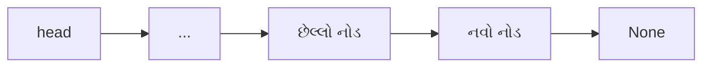

**મહત્વપૂર્ણ મુદ્દાઓ:**

- `insert_at_beginning()` મેથડ O(1) સમય જટિલતા ધરાવે છે, કારણ કે તે હંમેશા એક જ ઓપરેશન કરે છે.
- `insert_at_end()` મેથડ O(n) સમય જટિલતા ધરાવે છે, જ્યાં n એ લિસ્ટમાં નોડ્સની સંખ્યા છે, કારણ કે તેણે છેલ્લા નોડ સુધી જવું પડે છે.
- બંને મેથડ્સ લિસ્ટ ખાલી હોય કે ન હોય તે બંને કેસ હેન્ડલ કરે છે.
- `display()` મેથડ લિસ્ટના બધા એલિમેન્ટ્સને પ્રિન્ટ કરે છે, જેથી આપણે જોઈ શકીએ કે નવા નોડ્સ યોગ્ય રીતે ઉમેરાયા છે કે નહીં.

આ રીતે, આપણે સિંગ્લી લિંક્ડ લિસ્ટની શરૂઆતમાં અને અંતમાં નવા નોડ ઉમેરવાનો કોડ લખ્યો છે. આ મેથડ્સનો ઉપયોગ કરીને, આપણે લિંક્ડ લિસ્ટને ડાયનેમિકલી મેનેજ કરી શકીએ છીએ અને તેને વિવિધ એપ્લિકેશન્સમાં ઉપયોગ કરી શકીએ છીએ.

### Q3aOR: સિંગ્લી લિંક્ડ મા રહેલ નોડ ની સંખ્યા ગણવા માટેનો કોડ લખો. (૦૩)

**Answer:**

સિંગ્લી લિંક્ડ લિસ્ટમાં રહેલ નોડની સંખ્યા ગણવા માટે આપણે `count_nodes()` નામની એક મેથડ લખીશું. આ મેથડ LinkedList ક્લાસમાં ઉમેરવામાં આવશે. ચાલો, આખો કોડ જોઈએ:

```python
class Node:
    def __init__(self, data):
        self.data = data
        self.next = None

class LinkedList:
    def __init__(self):
        self.head = None

    def append(self, data):
        new_node = Node(data)
        if not self.head:
            self.head = new_node
            return
        current = self.head
        while current.next:
            current = current.next
        current.next = new_node

    def count_nodes(self):
        count = 0
        current = self.head
        while current:
            count += 1
            current = current.next
        return count

# લિંક્ડ લિસ્ટનો ઉપયોગ
my_list = LinkedList()

# નોડ્સ ઉમેરવા
my_list.append(10)
my_list.append(20)
my_list.append(30)
my_list.append(40)

# નોડની સંખ્યા ગણવી
node_count = my_list.count_nodes()
print(f"લિંક્ડ લિસ્ટમાં કુલ {node_count} નોડ છે.")
```

હવે આપણે `count_nodes()` મેથડને વિગતવાર સમજીએ:

1. `count` વેરિએબલને 0 થી શરૂ કરીએ છીએ.
2. `current` પોઈન્ટરને `head` પર સેટ કરીએ છીએ.
3. જ્યાં સુધી `current` None ન થાય ત્યાં સુધી લૂપ ચલાવીએ છીએ:
   - `count`માં 1 ઉમેરીએ છીએ.
   - `current`ને આગળના નોડ પર મૂવ કરીએ છીએ.
4. અંતે `count`ને રિટર્ન કરીએ છીએ.

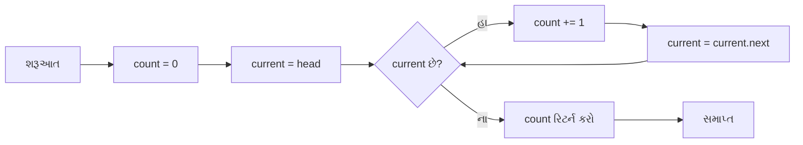

**મહત્વપૂર્ણ મુદ્દાઓ:**

- આ મેથડની સમય જટિલતા O(n) છે, જ્યાં n એ લિસ્ટમાં નોડ્સની સંખ્યા છે.
- મેથડ લિસ્ટ ખાલી હોય તે કેસને પણ હેન્ડલ કરે છે (આ કેસમાં 0 રિટર્ન થશે).
- આ મેથડ non-destructive છે, એટલે કે તે લિસ્ટને બદલતી નથી, માત્ર તેને traverse કરે છે.
- જો લિસ્ટ ખૂબ મોટી હોય, તો આ મેથડ મેમરી-એફિશિયન્ટ છે કારણ કે તે માત્ર એક કાઉન્ટર અને એક પોઈન્ટરનો ઉપયોગ કરે છે.

આ રીતે, આપણે સિંગ્લી લિંક્ડ લિસ્ટમાં રહેલ નોડની સંખ્યા ગણવા માટેનો કોડ લખ્યો છે. આ મેથડનો ઉપયોગ કરીને, આપણે લિંક્ડ લિસ્ટની લંબાઈ જાણી શકીએ છીએ, જે ઘણી એપ્લિકેશન્સમાં ઉપયોગી થઈ શકે છે.

### Q3bOR: કોલમ એ અને કોલમ બી ના યોગ્ય વિકલ્પ જોડો. (૦૪)

| કોલમ એ                 | કોલમ બી                                                |
| ---------------------- | ------------------------------------------------------ |
| 1. સિંગ્લી લિંક્ડ લિસ્ટ     | a. મુળભુત એકમ કે જેમા ડેટા અને સંદર્ભ હોય.                     |
| 2. ડબ્લી લિંક્ડ લિસ્ટ      | b. નોડ્સ એક લૂપ બનાવે જેમા છેલ્લો નોડ પ્રથમ નોડ તરફ નિર્દેશ કરે. |
| 3. સર્ક્યુલર લિંક્ડ લિસ્ટ    | c. નોડ્સમાં ડેટા અને આગામી નોડનો સંદર્ભ હોય છે                |
| 4. લિંક્ડ લિસ્ટ નો એક નોડ | d. નોડ્સમાં આગામી અને પાછલા બંને નોડ્સનો ડેટા અને સંદર્ભો હોય છે  |

**Answer:**

આ પ્રશ્નમાં આપણે લિંક્ડ લિસ્ટના વિવિધ પ્રકારો અને તેમના લક્ષણોને જોડવાના છે. ચાલો દરેક જોડીને સમજીએ અને પછી યોગ્ય જવાબ આપીએ:

1. સિંગ્લી લિંક્ડ લિસ્ટ (Singly Linked List):
   - આમાં દરેક નોડ પાસે ડેટા અને આગામી નોડનો સંદર્ભ હોય છે.
   - જવાબ: c. નોડ્સમાં ડેટા અને આગામી નોડનો સંદર્ભ હોય છે

2. ડબલી લિંક્ડ લિસ્ટ (Doubly Linked List):
   - આમાં દરેક નોડ પાસે ડેટા, આગામી નોડનો સંદર્ભ, અને પાછલા નોડનો સંદર્ભ હોય છે.
   - જવાબ: d. નોડ્સમાં આગામી અને પાછલા બંને નોડ્સનો ડેટા અને સંદર્ભો હોય છે

3. સર્ક્યુલર લિંક્ડ લિસ્ટ (Circular Linked List):
   - આમાં છેલ્લો નોડ પ્રથમ નોડને પોઇન્ટ કરે છે, જેથી એક લૂપ બને છે.
   - જવાબ: b. નોડ્સ એક લૂપ બનાવે જેમાં છેલ્લો નોડ પ્રથમ નોડ તરફ નિર્દેશ કરે

4. લિંક્ડ લિસ્ટનો એક નોડ (Node in a Linked List):
   - આ લિંક્ડ લિસ્ટનો મૂળભૂત એકમ છે, જેમાં ડેટા અને અન્ય નોડ્સના સંદર્ભો હોય છે.
   - જવાબ: a. મુળભુત એકમ કે જેમાં ડેટા અને સંદર્ભ હોય

તો, આખરી જવાબ આ પ્રમાણે થશે:

1. સિંગ્લી લિંક્ડ લિસ્ટ - c
2. ડબલી લિંક્ડ લિસ્ટ - d
3. સર્ક્યુલર લિંક્ડ લિસ્ટ - b
4. લિંક્ડ લિસ્ટનો એક નોડ - a

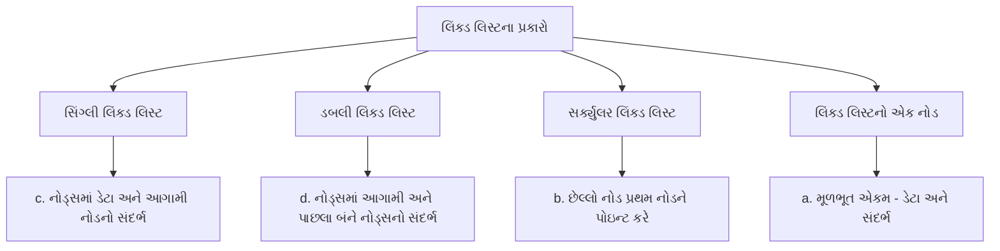

આ ડાયાગ્રામ લિંક્ડ લિસ્ટના વિવિધ પ્રકારો અને તેમના મુખ્ય લક્ષણોને વિઝ્યુઅલી દર્શાવે છે, જે વિદ્યાર્થીઓને આ વિષય સમજવામાં મદદ કરશે.

**Q3cOR:** Explain the deletion of the first and last node in the singly linked list. (**07 marks**)
Answer Q3cOR:

In a singly linked list, deleting the first and last nodes requires different approaches due to the list's structure. Let's examine both cases:

1. Deleting the First Node:
   - Set a temporary pointer to the current head.
   - Move the head to point to the second node (head.next).
   - Delete the temporary pointer to free memory.

   ```python
   def delete_first_node(self):
       if self.head:
           temp = self.head
           self.head = self.head.next
           del temp
   ```

2. Deleting the Last Node:
   - If the list is empty or has only one node, set head to None.
   - Otherwise, traverse the list until the second-to-last node.
   - Set the next of the second-to-last node to None.
   - Delete the last node to free memory.

   ```python
   def delete_last_node(self):
       if not self.head:
           return
       if not self.head.next:
           del self.head
           self.head = None
           return
       current = self.head
       while current.next.next:
           current = current.next
       del current.next
       current.next = None
   ```

Key points:
- Deleting the first node is O(1) time complexity.
- Deleting the last node is O(n) time complexity, where n is the number of nodes.
- Always handle edge cases like empty lists or lists with only one node.
- Proper memory management is crucial to avoid memory leaks.

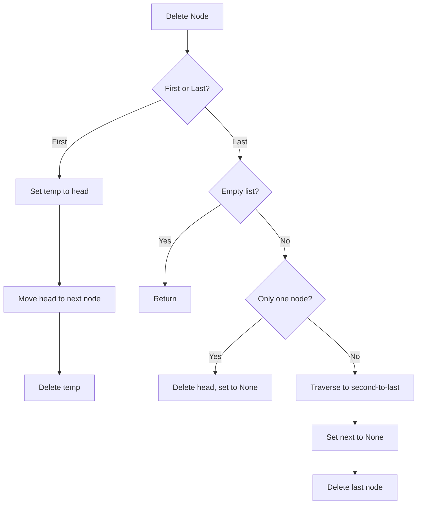

This diagram illustrates the decision process and steps involved in deleting the first and last nodes of a singly linked list.

________________
**Q3cOR:** સિંગ્લી લિંક્ડ લિસ્ટ મા પ્રથમ અને છેલ્લો નોડ ને કાઢી નાખવાનુ સમજાવો. (**૦૭**)
**જવાબ **Q3cOR**:**

સિંગ્લી લિંક્ડ લિસ્ટમાં પ્રથમ અને છેલ્લા નોડને કાઢી નાખવા માટે અલગ-અલગ પદ્ધતિઓની જરૂર પડે છે. ચાલો બંને કેસ જોઈએ:

1. પ્રથમ નોડ કાઢી નાખવો:
   - વર્તમાન head માટે એક અસ્થાયી પોઈન્ટર સેટ કરો.
   - head ને બીજા નોડ (head.next) પર પોઈન્ટ કરાવો.
   - મેમરી મુક્ત કરવા માટે અસ્થાયી પોઈન્ટરને કાઢી નાખો.

   ```python
   def delete_first_node(self):
       if self.head:
           temp = self.head
           self.head = self.head.next
           del temp
   ```

2. છેલ્લો નોડ કાઢી નાખવો:
   - જો લિસ્ટ ખાલી હોય અથવા માત્ર એક નોડ હોય, તો head ને None સેટ કરો.
   - અન્યથા, છેલ્લાથી બીજા નોડ સુધી લિસ્ટને ટ્રેવર્સ કરો.
   - છેલ્લાથી બીજા નોડના next ને None સેટ કરો.
   - મેમરી મુક્ત કરવા માટે છેલ્લા નોડને કાઢી નાખો.

   ```python
   def delete_last_node(self):
       if not self.head:
           return
       if not self.head.next:
           del self.head
           self.head = None
           return
       current = self.head
       while current.next.next:
           current = current.next
       del current.next
       current.next = None
   ```

મુખ્ય મુદ્દાઓ:
- પ્રથમ નોડ કાઢી નાખવાની સમય જટિલતા O(1) છે.
- છેલ્લો નોડ કાઢી નાખવાની સમય જટિલતા O(n) છે, જ્યાં n નોડ્સની સંખ્યા છે.
- ખાલી લિસ્ટ અથવા માત્ર એક નોડવાળી લિસ્ટ જેવા કિસ્સાઓને હંમેશા સંભાળવા જોઈએ.
- મેમરી લીક ટાળવા માટે યોગ્ય મેમરી મેનેજમેન્ટ મહત્વપૂર્ણ છે.

```mermaid
graph TD
    A[નોડ કાઢી નાખો] --> B{પ્રથમ કે છેલ્લો?}
    B -->|પ્રથમ| C[temp ને head પર સેટ કરો]
    C --> D[head ને આગળના નોડ પર ખસેડો]
    D --> E[temp ને કાઢી નાખો]
    B -->|છેલ્લો| F{લિસ્ટ ખાલી છે?}
    F -->|હા| G[પાછા ફરો]
    F -->|ના| H{માત્ર એક નોડ છે?}
    H -->|હા| I[head કાઢી નાખો, None સેટ કરો]
    H -->|ના| J[છેલ્લાથી બીજા સુધી જાઓ]
    J --> K[next ને None સેટ કરો]
    K --> L[છેલ્લો નોડ કાઢી નાખો]
```

આ આકૃતિ સિંગ્લી લિંક્ડ લિસ્ટમાં પ્રથમ અને છેલ્લા નોડને કાઢી નાખવાની પ્રક્રિયા અને પગલાંઓને દર્શાવે છે.

### Q4a: Explain concept of doubly linked list. (03 marks)

A doubly linked list is a type of linear data structure where each node contains three components:
1. Data: Stores the actual value.
2. Next pointer: Points to the next node in the sequence.
3. Previous pointer: Points to the previous node in the sequence.

Key features:
- Bidirectional traversal: Can be traversed both forward and backward.
- Dynamic size: Can grow or shrink at runtime.
- Efficient insertion/deletion: O(1) time complexity at both ends.

Structure of a node in Python:
```python
class Node:
    def __init__(self, data):
        self.data = data
        self.next = None
        self.prev = None
```

Advantages:
- Easy reversal of list
- Efficient deletion of nodes
- Can be used to implement stacks and queues

Disadvantages:
- More memory usage due to extra pointer
- Slightly more complex implementation

```mermaid
graph LR
    A[Node 1] <--> B[Node 2]
    B <--> C[Node 3]
    C <--> D[...]
```

This diagram illustrates the bidirectional nature of a doubly linked list, showing how nodes are connected in both directions.

### Q4a: ડબ્લી લિંક્ડ લિસ્ટ નો કોંસેપ્ટ સમજાવો. (૦૩)

ડબલી લિંક્ડ લિસ્ટ એ એક પ્રકારનું લીનીયર ડેટા સ્ટ્રક્ચર છે જેમાં દરેક નોડમાં ત્રણ ઘટકો હોય છે:
1. ડેટા: વાસ્તવિક મૂલ્ય સંગ્રહિત કરે છે.
2. આગળનો પોઇન્ટર: ક્રમમાં આગળના નોડને નિર્દેશ કરે છે.
3. પાછળનો પોઇન્ટર: ક્રમમાં પાછલા નોડને નિર્દેશ કરે છે.

મુખ્ય લક્ષણો:
- દ્વિદિશ ટ્રાવર્સલ: આગળ અને પાછળ બંને દિશામાં ટ્રાવર્સ કરી શકાય છે.
- ડાયનેમિક સાઇઝ: રનટાઇમ પર વધી અથવા ઘટી શકે છે.
- કાર્યક્ષમ ઇન્સર્શન/ડિલીશન: બંને છેડે O(1) સમય જટિલતા.

પાયથોનમાં નોડની રચના:
```python
class Node:
    def __init__(self, data):
        self.data = data
        self.next = None
        self.prev = None
```

ફાયદાઓ:
- લિસ્ટને સરળતાથી ઉલટાવી શકાય છે
- નોડ્સનું કાર્યક્ષમ ડિલીશન
- સ્ટેક્સ અને ક્યૂઝ implement કરવા માટે વાપરી શકાય છે

ગેરફાયદાઓ:
- વધારાના પોઇન્ટરને કારણે વધુ મેમરી વપરાશ
- થોડું વધુ જટિલ અમલીકરણ

```mermaid
graph LR
    A[નોડ 1] <--> B[નોડ 2]
    B <--> C[નોડ 3]
    C <--> D[...]
```

આ આકૃતિ ડબલી લિંક્ડ લિસ્ટની દ્વિદિશ પ્રકૃતિને દર્શાવે છે, જે બતાવે છે કે નોડ્સ બંને દિશાઓમાં કેવી રીતે જોડાયેલા છે.

### Q4b: Explain concept of linear search. (04 marks)

Linear search, also known as sequential search, is a simple searching algorithm used to find a specific element in a list or array. Here's an explanation of the concept:

1. Working Principle:
   - The algorithm checks each element in the list sequentially.
   - It compares each element with the target value until a match is found or the end of the list is reached.

2. Algorithm Steps:
   - Start from the first element of the list.
   - Compare the current element with the target value.
   - If they match, return the index of the current element.
   - If not, move to the next element and repeat steps 2-3.
   - If the end of the list is reached without finding a match, return -1 or indicate the element is not found.

3. Time Complexity:
   - Best Case: O(1) - when the target is the first element.
   - Worst Case: O(n) - when the target is the last element or not in the list.
   - Average Case: O(n) - on average, half the elements are checked.

4. Implementation in Python:
   ```python
   def linear_search(arr, target):
       for i in range(len(arr)):
           if arr[i] == target:
               return i
       return -1
   ```

5. Advantages and Disadvantages:
   - Advantages: Simple to implement, works on unsorted lists.
   - Disadvantages: Inefficient for large datasets.

```mermaid
graph LR
    A[Start] --> B[Check Element]
    B --> C{Match?}
    C -->|Yes| D[Return Index]
    C -->|No| E{End of List?}
    E -->|No| F[Move to Next]
    F --> B
    E -->|Yes| G[Not Found]
```

This diagram illustrates the linear search process, showing the step-by-step flow of checking elements until a match is found or the end of the list is reached.

### Q4b: લિનિયર સર્ચ નો કોંસેપ્ટ સમજાવો. (૦૪)

લિનિયર સર્ચ, જેને સિક્વેન્શિયલ સર્ચ પણ કહેવાય છે, એ એક સરળ શોધ એલ્ગોરિધમ છે જે લિસ્ટ અથવા એરેમાં કોઈ ચોક્કસ તત્વને શોધવા માટે વપરાય છે. અહીં કોન્સેપ્ટની સમજૂતી આપી છે:

1. કાર્ય સિદ્ધાંત:
   - એલ્ગોરિધમ લિસ્ટમાં દરેક તત્વને ક્રમશઃ ચકાસે છે.
   - તે દરેક તત્વને લક્ષ્ય મૂલ્ય સાથે સરખાવે છે જ્યાં સુધી મેળ ન મળે અથવા લિસ્ટનો અંત ન આવે.

2. એલ્ગોરિધમના પગલાં:
   - લિસ્ટના પ્રથમ તત્વથી શરૂ કરો.
   - વર્તમાન તત્વને લક્ષ્ય મૂલ્ય સાથે સરખાવો.
   - જો તેઓ મેળ ખાય, તો વર્તમાન તત્વનો ઇન્ડેક્સ પરત કરો.
   - જો નહીં, તો આગળના તત્વ પર જાઓ અને પગલાં 2-3 પુનરાવર્તિત કરો.
   - જો મેળ મળ્યા વિના લિસ્ટનો અંત આવે, તો -1 પરત કરો અથવા તત્વ મળ્યું નથી એમ સૂચવો.

3. સમય જટિલતા:
   - શ્રેષ્ઠ કેસ: O(1) - જ્યારે લક્ષ્ય પ્રથમ તત્વ હોય.
   - સૌથી ખરાબ કેસ: O(n) - જ્યારે લક્ષ્ય છેલ્લું તત્વ હોય અથવા લિસ્ટમાં ન હોય.
   - સરેરાશ કેસ: O(n) - સરેરાશ રીતે, અડધા તત્વો ચકાસવામાં આવે છે.

4. પાયથોનમાં અમલીકરણ:
   ```python
   def linear_search(arr, target):
       for i in range(len(arr)):
           if arr[i] == target:
               return i
       return -1
   ```

5. ફાયદા અને ગેરફાયદા:
   - ફાયદા: અમલ કરવામાં સરળ, અવ્યવસ્થિત લિસ્ટ પર કામ કરે છે.
   - ગેરફાયદા: મોટા ડેટાસેટ માટે અકાર્યક્ષમ.

```mermaid
graph LR
    A[શરૂઆત] --> B[તત્વ ચકાસો]
    B --> C{મેળ?}
    C -->|હા| D[ઇન્ડેક્સ પરત કરો]
    C -->|ના| E{લિસ્ટનો અંત?}
    E -->|ના| F[આગળના પર જાઓ]
    F --> B
    E -->|હા| G[મળ્યું નથી]
```

આ આકૃતિ લિનિયર સર્ચની પ્રક્રિયાને દર્શાવે છે, જે મેળ મળે અથવા લિસ્ટનો અંત આવે ત્યાં સુધી તત્વોની તપાસનો પગલે પગલે પ્રવાહ બતાવે છે.

### Q4c: Write a code to implement binary search algorithm. (07 marks)

Binary search is an efficient algorithm for searching a sorted array by repeatedly dividing the search interval in half. Here's an implementation of the binary search algorithm in Python:

```python
def binary_search(arr, target):
    left = 0
    right = len(arr) - 1

    while left <= right:
        mid = (left + right) // 2
        
        if arr[mid] == target:
            return mid  # Target found, return its index
        elif arr[mid] < target:
            left = mid + 1  # Target is in the right half
        else:
            right = mid - 1  # Target is in the left half

    return -1  # Target not found in the array

# Example usage
sorted_array = [1, 3, 5, 7, 9, 11, 13, 15, 17]
target = 7
result = binary_search(sorted_array, target)

if result != -1:
    print(f"Element {target} found at index {result}")
else:
    print(f"Element {target} not found in the array")
```

Key points of the implementation:

1. The function takes a sorted array and a target value as input.
2. It initializes two pointers, `left` and `right`, to the start and end of the array.
3. In each iteration, it calculates the middle index `mid`.
4. It compares the middle element with the target:
   - If equal, the target is found.
   - If the target is greater, search the right half.
   - If the target is smaller, search the left half.
5. The process continues until the target is found or the search space is exhausted.
6. If the target is not found, it returns -1.

Time Complexity: O(log n), where n is the number of elements in the array.
Space Complexity: O(1) as it uses only a constant amount of extra space.

```mermaid
graph TD
    A[Start] --> B[Initialize pointers]
    B --> C{Search condition met?}
    C -->|Yes| D[Calculate mid]
    D --> E{Compare mid element}
    E -->|Equal| F[Return mid]
    E -->|Less than| G[Update left pointer]
    E -->|Greater than| H[Update right pointer]
    G --> C
    H --> C
    C -->|No| I[Return not found]
    F --> J[End]
    I --> J
```

This diagram illustrates the flow of the binary search algorithm, showing the decision process and how the search space is narrowed down in each iteration.

### Q4c: બાયનરી સર્ચ અલ્ગોરિધમ ઇમ્પ્લીમેંટ કરવા માટેનો કોડ લખો. (૦૭)

બાયનરી સર્ચ એ એક કાર્યક્ષમ અલ્ગોરિધમ છે જે સોર્ટેડ એરેમાં શોધ અંતરાલને વારંવાર અડધામાં વિભાજિત કરીને શોધે છે. અહીં પાયથોનમાં બાયનરી સર્ચ અલ્ગોરિધમનું અમલીકરણ આપ્યું છે:

```python
def binary_search(arr, target):
    left = 0
    right = len(arr) - 1

    while left <= right:
        mid = (left + right) // 2
        
        if arr[mid] == target:
            return mid  # લક્ષ્ય મળ્યું, તેનો ઇન્ડેક્સ પરત કરો
        elif arr[mid] < target:
            left = mid + 1  # લક્ષ્ય જમણી બાજુના અર્ધભાગમાં છે
        else:
            right = mid - 1  # લક્ષ્ય ડાબી બાજુના અર્ધભાગમાં છે

    return -1  # લક્ષ્ય એરેમાં મળ્યું નથી

# ઉપયોગનું ઉદાહરણ
sorted_array = [1, 3, 5, 7, 9, 11, 13, 15, 17]
target = 7
result = binary_search(sorted_array, target)

if result != -1:
    print(f"તત્વ {target} ઇન્ડેક્સ {result} પર મળ્યું")
else:
    print(f"તત્વ {target} એરેમાં મળ્યું નથી")
```

અમલીકરણના મુખ્ય મુદ્દાઓ:

1. ફંક્શન સોર્ટેડ એરે અને લક્ષ્ય મૂલ્યને ઇનપુટ તરીકે લે છે.
2. તે `left` અને `right` નામના બે પોઇન્ટર્સને એરેની શરૂઆત અને અંત પર આરંભ કરે છે.
3. દરેક પુનરાવર્તનમાં, તે મધ્ય ઇન્ડેક્સ `mid` ની ગણતરી કરે છે.
4. તે મધ્ય તત્વને લક્ષ્ય સાથે સરખાવે છે:
   - જો સમાન હોય, તો લક્ષ્ય મળી ગયું છે.
   - જો લક્ષ્ય મોટું હોય, તો જમણી બાજુના અર્ધભાગમાં શોધો.
   - જો લક્ષ્ય નાનું હોય, તો ડાબી બાજુના અર્ધભાગમાં શોધો.
5. લક્ષ્ય મળે અથવા શોધ અવકાશ સમાપ્ત થાય ત્યાં સુધી પ્રક્રિયા ચાલુ રહે છે.
6. જો લક્ષ્ય ન મળે, તો તે -1 પરત કરે છે.

સમય જટિલતા: O(log n), જ્યાં n એરેમાં તત્વોની સંખ્યા છે.
સ્પેસ જટિલતા: O(1) કારણ કે તે માત્ર સ્થિર જગ્યાનો ઉપયોગ કરે છે.

```mermaid
graph TD
    A[શરૂઆત] --> B[પોઇન્ટર્સ આરંભ કરો]
    B --> C{શોધ ચાલુ?}
    C -->|હા| D[mid ગણો]
    D --> E{mid ચકાસો}
    E -->|સમાન| F[mid આપો]
    E -->|નાનું| G[left અપડેટ કરો]
    E -->|મોટું| H[right અપડેટ કરો]
    G --> C
    H --> C
    C -->|ના| I[ના મળ્યું]
    F --> K[સમાપ્ત]
    I --> K
```

આ આકૃતિ બાયનરી સર્ચ અલ્ગોરિધમના પ્રવાહને દર્શાવે છે, જે નિર્ણય પ્રક્રિયા અને દરેક પુનરાવર્તનમાં શોધ અવકાશ કેવી રીતે સાંકડો થાય છે તે બતાવે છે.

### Q4aOR: Explain concept of selection sort algorithm. (03 marks)

Selection sort is a simple comparison-based sorting algorithm. The main concept behind selection sort is as follows:

1. Basic Idea:
   - The algorithm divides the input list into two parts: a sorted portion and an unsorted portion.
   - It repeatedly selects the smallest (or largest) element from the unsorted portion and moves it to the end of the sorted portion.

2. Algorithm Steps:
   - Find the minimum element in the unsorted array
   - Swap it with the first element of the unsorted part
   - Move the boundary of the sorted array one element to the right

3. Time Complexity:
   - Best Case: O(n^2)
   - Average Case: O(n^2)
   - Worst Case: O(n^2)

4. Space Complexity:
   - O(1) as it sorts in-place

5. Key Characteristics:
   - Simple implementation
   - Performs well on small lists
   - Inefficient on large lists
   - Unstable sort (may change the relative order of equal elements)

```mermaid
graph TD
    A[Start] --> B[Set minimum to first element]
    B --> C[Compare with next element]
    C --> D{Smaller?}
    D -->|Yes| E[Update minimum]
    D -->|No| F[Move to next element]
    E --> F
    F --> G{End of array?}
    G -->|No| C
    G -->|Yes| H[Swap minimum with first unsorted element]
    H --> I{Whole array sorted?}
    I -->|No| B
    I -->|Yes| J[End]
```

This diagram illustrates the process of selection sort, showing how the algorithm repeatedly finds the minimum element and places it in the sorted portion of the array.

### Q4aOR: સિલેક્શન સોર્ટ અલ્ગોરીધમ નો કોંસેપ્ટ સમજાવો. (૦૩)

સિલેક્શન સોર્ટ એક સરળ તુલના-આધારિત સોર્ટિંગ અલ્ગોરિધમ છે. સિલેક્શન સોર્ટની પાછળનો મુખ્ય વિચાર આ મુજબ છે:

1. મૂળભૂત વિચાર:
   - અલ્ગોરિધમ ઇનપુટ લિસ્ટને બે ભાગમાં વિભાજિત કરે છે: સોર્ટેડ ભાગ અને અનસોર્ટેડ ભાગ.
   - તે વારંવાર અનસોર્ટેડ ભાગમાંથી સૌથી નાના (અથવા મોટા) તત્વને પસંદ કરે છે અને તેને સોર્ટેડ ભાગના અંતે ખસેડે છે.

2. અલ્ગોરિધમના પગલાં:
   - અનસોર્ટેડ એરેમાં લઘુત્તમ તત્વ શોધો
   - તેને અનસોર્ટેડ ભાગના પ્રથમ તત્વ સાથે સ્વેપ કરો
   - સોર્ટેડ એરેની સીમાને એક તત્વ જમણી તરફ ખસેડો

3. સમય જટિલતા:
   - શ્રેષ્ઠ કેસ: O(n^2)
   - સરેરાશ કેસ: O(n^2)
   - સૌથી ખરાબ કેસ: O(n^2)

4. સ્પેસ જટિલતા:
   - O(1) કારણ કે તે ઇન-પ્લેસ સોર્ટ કરે છે

5. મુખ્ય લક્ષણો:
   - સરળ અમલીકરણ
   - નાની યાદીઓ પર સારું પ્રદર્શન કરે છે
   - મોટી યાદીઓ પર અકાર્યક્ષમ
   - અસ્થિર સોર્ટ (સમાન તત્વોનો સાપેક્ષ ક્રમ બદલી શકે છે)

```mermaid
graph TD
    A[શરૂઆત] --> B[પ્રથમ તત્વને ન્યૂનતમ તરીકે સેટ કરો]
    B --> C[આગળના તત્વ સાથે સરખાવો]
    C --> D{નાનું?}
    D -->|હા| E[ન્યૂનતમ અપડેટ કરો]
    D -->|ના| F[આગળના તત્વ પર જાઓ]
    E --> F
    F --> G{એરેનો અંત?}
    G -->|ના| C
    G -->|હા| H[ન્યૂનતમને પ્રથમ અનસોર્ટેડ તત્વ સાથે સ્વેપ કરો]
    H --> I{આખો એરે સોર્ટેડ?}
    I -->|ના| B
    I -->|હા| J[સમાપ્ત]
```

આ આકૃતિ સિલેક્શન સોર્ટની પ્રક્રિયાને દર્શાવે છે, જે બતાવે છે કે અલ્ગોરિધમ કેવી રીતે વારંવાર ન્યૂનતમ તત્વ શોધે છે અને તેને એરેના સોર્ટેડ ભાગમાં મૂકે છે.

### Q4bOR: Explain bubble sort method. (04 marks)

Bubble sort is a simple sorting algorithm that repeatedly steps through the list, compares adjacent elements and swaps them if they are in the wrong order. The pass through the list is repeated until the list is sorted. Here's a detailed explanation:

1. Working Principle:
   - The algorithm compares adjacent elements in the array.
   - If the first element is greater than the second, it swaps them.
   - This process continues for the entire array, causing larger elements to "bubble up" to the end of the list.

2. Algorithm Steps:
   - Start with the first element of the array.
   - Compare it with the next element.
   - If it's larger, swap them.
   - Move to the next pair of adjacent elements and repeat steps 2-3.
   - After each pass, the largest unsorted element moves to its correct position at the end.
   - Repeat the process for n-1 passes, where n is the number of elements.

3. Time Complexity:
   - Best Case: O(n) when the array is already sorted
   - Average and Worst Case: O(n^2)

4. Space Complexity: O(1) as it sorts in-place

5. Advantages and Disadvantages:
   - Advantages: Simple to understand and implement
   - Disadvantages: Inefficient for large datasets

6. Optimization:
   - Can be optimized by stopping the algorithm if no swaps occur in a pass

```mermaid
graph TD
    A[Start] --> B[Outer loop]
    B --> C[Inner loop]
    C --> D{Compare adjacent elements}
    D -->|Greater| E[Swap elements]
    D -->|Not Greater| F[Move to next pair]
    E --> F
    F --> G{Inner loop complete?}
    G -->|No| C
    G -->|Yes| H{Outer loop complete?}
    H -->|No| B
    H -->|Yes| I[End]
```

This diagram illustrates the nested loop structure of the bubble sort algorithm, showing how elements are compared and swapped in each pass.

### Q4bOR: બબલ સોર્ટ મેથડ સમજાવો. (૦૪)

બબલ સોર્ટ એક સરળ સોર્ટિંગ અલ્ગોરિધમ છે જે વારંવાર યાદીમાંથી પસાર થાય છે, બાજુના તત્વોની તુલના કરે છે અને જો તેઓ ખોટા ક્રમમાં હોય તો તેમને સ્વેપ કરે છે. યાદી સોર્ટ થાય ત્યાં સુધી યાદીમાંથી પસાર થવાનું પુનરાવર્તન થાય છે. અહીં વિગતવાર સમજૂતી આપી છે:

1. કાર્ય સિદ્ધાંત:
   - અલ્ગોરિધમ એરેમાં બાજુના તત્વોની તુલના કરે છે.
   - જો પ્રથમ તત્વ બીજા કરતાં મોટું હોય, તો તે તેમને સ્વેપ કરે છે.
   - આ પ્રક્રિયા આખા એરે માટે ચાલુ રહે છે, જેના કારણે મોટા તત્વો યાદીના અંત તરફ "બબલ અપ" થાય છે.

2. અલ્ગોરિધમના પગલાં:
   - એરેના પ્રથમ તત્વથી શરૂ કરો.
   - તેને આગળના તત્વ સાથે સરખાવો.
   - જો તે મોટું હોય, તો તેમને સ્વેપ કરો.
   - બાજુના તત્વોની આગળની જોડી પર જાઓ અને પગલાં 2-3 પુનરાવર્તિત કરો.
   - દરેક પાસ પછી, સૌથી મોટું અનસોર્ટેડ તત્વ અંતે તેના સાચા સ્થાને ખસે છે.
   - n-1 પાસ માટે પ્રક્રિયાનું પુનરાવર્તન કરો, જ્યાં n તત્વોની સંખ્યા છે.

3. સમય જટિલતા:
   - શ્રેષ્ઠ કેસ: O(n) જ્યારે એરે પહેલેથી જ સોર્ટેડ હોય
   - સરેરાશ અને સૌથી ખરાબ કેસ: O(n^2)

4. સ્પેસ જટિલતા: O(1) કારણ કે તે ઇન-પ્લેસ સોર્ટ કરે છે

5. ફાયદા અને ગેરફાયદા:
   - ફાયદા: સમજવામાં અને અમલ કરવામાં સરળ
   - ગેરફાયદા: મોટા ડેટાસેટ્સ માટે અકાર્યક્ષમ

6. ઓપ્ટિમાઇઝેશન:
   - જો કોઈ પાસમાં કોઈ સ્વેપ ન થાય તો અલ્ગોરિધમને રોકીને ઓપ્ટિમાઇઝ કરી શકાય છે

```mermaid
graph TD
    A[શરૂઆત] --> B[બાહ્ય લૂપ]
    B --> C[આંતરિક લૂપ]
    C --> D{બાજુના તત્વોની તુલના}
    D -->|મોટું| E[તત્વો સ્વેપ કરો]
    D -->|નાનું/સમાન| F[આગળની જોડી]
    E --> F
    F --> G{આંતરિક લૂપ પૂર્ણ?}
    G -->|ના| C
    G -->|હા| H{બાહ્ય લૂપ પૂર્ણ?}
    H -->|ના| B
    H -->|હા| I[સમાપ્ત]
```

આ આકૃતિ બબલ સોર્ટ અલ્ગોરિધમની નેસ્ટેડ લૂપ સ્ટ્રક્ચરને દર્શાવે છે, જે બતાવે છે કે દરેક પાસમાં તત્વોની કેવી રીતે તુલના કરવામાં આવે છે અને સ્વેપ કરવામાં આવે છે.

### Q4cOR: Explain the working of quick sort method with example. (07 marks)

Quick sort is an efficient, divide-and-conquer sorting algorithm. Here's an explanation of its working with an example:

1. Basic Principle:
   - Choose a 'pivot' element from the array.
   - Partition the other elements into two sub-arrays, according to whether they are less than or greater than the pivot.
   - Recursively sort the sub-arrays.

2. Algorithm Steps:
   a. Select a pivot (usually the last element).
   b. Partition the array:
      - Move elements smaller than the pivot to the left.
      - Move elements larger than the pivot to the right.
   c. Recursively apply the above steps to the sub-arrays.

3. Example:
   Let's sort the array: [8, 3, 2, 5, 1, 7, 6, 4]

   Step 1: Choose last element (4) as pivot
   [8, 3, 2, 5, 1, 7, 6, 4]
                          ^
   Step 2: Partition
   [3, 2, 1, 4, 8, 7, 6, 5]
            ^
   Step 3: Recursively sort left and right sub-arrays
   Left: [3, 2, 1]   Right: [8, 7, 6, 5]

   Continuing this process:
   [1, 2, 3, 4, 5, 6, 7, 8]

4. Time Complexity:
   - Average case: O(n log n)
   - Worst case: O(n^2) (rare, occurs when the pivot is always the smallest or largest element)

5. Space Complexity: O(log n) due to the recursive call stack

6. Advantages:
   - Generally faster in practice compared to other O(n log n) algorithms
   - In-place sorting (doesn't require much additional memory)

```mermaid
graph TD
    A[Start] --> B[Choose Pivot]
    B --> C[Partition Array]
    C --> D{Left sub-array exists?}
    D -->|Yes| E[Recursively sort left]
    D -->|No| F{Right sub-array exists?}
    E --> F
    F -->|Yes| G[Recursively sort right]
    F -->|No| H[Combine sorted sub-arrays]
    G --> H
    H --> I[End]
```

This diagram illustrates the recursive nature of the quick sort algorithm, showing how the array is partitioned and sub-arrays are sorted.

### Q4cOR: ઉદાહરણ સાથે ક્વીક સોર્ટ મેથડનુ વર્કિંગ સમજાવો. (૦૭)

ક્વીક સોર્ટ એક કાર્યક્ષમ, વિભાજન-અને-શાસન સોર્ટિંગ અલ્ગોરિધમ છે. અહીં ઉદાહરણ સાથે તેના કાર્યની સમજૂતી આપી છે:

1. મૂળભૂત સિદ્ધાંત:
   - એરેમાંથી એક 'પિવોટ' તત્વ પસંદ કરો.
   - અન્ય તત્વોને બે પેટા-એરેમાં વિભાજિત કરો, તેઓ પિવોટ કરતાં નાના છે કે મોટા તે મુજબ.
   - પેટા-એરેને પુનરાવર્તિત રીતે સોર્ટ કરો.

2. અલ્ગોરિધમના પગલાં:
   a. પિવોટ પસંદ કરો (સામાન્ય રીતે છેલ્લું તત્વ).
   b. એરેને વિભાજિત કરો:
      - પિવોટ કરતાં નાના તત્વોને ડાબી બાજુ ખસેડો.
      - પિવોટ કરતાં મોટા તત્વોને જમણી બાજુ ખસેડો.
   c. ઉપરોક્ત પગલાંને પેટા-એરે પર પુનરાવર્તિત રીતે લાગુ કરો.

3. ઉદાહરણ:
   ચાલો આ એરેને સોર્ટ કરીએ: [8, 3, 2, 5, 1, 7, 6, 4]

   પગલું 1: છેલ્લા તત્વને (4) પિવોટ તરીકે પસંદ કરો
   [8, 3, 2, 5, 1, 7, 6, 4]
                          ^
   પગલું 2: વિભાજન કરો
   [3, 2, 1, 4, 8, 7, 6, 5]
            ^
   પગલું 3: ડાબા અને જમણા પેટા-એરેને પુનરાવર્તિત રીતે સોર્ટ કરો
   ડાબે: [3, 2, 1]   જમણે: [8, 7, 6, 5]

   આ પ્રક્રિયા ચાલુ રાખતાં:
   [1, 2, 3, 4, 5, 6, 7, 8]

4. સમય જટિલતા:
   - સરેરાશ કેસ: O(n log n)
   - સૌથી ખરાબ કેસ: O(n^2) (દુર્લભ, જ્યારે પિવોટ હંમેશા સૌથી નાનું અથવા સૌથી મોટું તત્વ હોય ત્યારે થાય છે)

5. સ્પેસ જટિલતા: O(log n) પુનરાવર્તિત કૉલ સ્ટેકને કારણે

6. ફાયદાઓ:
   - સામાન્ય રીતે અન્ય O(n log n) અલ્ગોરિધમ્સની તુલનામાં વ્યવહારમાં ઝડપી
   - ઇન-પ્લેસ સોર્ટિંગ (ઘણી વધારાની મેમરીની જરૂર પડતી નથી)

```mermaid
graph TD
    A[શરૂઆત] --> B[પિવોટ પસંદ કરો]
    B --> C[એરેને વિભાજિત કરો]
    C --> D{ડાબો પેટા-એરે છે?}
    D -->|હા| E[ડાબાને પુનરાવર્તિત સોર્ટ કરો]
    D -->|ના| F{જમણો પેટા-એરે છે?}
    E --> F
    F -->|હા| G[જમણાને પુનરાવર્તિત સોર્ટ કરો]
    F -->|ના| H[સોર્ટેડ પેટા-એરેને જોડો]
    G --> H
    H --> I[સમાપ્ત]
```

આ આકૃતિ ક્વીક સોર્ટ અલ્ગોરિધમની પુનરાવર્તિત પ્રકૃતિને દર્શાવે છે, જે બતાવે છે કે કેવી રીતે એરેને વિભાજિત કરવામાં આવે છે અને પેટા-એરેને સોર્ટ કરવામાં આવે છે.

### Q5a: Explain binary tree. (03 marks)

A binary tree is a hierarchical data structure in which each node has at most two children, referred to as the left child and the right child. Here are the key points about binary trees:

1. Structure:
   - Root: The topmost node of the tree.
   - Nodes: Each element in the tree, containing data and references to children.
   - Leaves: Nodes with no children.

2. Properties:
   - Each node has 0, 1, or 2 children.
   - Left child: The node on the left side.
   - Right child: The node on the right side.

3. Types:
   - Full Binary Tree: Every node has 0 or 2 children.
   - Complete Binary Tree: All levels are fully filled except possibly the last level, which is filled from left to right.
   - Perfect Binary Tree: All internal nodes have two children and all leaves are at the same level.

4. Applications:
   - Expression trees in compilers.
   - Huffman coding trees in data compression.
   - Binary Search Trees for efficient searching and sorting.

5. Traversal Methods:
   - Inorder: Left, Root, Right
   - Preorder: Root, Left, Right
   - Postorder: Left, Right, Root

```mermaid
graph TD
    A[Root] --> B[Left Child]
    A --> C[Right Child]
    B --> D[Left Grandchild]
    B --> E[Right Grandchild]
    C --> F[Left Grandchild]
    C --> G[Right Grandchild]
```

This diagram illustrates a simple binary tree structure, showing the root, left and right children, and grandchildren nodes.

### Q5a: બાયનરી ટ્રી સમજાવો. (૦૩)

બાયનરી ટ્રી એ એક હાયરાર્કિકલ ડેટા સ્ટ્રક્ચર છે જેમાં દરેક નોડને વધુમાં વધુ બે બાળકો હોય છે, જેને ડાબું બાળક અને જમણું બાળક કહેવાય છે. અહીં બાયનરી ટ્રી વિશેના મુખ્ય મુદ્દાઓ છે:

1. રચના:
   - રૂટ: ટ્રીનો સૌથી ઉપરનો નોડ.
   - નોડ્સ: ટ્રીમાં દરેક તત્વ, જેમાં ડેટા અને બાળકોના સંદર્ભો હોય છે.
   - પાંદડાં: બાળકો વગરના નોડ્સ.

2. ગુણધર્મો:
   - દરેક નોડને 0, 1, અથવા 2 બાળકો હોય છે.
   - ડાબું બાળક: ડાબી બાજુનો નોડ.
   - જમણું બાળક: જમણી બાજુનો નોડ.

3. પ્રકારો:
   - પૂર્ણ બાયનરી ટ્રી: દરેક નોડને 0 અથવા 2 બાળકો હોય છે.
   - સંપૂર્ણ બાયનરી ટ્રી: છેલ્લા સ્તર સિવાય બધા સ્તરો સંપૂર્ણ ભરેલા હોય છે, છેલ્લું સ્તર ડાબેથી જમણે ભરાય છે.
   - આદર્શ બાયનરી ટ્રી: બધા આંતરિક નોડ્સને બે બાળકો હોય છે અને બધા પાંદડાં એક જ સ્તરે હોય છે.

4. ઉપયોગો:
   - કમ્પાइલરોમાં એક્સપ્રેશન ટ્રીઓ.
   - ડેટા કમ્પ્રેશનમાં હફમેન કોડિંગ ટ્રીઓ.
   - કાર્યક્ષમ શોધ અને સોર્ટિંગ માટે બાયનરી સર્ચ ટ્રીઓ.

5. ટ્રાવર્સલ પદ્ધતિઓ:
   - ઇનઓર્ડર: ડાબું, રૂટ, જમણું
   - પ્રીઓર્ડર: રૂટ, ડાબું, જમણું
   - પોસ્ટઓર્ડર: ડાબું, જમણું, રૂટ

```mermaid
graph TD
    A[રૂટ] --> B[ડાબું બાળક]
    A --> C[જમણું બાળક]
    B --> D[ડાબું પૌત્ર]
    B --> E[જમણું પૌત્ર]
    C --> F[ડાબું પૌત્ર]
    C --> G[જમણું પૌત્ર]
```

આ આકૃતિ એક સરળ બાયનરી ટ્રી સ્ટ્રક્ચરને દર્શાવે છે, જેમાં રૂટ, ડાબા અને જમણા બાળકો, અને પૌત્ર નોડ્સ બતાવવામાં આવ્યા છે.

Certainly. I'll regenerate both the English and Gujarati answers with the improvements we discussed.

### Q5b: Define the terms root, path, parent and children with reference to tree. (04 marks)

In the context of tree data structures, these terms have specific meanings:

1. Root:
   - Definition: The topmost node in a tree structure.
   - Characteristics:
     * It has no parent.
     * All other nodes can be reached from the root.
   - Example: In a family tree, the oldest known ancestor would be the root.

2. Path:
   - Definition: A sequence of nodes and edges connecting a node with a descendant.
   - Characteristics:
     * Starts from one node and ends at another.
     * Each node in the path is connected by an edge to the next node.
   - Example: The sequence of nodes you traverse to get from the root to a specific leaf.

3. Parent:
   - Definition: A node that has one or more child nodes.
   - Characteristics:
     * Directly connected to its children.
     * A node can be a parent to multiple children but can have only one parent (except the root).
   - Example: In a directory structure, a folder containing files is a parent to those files.

4. Children:
   - Definition: Nodes that are direct descendants of a parent node.
   - Characteristics:
     * Directly connected to their parent.
     * A node can have multiple children or no children (leaf).
   - Example: In an organizational chart, employees directly under a manager are the children nodes of that manager node.

```mermaid
graph TD
    A[Root] --> B[Child 1]
    A --> C[Child 2]
    B --> D[Grandchild 1]
    B --> E[Grandchild 2]
    C --> F[Grandchild 3]
```

This diagram illustrates the concepts of root (A), parent (A, B, C), children (B, C, D, E, F), and path (e.g., A -> B -> E). Here, A is the root, B and C are children of A, and D, E, F are grandchildren. The path from A to E is A -> B -> E.

### Q5b: ટ્રી ના સંદર્ભ મા રૂટ, પાથ, parent અને children પદો વ્યાખ્યાયિત કરો. (૦૪)

ટ્રી ડેટા સ્ટ્રક્ચરના સંદર્ભમાં, આ પદોના ચોક્કસ અર્થ છે:

1. રૂટ (Root):
   - વ્યાખ્યા: ટ્રી સ્ટ્રક્ચરમાં સૌથી ઉપરનો નોડ.
   - લક્ષણો:
     * તેને કોઈ parent નથી.
     * બધા અન્ય નોડ્સ રૂટથી પહોંચી શકાય છે.
   - ઉદાહરણ: કુટુંબ વૃક્ષમાં, સૌથી જૂનો જાણીતો પૂર્વજ રૂટ હશે.

2. પાથ (Path):
   - વ્યાખ્યા: એક નોડને તેના વંશજ સાથે જોડતા નોડ્સ અને એજની શ્રેણી.
   - લક્ષણો:
     * એક નોડથી શરૂ થાય છે અને બીજા પર સમાપ્ત થાય છે.
     * પાથમાં દરેક નોડ આગળના નોડ સાથે એજ દ્વારા જોડાયેલો હોય છે.
   - ઉદાહરણ: રૂટથી ચોક્કસ leaf સુધી પહોંચવા માટે તમે જે નોડ્સની શ્રેણીમાંથી પસાર થાઓ છો તે.

3. Parent:
   - વ્યાખ્યા: એક અથવા વધુ child નોડ્સ ધરાવતો નોડ.
   - લક્ષણો:
     * તેના children સાથે સીધો જોડાયેલો.
     * એક નોડ અનેક childrenનો parent હોઈ શકે છે પરંતુ તેને માત્ર એક જ parent હોઈ શકે છે (રૂટ સિવાય).
   - ઉદાહરણ: ડિરેક્ટરી સ્ટ્રક્ચરમાં, ફાઇલો ધરાવતું ફોલ્ડર તે ફાઇલોનો parent છે.

4. Children:
   - વ્યાખ્યા: parent નોડના સીધા વંશજો.
   - લક્ષણો:
     * તેમના parent સાથે સીધા જોડાયેલા.
     * એક નોડને અનેક children હોઈ શકે છે અથવા કોઈ child ન પણ હોય (leaf).
   - ઉદાહરણ: સંગઠનાત્મક ચાર્ટમાં, મેનેજર હેઠળ સીધા કર્મચારીઓ તે મેનેજર નોડના children નોડ્સ છે.

```mermaid
graph TD
    A[Root] --> B[Child 1]
    A --> C[Child 2]
    B --> D[Grandchild 1]
    B --> E[Grandchild 2]
    C --> F[Grandchild 3]
```

આ આકૃતિ રૂટ (A), parent (A, B, C), children (B, C, D, E, F), અને પાથ (દા.ત., A -> B -> E) ના ખ્યાલોને દર્શાવે છે. અહીં, A એ રૂટ છે, B અને C એ A ના children છે, અને D, E, F એ grandchildren છે. A થી E સુધીનો પાથ A -> B -> E છે.

### Q5c: Apply preorder and postorder traversal for given below tree. (07 marks)

```mermaid
graph TD
    Root["Root"] --> 40
    40((40)) --> 30((30))
    40 --> 50((50))
    30 --> 25((25))
    30 --> 35((35))
    50 --> 45((45))
    50 --> 60((60))
    25 --> 15((15))
    25 --> 28((28))
    60 --> 55((55))
    60 --> 70((70))
    
    classDef default fill:#D3D3D3,stroke:#000,stroke-width:1px;
    class Root font-weight:bold,fill:none,stroke:none;
    linkStyle default stroke:#000,stroke-width:1px;
```

Let's apply both preorder and postorder traversals to the given binary tree:

1. Preorder Traversal:
   - Algorithm: Visit Root, Traverse Left Subtree, Traverse Right Subtree
   - Steps:
     1. Visit the root (40)
     2. Traverse left subtree of 40
     3. Traverse right subtree of 40
   - Preorder sequence: 40, 30, 25, 15, 28, 35, 50, 45, 60, 55, 70

   Explanation:
   - Start at 40 (root)
   - Go left: 30, then 25, then 15
   - Backtrack to 25, go right: 28
   - Backtrack to 30, go right: 35
   - Backtrack to 40, go right: 50, then 45
   - Backtrack to 50, go right: 60, then 55
   - Backtrack to 60, go right: 70

2. Postorder Traversal:
   - Algorithm: Traverse Left Subtree, Traverse Right Subtree, Visit Root
   - Steps:
     1. Traverse left subtree of 40
     2. Traverse right subtree of 40
     3. Visit the root (40)
   - Postorder sequence: 15, 28, 25, 35, 30, 45, 55, 70, 60, 50, 40

   Explanation:
   - Start at leftmost leaf: 15
   - Go to its sibling: 28
   - Visit their parent: 25
   - Go to 25's sibling: 35
   - Visit their parent: 30
   - Move to right subtree, start at leftmost leaf: 45
   - Move to 60's left child: 55
   - Then to 60's right child: 70
   - Visit 60, then 50
   - Finally, visit the root: 40

```mermaid
graph TD
    Root["Root"] --> 40
    40((40)) --> 30((30))
    40 --> 50((50))
    30 --> 25((25))
    30 --> 35((35))
    50 --> 45((45))
    50 --> 60((60))
    25 --> 15((15))
    25 --> 28((28))
    60 --> 55((55))
    60 --> 70((70))
    
    classDef default fill:#D3D3D3,stroke:#000,stroke-width:1px;
    class Root font-weight:bold,fill:none,stroke:none;
    linkStyle default stroke:#000,stroke-width:1px;
```

This diagram shows the tree structure. The traversal orders given above demonstrate how preorder and postorder traversals navigate through this tree.

### Q5c: નીચે આપેલા ટ્રી માટે પ્રી ઓર્ડર અને પોસ્ટઓર્ડર ટ્રાવર્સલ લાગુ કરો. (૦૭)

```mermaid
graph TD
    Root["Root"] --> 40
    40((40)) --> 30((30))
    40 --> 50((50))
    30 --> 25((25))
    30 --> 35((35))
    50 --> 45((45))
    50 --> 60((60))
    25 --> 15((15))
    25 --> 28((28))
    60 --> 55((55))
    60 --> 70((70))
    
    classDef default fill:#D3D3D3,stroke:#000,stroke-width:1px;
    class Root font-weight:bold,fill:none,stroke:none;
    linkStyle default stroke:#000,stroke-width:1px;
```

આપેલા બાયનરી ટ્રી માટે પ્રી ઓર્ડર અને પોસ્ટઓર્ડર ટ્રાવર્સલ લાગુ કરીએ:

1. પ્રી ઓર્ડર ટ્રાવર્સલ:
   - અલ્ગોરિધમ: રૂટની મુલાકાત લો, ડાબા સબટ્રીને ટ્રાવર્સ કરો, જમણા સબટ્રીને ટ્રાવર્સ કરો
   - પગલાં:
     1. રૂટની મુલાકાત લો (40)
     2. 40ના ડાબા સબટ્રીને ટ્રાવર્સ કરો
     3. 40ના જમણા સબટ્રીને ટ્રાવર્સ કરો
   - પ્રી ઓર્ડર ક્રમ: 40, 30, 25, 15, 28, 35, 50, 45, 60, 55, 70

   સમજૂતી:
   - 40 (રૂટ)થી શરૂ કરો
   - ડાબે જાઓ: 30, પછી 25, પછી 15
   - 25 પર પાછા ફરો, જમણે જાઓ: 28
   - 30 પર પાછા ફરો, જમણે જાઓ: 35
   - 40 પર પાછા ફરો, જમણે જાઓ: 50, પછી 45
   - 50 પર પાછા ફરો, જમણે જાઓ: 60, પછી 55
   - 60 પર પાછા ફરો, જમણે જાઓ: 70

2. પોસ્ટઓર્ડર ટ્રાવર્સલ:
   - અલ્ગોરિધમ: ડાબા સબટ્રીને ટ્રાવર્સ કરો, જમણા સબટ્રીને ટ્રાવર્સ કરો, રૂટની મુલાકાત લો
   - પગલાં:
     1. 40ના ડાબા સબટ્રીને ટ્રાવર્સ કરો
     2. 40ના જમણા સબટ્રીને ટ્રાવર્સ કરો
     3. રૂટની મુલાકાત લો (40)
   - પોસ્ટઓર્ડર ક્રમ: 15, 28, 25, 35, 30, 45, 55, 70, 60, 50, 40

   સમજૂતી:
   - સૌથી ડાબા છેડાના leafથી શરૂ કરો: 15
   - તેના siblingમાં જાઓ: 28
   - તેમના parentની મુલાકાત લો: 25
   - 25ના siblingમાં જાઓ: 35
   - તેમના parentની મુલાકાત લો: 30
   - જમણા સબટ્રીમાં જાઓ, સૌથી ડાબા છેડાના leafથી શરૂ કરો: 45
   - 60ના ડાબા childમાં જાઓ: 55
   - પછી 60ના જમણા childમાં: 70
   - 60ની મુલાકાત લો, પછી 50
   - અંતે, રૂટની મુલાકાત લો: 40

```mermaid
graph TD
    Root["Root"] --> 40
    40((40)) --> 30((30))
    40 --> 50((50))
    30 --> 25((25))
    30 --> 35((35))
    50 --> 45((45))
    50 --> 60((60))
    25 --> 15((15))
    25 --> 28((28))
    60 --> 55((55))
    60 --> 70((70))
    
    classDef default fill:#D3D3D3,stroke:#000,stroke-width:1px;
    class Root font-weight:bold,fill:none,stroke:none;
    linkStyle default stroke:#000,stroke-width:1px;
```

આ આકૃતિ ટ્રી સ્ટ્રક્ચરને દર્શાવે છે. ઉપર આપેલા ટ્રાવર્સલ ક્રમો દર્શાવે છે કે પ્રી ઓર્ડર અને પોસ્ટઓર્ડર ટ્રાવર્સલ આ ટ્રીમાં કેવી રીતે નેવિગેટ કરે છે.

### Q5aOR: Enlist applications of binary tree. (03 marks)

Binary trees have numerous applications in computer science and real-world scenarios. Here are some key applications:

1. Expression Trees:
   - Used in compilers to represent and evaluate arithmetic expressions
   - Enables efficient parsing and calculation of mathematical formulas

2. Huffman Coding Trees:
   - Applied in data compression algorithms
   - Assigns variable-length codes to characters based on their frequency

3. Binary Search Trees (BST):
   - Efficient for searching, inserting, and deleting elements
   - Used in implementing database indexes and file systems

4. Decision Trees:
   - Applied in machine learning for classification and regression tasks
   - Used in artificial intelligence for game strategies

5. Syntax Trees:
   - Used in programming language compilers for parsing and code generation
   - Represents the structure of program code

6. Heap Data Structure:
   - Implements priority queues
   - Used in heap sort algorithm and graph algorithms like Dijkstra's shortest path

7. Trie (Prefix Tree):
   - Efficient for storing and searching strings
   - Used in autocomplete features and IP routing tables

These applications demonstrate the versatility and importance of binary trees in various areas of computer science and software development.

### Q5aOR: બાયનરી ટ્રી ની એપ્લિકેશંસ લખો. (૦૩)

બાયનરી ટ્રીના કમ્પ્યુટર સાયન્સ અને વાસ્તવિક દુનિયાના સ્થિતિઓમાં ઘણા ઉપયોગો છે. અહીં કેટલીક મુખ્ય એપ્લિકેશન્સ આપી છે:

1. Expression Trees:
   - કમ્પાઇલર્સમાં ગાણિતિક અભિવ્યક્તિઓને રજૂ કરવા અને મૂલ્યાંકન કરવા માટે વપરાય છે
   - ગાણિતિક સૂત્રોનું કાર્યક્ષમ parsing અને ગણતરી સક્ષમ કરે છે

2. Huffman Coding Trees:
   - ડેટા કમ્પ્રેશન અલ્ગોરિધમ્સમાં લાગુ કરવામાં આવે છે
   - અક્ષરોની આવૃત્તિના આધારે તેમને variable-length કોડ્સ આપે છે

3. Binary Search Trees (BST):
   - એલિમેન્ટ્સ શોધવા, દાખલ કરવા અને કાઢી નાખવા માટે કાર્યક્ષમ
   - ડેટાબેસ ઇન્ડેક્સ અને ફાઇલ સિસ્ટમ્સને અમલમાં મૂકવા માટે વપરાય છે

4. Decision Trees:
   - મશીન લર્નિંગમાં વર્ગીકરણ અને નિયમન કાર્યો માટે લાગુ કરવામાં આવે છે
   - ગેમ વ્યૂહરચનાઓ માટે આર્ટિફિશિયલ ઇન્ટેલિજન્સમાં વપરાય છે

5. Syntax Trees:
   - પ્રોગ્રામિંગ લેંગ્વેજ કમ્પાઇલર્સમાં parsing અને કોડ જનરેશન માટે વપરાય છે
   - પ્રોગ્રામ કોડની રચનાનું પ્રતિનિધિત્વ કરે છે

6. Heap Data Structure:
   - પ્રાયોરિટી ક્યૂઝને અમલમાં મૂકે છે
   - heap sort અલ્ગોરિધમ અને Dijkstra's shortest path જેવા ગ્રાફ અલ્ગોરિધમ્સમાં વપરાય છે

7. Trie (Prefix Tree):
   - સ્ટ્રિંગ્સ સ્ટોર કરવા અને શોધવા માટે કાર્યક્ષમ
   - ઓટોકમ્પ્લીટ સુવિધાઓ અને IP રાઉટિંગ ટેબલ્સમાં વપરાય છે

આ એપ્લિકેશન્સ કમ્પ્યુટર સાયન્સ અને સોફ્ટવેર ડેવલપમેન્ટના વિવિધ ક્ષેત્રોમાં બાયનરી ટ્રીની બહુમુખી પ્રતિભા અને મહત્વ દર્શાવે છે.

### Q5bOR: Explain insertion of a node in binary search tree. (04 marks)

Insertion of a node in a Binary Search Tree (BST) follows a specific algorithm to maintain the BST property. Here's a detailed explanation:

1. BST Property:
   - For any node, all elements in its left subtree are smaller than the node.
   - All elements in its right subtree are larger than the node.

2. Insertion Algorithm:
   a. Start at the root of the tree.
   b. Compare the new value with the current node:
      - If smaller, move to the left child.
      - If larger, move to the right child.
   c. Repeat step b until reaching a null pointer.
   d. Create a new node with the value and insert it at the null position.

3. Steps in Detail:
   - If the tree is empty, the new node becomes the root.
   - Otherwise, traverse the tree:
     * If the new value is less than the current node, go left.
     * If it's greater, go right.
     * If you reach a null pointer, insert the new node there.

4. Time Complexity:
   - Average case: O(log n), where n is the number of nodes.
   - Worst case (skewed tree): O(n)

```mermaid
graph TD
    A[Start at root] --> B{New value < current node?}
    B -->|Yes| C[Move to left child]
    B -->|No| D[Move to right child]
    C --> E{Left child exists?}
    D --> F{Right child exists?}
    E -->|Yes| B
    E -->|No| G[Insert new node as left child]
    F -->|Yes| B
    F -->|No| H[Insert new node as right child]
```

This flowchart illustrates the decision process for inserting a new node in a BST.

### Q5bOR: બાયનરી સર્ચ ટ્રી મા નોડ કેવી રીતે ઉમેરી શકાય તે સમજાવો. (૦૪)

બાયનરી સર્ચ ટ્રી (BST)માં નોડ ઉમેરવાની પ્રક્રિયા BST ગુણધર્મને જાળવવા માટે ચોક્કસ અલ્ગોરિધમનું પાલન કરે છે. અહીં વિગતવાર સમજૂતી આપી છે:

1. BST ગુણધર્મ:
   - કોઈપણ નોડ માટે, તેના ડાબા સબટ્રીમાં બધા તત્વો નોડ કરતાં નાના હોય છે.
   - તેના જમણા સબટ્રીમાં બધા તત્વો નોડ કરતાં મોટા હોય છે.

2. ઉમેરવાનો અલ્ગોરિધમ:
   a. ટ્રીના રૂટથી શરૂ કરો.
   b. નવા મૂલ્યને વર્તમાન નોડ સાથે સરખાવો:
      - જો નાનું હોય, તો ડાબા child પર જાઓ.
      - જો મોટું હોય, તો જમણા child પર જાઓ.
   c. null pointer સુધી પહોંચે ત્યાં સુધી પગલું b પુનરાવર્તિત કરો.
   d. મૂલ્ય સાથે નવો નોડ બનાવો અને તેને null સ્થાને દાખલ કરો.

3. વિગતવાર પગલાં:
   - જો ટ્રી ખાલી હોય, તો નવો નોડ રૂટ બને છે.
   - અન્યથા, ટ્રીને ટ્રાવર્સ કરો:
     * જો નવું મૂલ્ય વર્તમાન નોડ કરતાં ઓછું હોય, તો ડાબે જાઓ.
     * જો તે વધારે હોય, તો જમણે જાઓ.
     * જો તમે null pointer પર પહોંચો, તો ત્યાં નવો નોડ દાખલ કરો.

4. સમય જટિલતા:
   - સરેરાશ કેસ: O(log n), જ્યાં n નોડ્સની સંખ્યા છે.
   - સૌથી ખરાબ કેસ (skewed tree): O(n)

```mermaid
graph TD
    A[રૂટથી શરૂ કરો] --> B{નવું મૂલ્ય < વર્તમાન નોડ?}
    B -->|હા| C[ડાબા child પર જાઓ]
    B -->|ના| D[જમણા child પર જાઓ]
    C --> E{ડાબું child છે?}
    D --> F{જમણું child છે?}
    E -->|હા| B
    E -->|ના| G[નવા નોડને ડાબા child તરીકે દાખલ કરો]
    F -->|હા| B
    F -->|ના| H[નવા નોડને જમણા child તરીકે દાખલ કરો]
```

આ ફ્લોચાર્ટ BST માં નવો નોડ દાખલ કરવા માટેની નિર્ણય પ્રક્રિયાને દર્શાવે છે.

### Q5cOR: Draw Binary search tree for 8, 4, 12, 2, 6, 10, 14, 1, 3, 5 and write In-order traversal for the tree. (07 marks)

Let's construct the Binary Search Tree (BST) step by step and then perform an in-order traversal.

1. BST Construction:
   - Start with 8 as the root
   - Insert each number one by one according to BST rules

Here's the resulting BST:

```mermaid
graph TD
    8((8)) --> 4((4))
    8 --> 12((12))
    4 --> 2((2))
    4 --> 6((6))
    2 --> 1((1))
    2 --> 3((3))
    6 --> 5((5))
    12 --> 10((10))
    12 --> 14((14))

    classDef default fill:#f9f,stroke:#333,stroke-width:1px;
```

2. In-order Traversal:
   - Algorithm: Visit left subtree, visit root, visit right subtree
   - Process: 
     * Start at the root (8)
     * Traverse left subtree completely
     * Visit the root
     * Traverse right subtree completely

3. In-order Traversal Sequence:
   1, 2, 3, 4, 5, 6, 8, 10, 12, 14

Explanation of the traversal:
- Start at 8, go left to 4, then to 2, then to 1
- Visit 1, go back to 2, visit 2, go right to 3
- Visit 3, go back to 4, visit 4, go right to 6
- Go left to 5, visit 5, go back to 6, visit 6
- Go back to 8, visit 8
- Go right to 12, go left to 10, visit 10
- Go back to 12, visit 12, go right to 14, visit 14

This in-order traversal results in the numbers being visited in ascending order, which is a property of in-order traversal in a BST.

### Q5cOR: 8, 4, 12, 2, 6, 10, 14, 1, 3, 5 નમ્બર માટે બાયનરી સર્ચ ટ્રી દોરો અને ટ્રી માટે ઇન ઓર્ડર ટ્રાવર્સલ લખો. (૦૭)

ચાલો, પગલે પગલે બાયનરી સર્ચ ટ્રી (BST) બનાવીએ અને પછી ઇન-ઓર્ડર ટ્રાવર્સલ કરીએ.

1. BST નિર્માણ:
   - 8 ને રૂટ તરીકે શરૂ કરો
   - BST નિયમો અનુસાર દરેક નંબરને એક પછી એક દાખલ કરો

અહીં પરિણામી BST છે:

```mermaid
graph TD
    8((8)) --> 4((4))
    8 --> 12((12))
    4 --> 2((2))
    4 --> 6((6))
    2 --> 1((1))
    2 --> 3((3))
    6 --> 5((5))
    12 --> 10((10))
    12 --> 14((14))

    classDef default fill:#f9f,stroke:#333,stroke-width:1px;
```

2. ઇન-ઓર્ડર ટ્રાવર્સલ:
   - અલ્ગોરિધમ: ડાબા સબટ્રીની મુલાકાત લો, રૂટની મુલાકાત લો, જમણા સબટ્રીની મુલાકાત લો
   - પ્રક્રિયા:
     * રૂટ (8) થી શરૂ કરો
     * ડાબા સબટ્રીને સંપૂર્ણપણે ટ્રાવર્સ કરો
     * રૂટની મુલાકાત લો
     * જમણા સબટ્રીને સંપૂર્ણપણે ટ્રાવર્સ કરો

3. ઇન-ઓર્ડર ટ્રાવર્સલ ક્રમ:
   1, 2, 3, 4, 5, 6, 8, 10, 12, 14

ટ્રાવર્સલની સમજૂતી:
- 8 થી શરૂ કરો, ડાબે 4 પર જાઓ, પછી 2 પર, પછી 1 પર
- 1 ની મુલાકાત લો, 2 પર પાછા જાઓ, 2 ની મુલાકાત લો, જમણે 3 પર જાઓ
- 3 ની મુલાકાત લો, 4 પર પાછા જાઓ, 4 ની મુલાકાત લો, જમણે 6 પર જાઓ
- ડાબે 5 પર જાઓ, 5 ની મુલાકાત લો, 6 પર પાછા જાઓ, 6 ની મુલાકાત લો
- 8 પર પાછા જાઓ, 8 ની મુલાકાત લો
- જમણે 12 પર જાઓ, ડાબે 10 પર જાઓ, 10 ની મુલાકાત લો
- 12 પર પાછા જાઓ, 12 ની મુલાકાત લો, જમણે 14 પર જાઓ, 14 ની મુલાકાત લો

આ ઇન-ઓર્ડર ટ્રાવર્સલ પરિણામે નંબરોની મુલાકાત ચડતા ક્રમમાં લેવાય છે, જે BST માં ઇન-ઓર્ડર ટ્રાવર્સલની એક વિશેષતા છે.
