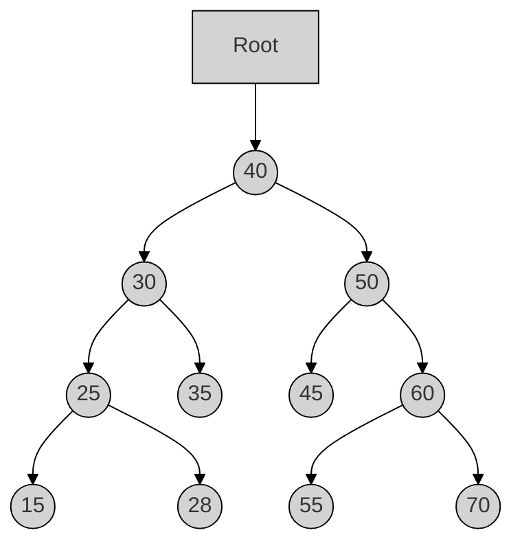
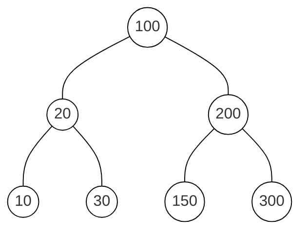
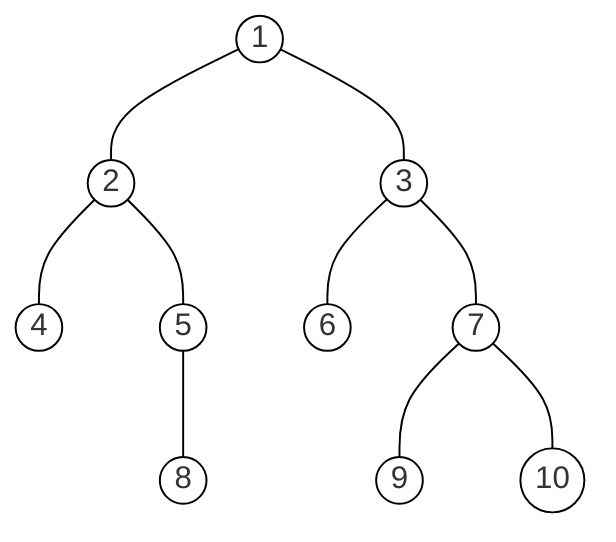
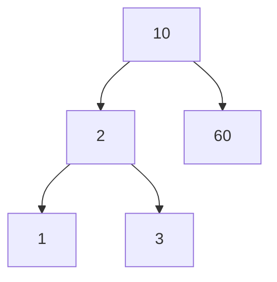

# 1333203 - DSA - Summer 2024

**Q1a:** Define linear data structure and give its examples. (**03 marks**)

**Q1b:** Define time and space complexity. (**04 marks**)

**Q1c:** Explain the concept of class and object with example. (**07 marks**)

**Q1cOR:** Explain instance method, class method and static method with example. (**07 marks**)

**Q2a:** Explain concept of recursive function. (**03 marks**)

**Q2b:** Define stack and queue. (**04 marks**)

**Q2c:** Explain basic operations on stack. (**07 marks**)

**Q2aOR:** Define singly linked list. (**03 marks**)

**Q2bOR:** Explain Enqueue and Dequeue operations on Queue. (**04 marks**)

**Q2cOR:** Convert expression A+B/C+D to postfix and evaluate postfix expression using stack assuming some values for A, B, C and D. (**07 marks**)

**Q3a:** Enlist applications of Linked List. (**03 marks**)

**Q3b:** Explain creation of singly linked list in python. (**04 marks**)

**Q3c:** Write a code to insert a new node at the beginning and end of singly linked list. (**07 marks**)

**Q3aOR:** Write a code to count the number of nodes in singly linked list. (**03 marks**)

**Q3bOR:** Match appropriate options from column A and B (**04 marks**)

| Column A                 | Column B                                                     |
| ------------------------ | ------------------------------------------------------------ |
| 1. Singly Linked List    | a. Basic unit containing data and references                 |
| 2. Doubly Linked List    | b. Nodes form a loop where the last node points to the first node |
| 3. Circular Linked List  | c. Nodes contain data and a reference to the next node       |
| 4. Node in a Linked List | d. Nodes contain data and references to both the next and previous nodes |

**Q3cOR:** Explain deletion of first and last node in singly linked list. (**07 marks**)

**Q4a:** Explain concept of doubly linked list. (**03 marks**)

**Q4b:** Explain concept of linear search. (**04 marks**)

**Q4c:** Write a code to implement binary search algorithm. (**07 marks**)

**Q4aOR:** Explain concept of selection sort algorithm. (**03 marks**)

**Q4bOR:** Explain bubble sort method. (**04 marks**)

**Q4cOR:** Explain the working of quick sort method with example. (**07 marks**)

**Q5a:** Explain binary tree. (**03 marks**)

**Q5b:** Define the terms root, path, parent and children with reference to tree. (**04 marks**)

**Q5c:** Apply preorder and postorder traversal for given below tree. (**07 marks**)

**Q5aOR:** Enlist applications of binary tree. (**03 marks**)

**Q5bOR:** Explain insertion of a node in binary search tree. (**04 marks**)

**Q5cOR:** Draw Binary search tree for 8, 4, 12, 2, 6, 10, 14, 1, 3, 5 and write In-order traversal for the tree. (**07 marks**)

---

# 1333203 - DSA - Winter 2023 

**Q1a:** Define linked list. List different types of linked list. (**03 marks**)

**Q1b:** Explain Linear and Non Linear Data structure in Python with examples. (**04 marks**)

**Q1c:** Explain class, attributes, object and class method in python with suitable example. (**07 marks**)

**Q1cOR:** Define Data Encapsulation & Polymorphism. Develop a Python code to explain Polymorphism. (**07 marks**)

**Q2a:** Differentiate between Stack and Queue. (**03 marks**)

**Q2b:** Write an algorithm for PUSH and POP operation of stack in python. (**04 marks**)

**Q2c:** Convert following equation from infix to postfix using Stack: A * (B + C) - D / (E + F) (**07 marks**)

**Q2aOR:** Differentiate between simple Queue and circular Queue. (**03 marks**)

**Q2bOR:** Explain concept of recursive function with suitable example. (**04 marks**)

**Q2cOR:** Develop a python code to implement Enqueue and Dequeue operation in Queue. (**07 marks**)

**Q3a:** Give Difference between Singly linked list and Circular linked list. (**03 marks**)

**Q3b:** Explain concept of Doubly linked list. (**04 marks**)

**Q3c:** Write an algorithm for following operation on singly linked list: (**07 marks**)

1. To insert a node at the beginning of the list.
2. To insert the node at the end of the list. 

**Q3aOR:** List different operations performed on singly linked list. (**03 marks**)

**Q3bOR:** Explain concept of Circular linked list. (**04 marks**)

**Q3cOR:** List application of linked list. Write an algorithm to count the number of nodes in singly linked list. (**07 marks**)

**Q4a:** Compare Linear search with Binary search. (**03 marks**)

**Q4b:** Write an algorithm for selection sort method. (**04 marks**)

**Q4c:** Develop a python code to sort following list in ascending order using Bubble sort method.
list1=[5,4,3,2,1,0] (**07 marks**)

**Q4aOR:** Define sorting. List different sorting methods. (**03 marks**)

**Q4bOR:** Write an algorithm for Insertion sort method. (**04 marks**)

**Q4cOR:** Develop a python code to sort following list in ascending order using selection sort method.
list1=[6,3,25,8,-1,55,0] (**07 marks**)

**Q5a:** Define following terms regarding Tree data structure:  (**03 marks**)

1. Forest
2. Root node
3. Leaf node

**Q5b:** Draw Binary search tree for 78,58,82,15,66,80,99 and write In-order traversal for the tree. (**04 marks**)

**Q5c:** Write an algorithm for following operation: (**07 marks**)

1. Insertion of Node in Binary Tree
2. Deletion of Node in Binary Tree 

**Q5aOR:** Define following terms regarding Tree data structure: (**03 marks**)

1. In-degree
2. Out-degree
3. Depth 

**Q5bOR:** Write Preorder and postorder traversal of following Binary tree. (**04 marks**)

**Q5cOR:** Develop a program to implement construction of Binary Search Tree. (**07 marks**)

____

# 4331601 - DSP - Summer 2024
**Q1a:** Differentiate between array and list. (**03 marks**)

**Q1b:** Explain the concept of class and object with the help of python program. (**04 marks**)

**Q1c:** Define constructor. Discuss different types of constructors with suitable python program. (**07 marks**)

**Q1cOR:** Define Polymorphism. Write a python program for polymorphism through inheritance. (**07 marks**)

**Q2a:** Explain Python specific data structure List, Tuple and Dictionary. (**03 marks**)

**Q2b:** Explain application of stack. (**04 marks**)

**Q2c:** Define stack. Explain PUSH & POP operation with example. Write an algorithm for PUSH and POP operations of stack. (**07 marks**)

**Q2aOR:** Define Following terms: (**03 marks**)
I. Time Complexity
II. Space Complexity
III. Best case 

**Q2bOR:** Convert A – (B / C + (D % E * F) / G)* H into postfix expression (**04 marks**)

**Q2cOR:** Define circular queue. Explain INSERT and DELETE operations of circular queue with diagrams. (**07 marks**)

**Q3a:** Explain Implementation of Stack using List. (**03 marks**)

**Q3b:** Discuss different applications of linked list. (**04 marks**)

**Q3c:** Explain doubly linked list. Write an algorithm to delete a node from the beginning of doubly linked list (**07 marks**)

**Q3aOR:** Convert this Infix expression into Postfix expression: A+B/C*D-E/F-G (**03 marks**)

**Q3bOR:** Explain Circular Linked List with its disadvantages. (**04 marks**)

**Q3cOR:** Write a Python Program to perform Insert operation in doubly Linked List. Explain with neat diagrams. (**07 marks**)

**Q4a:** Write an algorithm for Merge sort. (**03 marks**)

**Q4b:** Differentiate between Singly Linked List and Doubly Linked List. (**04 marks**)

**Q4c:** Write an algorithm for selection sort. Give the trace to sort the given data using selection sort method. Data are: 13, 2, 6, 54, 18, 42, 11 (**07 marks**)

**Q4aOR:** Write an algorithm for Insertion sort. (**03 marks**)

**Q4bOR:** Write an algorithm to insert a new node at the end of circular linked list. (**04 marks**)

**Q4cOR:** Write an algorithm for bubble sort. Give the trace to sort the given data using bubble sort method. Data are: 37, 22, 64, 84, 58, 52, 11 (**07 marks**)

**Q5a:** Explain Binary search tree and application of it. (**03 marks**)

**Q5b:** Write Python Program for Linear Search and explain it with an example (**04 marks**)

**Q5c:** Create a Binary Search Tree for the keys 45, 35, 12, 58, 5, 55, 58, 80, 35, 42 and write the Preorder, Inorder and Postorder traversal sequences. (**07 marks**)

**Q5aOR:** Define following terms: (**03 marks**)
I. Binary tree
II. level number
III. Leaf-node 

**Q5bOR:** Differentiate between Linear Search and Binary search. (**04 marks**)

**Q5cOR:** Write an algorithm for insertion and deletion a node in Binary search tree. (**07 marks**)

____
# 4331601 - DSP - Winter 2023

**Q1a:** Define best case, worst case and average case for time complexity. (**03 marks**)

**Q1b:** What is Class and Object in OOP? Give suitable example. (**04 marks**)

**Q1c:** Write a program for two matrix multiplication using simple nested loop and numpy module. (**07 marks**)

**Q1cOR:** Write a program to implement basic operations on arrays. (**07 marks**)

**Q2a:** Explain Big 'O' Notation. (**03 marks**)

**Q2b:** Differentiate between class method and static method. (**04 marks**)

**Q2c:** Implement a class for single level inheritance using public and private type derivation. (**07 marks**)

**Q2aOR:** Explain constructor with example. (**03 marks**)

**Q2bOR:** Write a program to demonstrate Polymorphism. (**04 marks**)

**Q2cOR:** Write a Python to implement multiple and hierarchical inheritance. (**07 marks**)

**Q3a:** Explain Push and Pop operations on Stack. (**03 marks**)

**Q3b:** Explain Enqueue and Dequeue operations on Queue. (**04 marks**)

**Q3c:** Explain various applications of Stack. (**07 marks**)

**Q3aOR:** List out limitations of Single Queue. (**03 marks**)

**Q3bOR:** Differentiate circular and simple queues. (**04 marks**)

**Q3cOR:** Convert the following infix expression into postfix: (a * b) * (c ^ (d + e) – f) (**07 marks**)

**Q4a:** List types of Linked List. (**03 marks**)

**Q4b:** Differentiate between circular linked list and singly linked list. (**04 marks**)

**Q4c:** Implement a program to perform following operation on singly linked list: (**07 marks**)
a. Insert a node at the beginning of a singly linked list.
b. Insert a node at the end of a singly linked list. 

**Q4aOR:** Explain doubly linked list. (**03 marks**)

**Q4bOR:** Describe applications of Linked List. (**04 marks**)

**Q4cOR:** Implement Merge Sort algorithm. (**07 marks**)

**Q5a:** Describe applications of binary tree. (**03 marks**)

**Q5b:** Explain Indegree and Outdegree of Binary Tree with example. (**04 marks**)

**Q5c:** Write a program to implement construction of binary search trees. (**07 marks**)

**Q5aOR:** Define level, degree and leaf node in binary tree. (**03 marks**)

**Q5bOR:** Explain complete binary tree with example. (**04 marks**)

**Q5cOR:** Construct a Binary Search Tree (BST) for the following sequence of numbers- 50, 70, 60, 20, 90, 10, 40, 100 (**07 marks**)

---

# 4331601 - DSP - Summer 2023
**Q1a:** List types of Data Structure. (**03 marks**)

**Q1b:** Explain various types of methods in OOP. (**04 marks**)

**Q1c:** Implement a Program for two matrix multiplication using simple nested loop and numpy module. (**07 marks**)

**Q1cOR:** Write a program to demonstrate array operations in Python. (**07 marks**)

**Q2a:** Explain Asymptotic Notations. (**03 marks**)

**Q2b:** Explain types of Inheritance. (**04 marks**)

**Q2c:** Design a student class for reading and displaying the student information, the getInfo() and displayInfo() methods will be used respectively. (**07 marks**)

**Q2aOR:** Compare List and Tuples. (**03 marks**)

**Q2bOR:** Explain Polymorphism with suitable example. (**04 marks**)

**Q2cOR:** Write a Python program to demonstrate method overriding using inheritance. (**07 marks**)

**Q3a:** Explain operations on Stack. (**03 marks**)

**Q3b:** Explain Circular Queue. (**04 marks**)

**Q3c:** Summarize Applications of queue. Show limitations of queue. (**07 marks**)

**Q3aOR:** Create a program to print factorial of given number using recursive function. (**03 marks**)

**Q3bOR:** Differentiate circular and simple queues. (**04 marks**)

**Q3cOR:** Develop a program to convert infix notation to postfix notation using stack. (**07 marks**)

**Q4a:** List types of Linked List. (**03 marks**)

**Q4b:** Differentiate between circular linked list and singly linked list. (**04 marks**)

**Q4c:** Write a program to insert a node at the beginning of a singly linked list and to insert a node at the end of a singly linked list. (**07 marks**)

**Q4aOR:** What is doubly linked list? (**03 marks**)

**Q4bOR:** Describe applications of Linked List. (**04 marks**)

**Q4cOR:** Implement Bubble Sort algorithm. (**07 marks**)

**Q5a:** Describe applications of binary tree. (**03 marks**)

**Q5b:** Explain Indegree and Outdegree of Binary Tree with example. (**04 marks**)

**Q5c:** Write a program to implement construction of binary search trees. (**07 marks**)

**Q5aOR:** Explain level and leaf node in binary tree. (**03 marks**)

**Q5bOR:** Explain complete binary tree with example. (**04 marks**)

**Q5cOR:** Perform Inorder, Preorder, Postorder traversal of below given binary tree. (**07 marks**)

---

# 4331601 - DSP - Winter 2022
**Q1a:** Give difference between pop() and remove() method of list in python. (**03 marks**)

**Q1b:** Define numpy array? Explain operations of array in python. (**04 marks**)

**Q1c:** Explain class in python? Write a python program to find the area of a rectangle using classes and object. (**07 marks**)

**Q1cOR:** Define Inheritance. List out different types of inheritance. Write a python program to multiple inheritances. (**07 marks**)

**Q2a:** Differentiate between stack and queue. (**03 marks**)

**Q2b:** Describe polymorphism in python? (**04 marks**)

**Q2c:** Define stack? Given equation to conversion from infix to postfix using stack.
(A^B)+C*D (**07 marks**)

**Q2aOR:** Explain factorial no using recursive function in python. (**03 marks**)

**Q2bOR:** Explain abstract class in python with suitable example? (**04 marks**)

**Q2cOR:** Write an algorithm for Evaluation of postfix expression. Also, Evaluate Postfix expression: 12, 7, 3, -, /, 2, 1, 5, +, *, + (**07 marks**)

**Q3a:** Write an algorithm to count the number of nodes in singly linked list. (**03 marks**)

**Q3b:** Write an algorithm for Enqueue operation in circular queue using List. (**04 marks**)

**Q3c:** Define Linked List and list its types. Write an algorithm to insert a node at specified position in singly linked list. (**07 marks**)

**Q3aOR:** Explain applications of linked list. (**03 marks**)

**Q3bOR:** Write an algorithm for POP operation of stack using List. (**04 marks**)

**Q3cOR:** Explain advantages of a linked list. Write an algorithm to delete node from beginning from double linked list. (**07 marks**)

**Q4a:** Consider a list of 5 elements: list = [4, 3, 6, 3, 2]. Write a python program to display the partially sorted list after three complete passes of Bubble sort. (**03 marks**)

**Q4b:** Difference between single linked list and circular linked list. (**04 marks**)

**Q4c:** Explain working principle of Quick sort. Sort the following list using quick sort: 4, 2, 1, 8, 6, 5, 7, 3, 10 (**07 marks**)

**Q4aOR:** Write an algorithm for insertion sort. (**03 marks**)

**Q4bOR:** Explain node representation of double linked list with suitable example. (**04 marks**)

**Q4cOR:** Write an algorithm for selection sort. Apply selection sort to following data to arrange them in ascending order: 34, 15, 29, 8, 17 (**07 marks**)

**Q5a:** Difference between binary tree and binary search tree. (**03 marks**)

**Q5b:** Define sorting? Write a Python program for binary search for an ordered list. (**04 marks**)

**Q5c:** Define a). Complete binary tree b). Node degree. Given a binary search tree. Insert node 5, Write a tree traversal preorder, inoder, postorder of binary search tree. (**07 marks**)

**Q5aOR:** Write an algorithm for post-order traversal of tree. (**03 marks**)

**Q5bOR:** Define sequential search? Write a Python program for Linear search using list. (**04 marks**)

**Q5cOR:** Define: a) Sibling b). Internal Node. Construct a binary search tree for following data items.
25, 32, 4, 7, 12, 67, 27, 78, 2 (**07 marks**)
