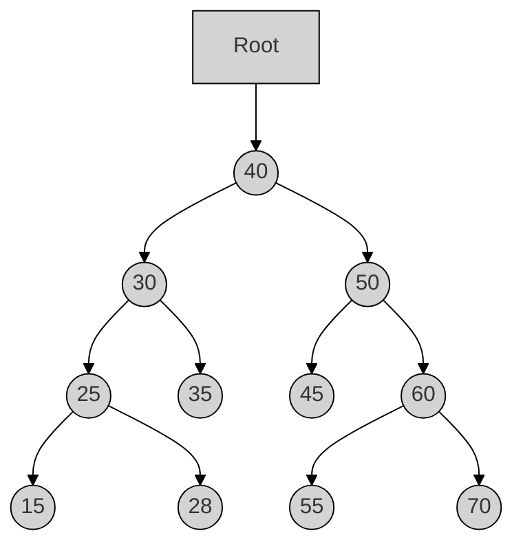
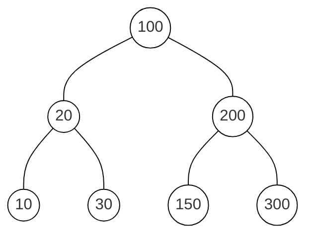
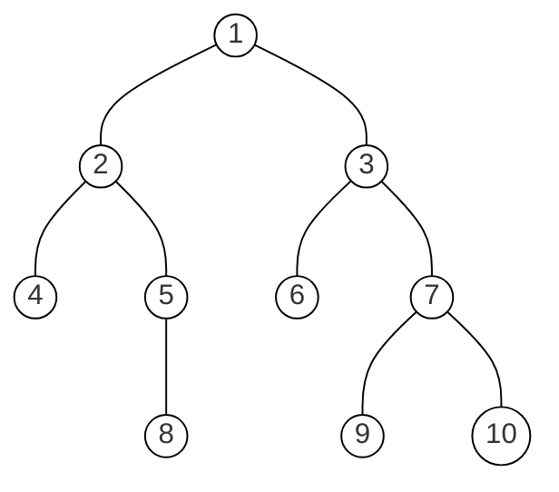
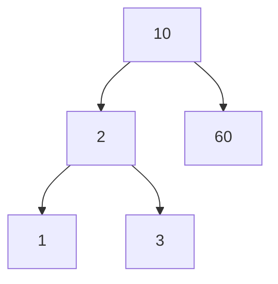

# 1333203 - DSA - Summer 2024
**Q1a:** રેખીય ડેટા સ્ટ્રક્ચર વ્યાખ્યાયિત કરો અને તેના ઉદાહરણો આપો. (**૦૩**)

**Q1b:** ટાઇમ અને સ્પેસ કોમ્પ્લેક્ષીટી વ્યાખ્યાયિત કરો. (**૦૪**)

**Q1c:** ક્લાસ અને ઓબ્જેક્ટ ઉદાહરણ સાથે સમજાવો. (**૦૭**)

**Q1cOR:** ઇંસ્ટંસ મેથડ, ક્લાસ મેથડ અને સ્ટેટીક મેથડ ઉદાહરણ સાથે સમજાવો. (**૦૭**)

**Q2a:** રીકર્ઝીવ ફંકશન નો કોંસેપ્ટ સમજાવો. (**૦૩**)

**Q2b:** સ્ટેક અને ક્યુ વ્યાખ્યાયિત કરો. (**૦૪**)

**Q2c:** સ્ટેક ના બેઝિક ઓપરેશન સમજાવો. (**૦૭**)

**Q2aOR:** સિંગ્લી લિંક્ડ લિસ્ટ વ્યાખ્યાયિત કરો. (**૦૩**)

**Q2bOR:** ક્યુ ઉપર એનક્યુ ડીક્યુ ઓપરેશન સમજાવો. (**૦૪**)

**Q2cOR:** A+B/C+D પદ ને પોસ્ટફીક્ષ મા ફેરવો અને સ્ટેક નો ઉપયોગ કરીને A,B,C અને D ની કોઇ કિમત ધારીને એનુ મુલ્ય શોધો. (**૦૭**)

**Q3a:** લિંક્ડ લિસ્ટ ના ઉપયોગો લખો. (**૦૩**)

**Q3b:** પાયથનમા સિંગ્લી લિંક્ડ લિસ્ટ કેવી રીતે બનાવી શકાય એ સમજાવો. (**૦૪**)

**Q3c:** સિંગ્લી લિંક્ડ લિસ્ટ ની શરૂઆતમાં અને અંતમાં નવા નોડ ઉમેરવાનો કોડ લખો. (**૦૭**)

**Q3aOR:** સિંગ્લી લિંક્ડ મા રહેલ નોડ ની સંખ્યા ગણવા માટેનો કોડ લખો. (**૦૩**)

**Q3bOR:** કોલમ એ અને કોલમ બી ના યોગ્ય વિકલ્પ જોડો. (**૦૪**)

**Q3cOR:** સિંગ્લી લિંક્ડ લિસ્ટ મા પ્રથમ અને છેલ્લો નોડ ને કાઢી નાખવાનુ સમજાવો. (**૦૭**)

**Q4a:** ડબ્લી લિંક્ડ લિસ્ટ નો કોંસેપ્ટ સમજાવો. (**૦૩**)

**Q4b:** લિનિયર સર્ચ નો કોંસેપ્ટ સમજાવો. (**૦૪**)

**Q4c:** બાયનરી સર્ચ અલ્ગોરિધમ ઇમ્પ્લીમેંટ કરવા માટેનો કોડ લખો. (**૦૭**)

**Q4aOR:** સિલેક્શન સોર્ટ અલ્ગોરીધમ નો કોંસેપ્ટ સમજાવો. (**૦૩**)

**Q4bOR:** બબલ સોર્ટ મેથડ સમજાવો. (**૦૪**)

**Q4cOR:** ઉદાહરણ સાથે ક્વીક સોર્ટ મેથડનુ વર્કિંગ સમજાવો. (**૦૭**)

**Q5a:** બાયનરી ટ્રી સમજાવો. (**૦૩**)

**Q5b:** ટ્રી ના સંદર્ભ મા રૂટ, પાથ, પેરંટ અને ચિલ્ડ્રન પદો વ્યાખ્યાયિત કરો. (**૦૪**)

**Q5c:** નીચે આપેલા ટ્રી માટે પ્રી ઓર્ડર અને પોસ્ટઓર્ડર ટ્રાવર્સલ લાગુ કરો. (**૦૭**)

**Q5aOR:** બાયનરી ટ્રી ની એપ્લિકેશંસ લખો. (**૦૩**)

**Q5bOR:** બાયનરી સર્ચ ટ્રી મા નોડ કેવી રીતે ઉમેરી શકાય તે સમજાવો. (**૦૪**)

**Q5cOR:** 8, 4, 12, 2, 6, 10, 14, 1, 3, 5 નમ્બર માટે બાયનરી સર્ચ ટ્રી દોરો અને ટ્રી માટે ઇન ઓર્ડર ટ્રાવર્સલ લખો. (**૦૭**)

---

# 1333203 - DSA - Winter 2023 
**Q1a:** લીન્કડ લીસ્ટની વ્યાખ્યા આપો. વિવિધ પ્રકારના લિન્ક્ડ લીસ્ટ ની યાદી આપો. (**૦૩**)

**Q1b:** પાયથનમાં લીનીયર અને નોન-લીનીયર ડેટા સ્ટ્રક્ચર ઉદાહરણ સાથે સમજાવો. (**૦૪**)

**Q1c:** પાયથનમાં ક્લાસ, એટ્રીબ્યુટ, ઓબ્જેક્ટ અને ક્લાસ મેથડ યોગ્ય ઉદાહરણ સાથે સમજાવો. (**૦૭**)

**Q1cOR:** ડેટા એન્કેપ્સુલેસન અને પોલીમોર્ફીસમની વ્યાખ્યા આપો. પોલીમોર્ફીસમ સમજાવવા માટેનો પાયથન કોડ વિકસાવો. (**૦૭**)

**Q2a:** સ્ટેક અને ક્યુ નો તફાવત આપો. (**૦૩**)

**Q2b:** પુશ અને પોપ ઓપરેશન માટેનો અલ્ગોરીધમ લખો. (**૦૪**)

**Q2c:** નીચે. આપેલ સમીકરણ ને ઇન્ફીક્સ માંથી પોસ્ટફિક્ષ માં બદલો. A * (B + C) - D / (E + F) (**૦૭**)

**Q2aOR:** સિમ્પલ ક્યુ અને સર્ક્યુલર ક્યુ નો તફાવત આપો. (**૦૩**)

**Q2bOR:** રીકસીવ ફંક્શનનો કોન્સેપ્ટ યોગ્ય ઉદાહરણ સાથે સમજાવો. (**૦૪**)

**Q2cOR:** Enqueue અને Dequeue ઓપરેશન માટેનો પાયથન કોડ વિકસાવો. (**૦૭**)

**Q3a:** સીન્ગલી લિન્ક્ડ લીસ્ટ અને સર્ક્યુલર લિન્ક્ડ લીસ્ટ નો તફાવત આપો. (**૦૩**)

**Q3b:** ડબલી લિન્ક્ડ લીસ્ટ નો કોન્સેપ્ટ સમજાવો. (**૦૪**)

**Q3c:** નીચે આપેલ ઓપરેશન માટે અલગોરિધમ લખો:
૧. લીસ્ટ ની શરૂઆતમાં નોડ દાખલ કરવા
૨. લીસ્ટ ના અંતમાં નોડ દાખલ કરવા (**૦૭**)

**Q3aOR:** સીન્ગલી લિન્ક્ડ લીસ્ટ પરના વિવિધ ઓપરેશન ની યાદી આપો. (**૦૩**)

**Q3bOR:** સર્ક્યુલર લિન્ક્ડ લીસ્ટ નો કોન્સેપ્ટ સમજાવો. (**૦૪**)

**Q3cOR:** લિન્ક્ડ લીસ્ટની એપ્લીકેશનોની યાદી આપો. સીન્ગલી લિન્ક્ડ લીસ્ટમાં કુલ નોડ ગણવા માટેનો અલગોરિધમ લખો. (**૦૭**)

**Q4a:** લીનીયર સર્ચ અને બાયનરી સર્ચની સરખામણી કરો. (**૦૩**)

**Q4b:** સિલેકશન સોર્ટ માટેનો અલગોરિધમ લખો. (**૦૪**)

**Q4c:** નીચે આપેલા લીસ્ટ ને બબલ સોર્ટ મેથડ વડે ચડતા ક્રમમાં ગોઠવવા માટેનો પાયથન કોડ વિકસાવો.
list1=[5,4,3,2,1,0] (**૦૭**)

**Q4aOR:** સોટીંગ ની વ્યાખ્યા આપો. વિવિધ પ્રકારના સોટીંગ ની યાદી આપો. (**૦૩**)

**Q4bOR:** Insertion sort method નો અલગોરિધમ લખો. (**૦૪**)

**Q4cOR:** નીચે આપેલા લીસ્ટ ને સિલેકશન સોર્ટ મેથડ વડે ચડતા ક્રમમાં ગોઠવવા માટેનો પાયથન કોડ વિકસાવો.
list1=[6,3,25,8,-1,55,0] (**૦૭**)

**Q5a:** Tree data structure ને લગતા નીચે આપેલ પદોની વ્યાખ્યા આપો.
1. Forest
2. Root node
3. Leaf node (**૦૩**)

**Q5b:** 78,58,82,15,66,80,99 માટે Binary search tree દોરો અને તે tree માટેનું In-order traversal લખો. (**૦૪**)

**Q5c:** નીચે આપેલ ઓપરેશન માટે અલગોરિધમ લખો:
૧. Binary Tree માં નોડ દાખલ કરવા
૨. Binary Tree માંથી નોડ કાઢવા માટે (**૦૭**)

**Q5aOR:** Tree data structure ને લગતા નીચે આપેલ પદોની વ્યાખ્યા આપો.
1. In-degree
2. Out-degree
3. Depth (**૦૩**)

**Q5bOR:** નીચે દર્શાવેલા Binary tree માટે Preorder and postorder traversal લખો. (**૦૪**)

**Q5cOR:** Binary Search Tree રચવા માટેનો પાયથન કોડ વિકસાવો. (**૦૭**)

---

# 4331601 - DSP - Summer 2024

**Q1a:** Array અને list નો તફાવત જણાવો. (**૦૩**)

**Q1b:** Class અને object ના concept python program ની મદદથી સમજાવો. (**૦૪**)

**Q1c:** Constructor ની વ્યાખ્યા આપો. વિવિધ પ્રકાર ના constructor python program સાથે સમજાવો. (**૦૭**)

**Q1cOR:** Polymorphism ની વ્યાખ્યા આપો. Inheritance વડે Polymorphism નો python program લખો. (**૦૭**)

**Q2a:** Python અંતર્ગત data structure List, Tuple અને Dictionary સમજાવો. (**૦૩**)

**Q2b:** Stack ની એપ્લિકેશન જણાવો. (**૦૪**)

**Q2c:** Stack ની વ્યાખ્યા આપો. PUSH અને POP operation ઉદાહરણ સાથે સમજાવો. Stack ના PUSH અને POP operation ના algorithm લખો. (**૦૭**)

**Q2aOR:** નીચેની વ્યાખ્યા આપો:
I. Time Complexity
II. Space Complexity
III. Best case (**૦૩**)

**Q2bOR:** નીચે આપેલા infix expression ને postfix માં ફેરવો.
A – (B / C + (D % E * F) / G)* H (**૦૪**)

**Q2cOR:** Circular queue ની વ્યાખ્યા આપો. Circular queue ના INSERT અને DELETE operations આકૃતિ સાથે સમજાવો. (**૦૭**)

**Q3a:** List નો ઉપયોગ કરી Stack નું Implementation સમજાવો. (**૦૩**)

**Q3b:** Linked list ની વિવિધ એપ્લિકેશન વિશે ચર્ચા કરો. (**૦૪**)

**Q3c:** Doubly linked list સમજાવો. Doubly linked list માં શરૂઆત ની node ને delete કરવા માટે નો algorithm લખો (**૦૭**)

**Q3aOR:** નીચે આપેલા infix expression ને postfix માં ફેરવો.
A+B/C*D-E/F-G (**૦૩**)

**Q3bOR:** Circular Linked List તેના ગેરફાયદા સાથે સમજાવો. (**૦૪**)

**Q3cOR:** Doubly Linked List માં Insert operation ને perform કરવા માટે નો algorithm લખો. સ્વચ્છ આકૃતિ સાથે સમજાવો. (**૦૭**)

**Q4a:** Merge sort નો algorithm લખો. (**૦૩**)

**Q4b:** Singly Linked List અને Doubly Linked List નો તફાવત જણાવો. (**૦૪**)

**Q4c:** Selection sort નો algorithm લખો. આપેલા ડેટા ને selection sort ની મદદથી ચડતા ક્રમમાં ગોઠવી બતાવો. ડેટા: 13, 2, 6, 54, 18, 42, 11 (**૦૭**)

**Q4aOR:** Insertion sort નો algorithm લખો. (**૦૩**)

**Q4bOR:** Circular linked list માં અંત માં નવી node insert કરવા માટે નો algorithm લખો. (**૦૪**)

**Q4cOR:** Bubble sort નો algorithm લખો. આપેલા ડેટા ને bubble sort ની મદદથી ચડતા ક્રમમાં ગોઠવી બતાવો. ડેટા: 37, 22, 64, 84, 58, 52, 11 (**૦૭**)

**Q5a:** Binary search tree અને તેની application સમજાવો. (**૦૩**)

**Q5b:** Linear Search માટે નો Python Program લખો તથા ઉદાહરણ સાથે સમજાવો. (**૦૪**)

**Q5c:** આપેલી સંખ્યઓ માટે Binary Search Tree બનાવો તથા તેના Preorder, Inorder અને Postorder traversals લખો:
45, 35, 12, 58, 5, 55, 58, 80, 35, 42 (**૦૭**)

**Q5aOR:** નીચેની વ્યાખ્યા આપો:
I. Binary tree
II. level number
III. Leaf-node (**૦૩**)

**Q5bOR:** Linear Search અને Binary search વચ્ચે નો તફાવત જણાવો. (**૦૪**)

**Q5cOR:** Binary search tree માં node ને insertion અને deletion માટે નો algorithm લખો. (**૦૭**)

---

# 4331601 - DSP - Winter 2023

**Q1a:** Time Complexity માટે શ્રેષ્ઠ કેસ, સૌથી ખરાબ કેસ અને સરેરાશ કેસ વ્યાખ્યાયિત કરો. (**૦૩**)

**Q1b:** OOP માં ક્લાસ અને ઑબ્જેક્ટ શું છે? યોગ્ય ઉદાહરણ આપો. (**૦૪**)

**Q1c:** Simple nested Loop અને NUMPY મોડ્યુલનો ઉપયોગ કરીને બે મેટ્રિક્સ ગુણાકાર માટે પ્રોગ્રામ લખો. (**૦૭**)

**Q1cOR:** Array ના બેઝિક ઓપેરશન માટે એક પ્રોગ્રામ લખો. (**૦૭**)

**Q2a:** Big 'O' Notation સમજાવો (**૦૩**)

**Q2b:** class method and static method વચ્ચે તફાવત લખી સમજાવો (**૦૪**)

**Q2c:** public and private type નો ઉપયોગ કરીને સિંગલ લેવલ INHERITANCE માટે ક્લાસ બનાવો. (**૦૭**)

**Q2aOR:** કન્સ્ટ્રક્ટરને ઉદાહરણ સાથે સમજાવો. (**૦૩**)

**Q2bOR:** પોલીમોર્ફિઝમ દર્શાવવા માટે એક પ્રોગ્રામ લખો. (**૦૪**)

**Q2cOR:** multiple and hierarchical inheritance નો ઉપયોગ કરી પાયથોન પ્રોગ્રામ લખો (**૦૭**)

**Q3a:** Stack પર push અને pop ઓપરેશન્સ સમજાવો (**૦૩**)

**Q3b:** Queue ના એન્ક્યૂ અને ડીક્યુ ઓપરેશન્સ સમજાવો (**૦૪**)

**Q3c:** Stack ની વિવિધ એપ્લિકેશનો સમજાવો (**૦૭**)

**Q3aOR:** Single Queue ના મર્યાદાઓની યાદી બનાવો. (**૦૩**)

**Q3bOR:** circular અને simple queues નો તફાવત લખી સમજાવો. (**૦૪**)

**Q3cOR:** નીચેઆપેલ infix expression ને postfix માં રૂપાંતર કરો.
(a * b) * (c ^ (d + e) – f) (**૦૭**)

**Q4a:** Linked List ના પ્રકારો સમજાવો. (**૦૩**)

**Q4b:** Circular linked list અને singly linked list નો તફાવત લખી સમજાવો (**૦૪**)

**Q4c:** Singly linked list માં નીચેની કામગીરી કરવા માટે એક પ્રોગ્રામનો અમલ કરો:
a singly linked list ની શરૂઆતમાં નોડ દાખલ કરો.
b singly linked list ના અંતે નોડ દાખલ કરો. (**૦૭**)

**Q4aOR:** Doubly linked list સમજાવો. (**૦૩**)

**Q4bOR:** Linked List. ની એપ્લિકેશનોનું વર્ણન કરો (**૦૪**)

**Q4cOR:** Merge sort અલ્ગોરિધમનો પ્રોગ્રામ લખી સમજાવો. (**૦૭**)

**Q5a:** binary tree ની એપ્લીકશનનું વર્ણન કરો. (**૦૩**)

**Q5b:** ઉદાહરણ સાથે binary tree ની ઈન્ડીગ્રી અને આઉટડિગ્રી સમજાવો. (**૦૪**)

**Q5c:** Binary search tree બનાવવા માટેનો પ્રોગ્રામ લખો. (**૦૭**)

**Q5aOR:** binary tree માં લેવલ, ડિગ્રી અને લીફ નોડ વ્યાખ્યાયિત કરો (**૦૩**)

**Q5bOR:** Complete binary tree ઉદાહરણ સાથે સમજાવો. (**૦૪**)

**Q5cOR:** નીચેના નંબરોના ક્રમ માટે binary search tree (BST) બનાવો
50, 70, 60, 20, 90, 10, 40, 100 (**૦૭**)

---

# 4331601 - DSP - Summer 2023

**Q1a:** ડેટા સ્ટ્રક્ચરના પ્રકારોની સૂચિ બનાવો. (**૦૩**)

**Q1b:** OOP માં વિવિધ પ્રકારની methods સમજાવો. (**૦૪**)

**Q1c:** સરળ Nested Loop અને Numpy મોડ્યુલનો ઉપયોગ કરીને બે મેટ્રિક્સ ગુણાકાર માટે એક પ્રોગ્રામ ડેવલોપ કરો. (**૦૭**)

**Q1cOR:** પાયથોનમાં Array Operations દર્શાવવા માટે એક પ્રોગ્રામ લખો (**૦૭**)

**Q2a:** Asymptotic Notations સમજાવો. (**૦૩**)

**Q2b:** Inheritance ના પ્રકારો સમજાવો. (**૦૪**)

**Q2c:** વિદ્યાર્થી માહિતી reading અને displaying કરવા માટે student class ની રચના કરો, getInfo() અને displayInfo() પદ્ધતિઓ અનુક્રમે ઉપયોગ કરવામાં આવશે. (**૦૭**)

**Q2aOR:** List અને Tuples ની સરખામણી કરો. (**૦૩**)

**Q2bOR:** પોલીમોર્ફિઝમને યોગ્ય ઉદાહરણ સાથે સમજાવો. (**૦૪**)

**Q2cOR:** Inheritance નો ઉપયોગ કરીને મેથડ ઓવરરાઇડીંગ દર્શાવવા માટે પાયથોન પ્રોગ્રામ લખો. (**૦૭**)

**Q3a:** Stack ના ઓપરેશન સમજાવો. (**૦૩**)

**Q3b:** Circular Queue સમજાવો. (**૦૪**)

**Q3c:** Queue ની એપ્લીકેસન અને લિમિટેશન જણાવો (**૦૭**)

**Q3aOR:** Recursive ફંક્શનનો ઉપયોગ કરીને આપેલ સંખ્યાના ફેક્ટોરિયલ પ્રિન્ટ કરવા માટે એક પ્રોગ્રામ બનાવો. (**૦૩**)

**Q3bOR:** circular અને simple queues નો તફાવત લખી સમજાવો. (**૦૪**)

**Q3cOR:** Stack નો ઉપયોગ કરીને infix નોટેશનને postfix માં કન્વર્ટ કરવા માટે એક પ્રોગ્રામ ડેવલપ કરો. (**૦૭**)

**Q4a:** Linked List ના પ્રકારો સમજાવો. (**૦૩**)

**Q4b:** circular linked list અને singly linked list નો તફાવત લખી સમજાવો (**૦૪**)

**Q4c:** singly linked list ની શરૂઆતમાં નોડ દાખલ કરવા અને singly linked list ના અંતે નોડ દાખલ કરવા માટે પ્રોગ્રામ લખો. (**૦૭**)

**Q4aOR:** doubly linked list શું છે? (**૦૩**)

**Q4bOR:** Linked List. ની એપ્લિકેશનોનું વર્ણન કરો (**૦૪**)

**Q4cOR:** Bubble sort અલ્ગોરિધમનો પ્રોગ્રામ લખી સમજાવો. (**૦૭**)

**Q5a:** binary tree ની એપ્લીકશનનું વર્ણન કરો. (**૦૩**)

**Q5b:** ઉદાહરણ સાથે Binary Tree ની indegree અને outdegree સમજાવો. (**૦૪**)

**Q5c:** Binary search tree બનાવવા માટેનો પ્રોગ્રામ લખો. (**૦૭**)

**Q5aOR:** Binary tree માં લેવલ અને લીફ નોડ સમજાવો. (**૦૩**)

**Q5bOR:** Complete binary tree ઉદાહરણ સાથે સમજાવો. (**૦૪**)

**Q5cOR:** નીચે આપેલ binary tree નો ઇનઓર્ડર, પ્રીઓર્ડર, પોસ્ટઓર્ડર ટ્રાવર્સલ કરી નોડ નું લિસ્ટ બનાવો. (**૦૭**)

---

# 4331601 - DSP - Winter 2022
**Q1a:** પાયથોનમાં લિસ્ટની pop() અને remove() પદ્ધતિ વચ્ચે નો તફાવત આપો. (**૦૩**)

**Q1b:** Numpy arrayની વ્યાખ્યા આપો? પાયથોનમાં એરેના operations સમજાવો. (**૦૪**)

**Q1c:** પાયથોનમાં class સમજાવો? Class અને objectનો ઉપયોગ કરીને લંબચોરસનો વિસ્તાર શોધવા માટે પાયથોન પ્રોગ્રામ લખો. (**૦૭**)

**Q1cOR:** Inheritance ની વ્યાખ્યા આપો? Inheritance ની વિવિધ પ્રકારોની યાદી આપો. Multiple inheritance માટે પાયથોન પ્રોગ્રામ લખો. (**૦૭**)

**Q2a:** Stack અને Queue વચ્ચેનો તફાવત આપો. (**૦૩**)

**Q2b:** પાયથોનમાં પોલીમોર્ફિઝમનું વર્ણન કરો? (**૦૪**)

**Q2c:** Stack ની વ્યાખ્યા આપો. સ્ટેકનો ઉપયોગ કરીને આપેલ Infix expression ને Postfix expression માં ફેરવો.
(A^B)+C*D (**૦૭**)

**Q2aOR:** પાયથોનમાં Recursive functionનો ઉપયોગ કરીને ફેક્ટોરિયલ નો સમજાવો. (**૦૩**)

**Q2bOR:** પાયથોનમાં abstract classને યોગ્ય ઉદાહરણ સાથે સમજાવો? (**૦૪**)

**Q2cOR:** પોસ્ટફિક્સ મૂલ્યાંકન માટેનો અલગોરિધમ લખો. ઉપરાંત, નીચેની પોસ્ટફિક્સ એક્સપ્રેસન મૂલ્યાંકન કરો.
12, 7, 3, -, /, 2, 1, 5, +, *, + (**૦૭**)

**Q3a:** Singly linked list માં કેટલા નોડ છે તે ગણવા માટેનો અલગોરીધમ લખો. (**૦૩**)

**Q3b:** લિસ્ટનો ઉપયોગ કરીને Circular Queueના Enqueue ઓપરેશન માટેનો અલગોરિધમ લખો. (**૦૪**)

**Q3c:** Linked List ની વ્યાખ્યા આપો. અને તેના પ્રકારોની List બનાવો. Single Linked list મા specified position પર નોડ દાખલ કરવા માટેનો અલગોરિધમ લખો. (**૦૭**)

**Q3aOR:** Linked List ની એપ્લિકેશન સમજાવો. (**૦૩**)

**Q3bOR:** લિસ્ટનો ઉપયોગ કરીને સ્ટેકના POP ઓપરેશન માટે અલગોરિધમ લખો. (**૦૪**)

**Q3cOR:** Linked listના ફાયદા સમજાવો. Double linked list માંથી પ્રથમ નોડ કાઢી નાખવા માટે અલગોરિધમ લખો. (**૦૭**)

**Q4a:** 5 ઘટકોની list ધ્યાનમાં લો: list = [4, 3, 6, 3, 2].
બબલ સૉર્ટના ત્રણ સંપૂર્ણ પાસ પછી આંશિક રીતે સૉર્ટ કરેલી list પ્રદર્શિત કરવા માટે પાયથોન પ્રોગ્રામ લખો. (**૦૩**)

**Q4b:** Single linked list અને circular linked list વચ્ચેનો તફાવત આપો. (**૦૪**)

**Q4c:** Quick sortના કાર્ય સિદ્ધાંતને સમજાવો. Quick sort નો ઉપયોગ કરીને નીચેના ડેટાને સૉર્ટ કરો:
4, 2, 1, 8, 6, 5, 7,3,10 (**૦૭**)

**Q4aOR:** Insertion sort પ્રક્રિયા માટેનો algorithm લખો. (**૦૩**)

**Q4bOR:** યોગ્ય ઉદાહરણ સાથે double linked list નોડનું representation સમજાવો. (**૦૪**)

**Q4cOR:** Selection sort પ્રક્રિયા માટેનો algorithm લખો.
નીચે આપેલ ડેટાને Selection Sort નો ઉપયોગ કરીને ચડતા ક્રમમા ગોઠવો. 34, 15,29,8,17 (**૦૭**)

**Q5a:** બાઈનરી ટ્રી અને બાઈનરી સર્ચ ટ્રી વચ્ચેનો તફાવત આપો. (**૦૩**)

**Q5b:** Sorting ની વ્યાખ્યા આપો? ઓર્ડર લિસ્ટનો ઉપયોગ કરીને Binary search માટે પાયથોન પ્રોગ્રામ લખો. (**૦૪**)

**Q5c:** વ્યાખ્યા આપો a). Complete binary tree b). Node degree. આપેલ binary search treeમાં નોડ 5 દાખલ કરો, બાઈનરી સર્ચ ટ્રીના ટ્રી ટ્રાવર્સલ પ્રી-ઓર્ડર, ઇનોડર, પોસ્ટઓર્ડર લખો. (**૦૭**)

**Q5aOR:** ટ્રીના પોસ્ટઓર્ડર ટ્રાવર્સલનો અલગોરિધમ લખો. (**૦૩**)

**Q5bOR:** Linear search ની વ્યાખ્યા આપો? લિસ્ટનો ઉપયોગ કરીને Linear search માટે પાયથોન પ્રોગ્રામ લખો. (**૦૪**)

**Q5cOR:** વ્યાખ્યા આપો: a) સિબલિંગ b). આંતરિક નોડ. નીચે આપેલ માહિતી ઉપરથી binary search tree બનાવો.
25, 32, 4, 7,12,67,27,78,2 (**૦૭**)
